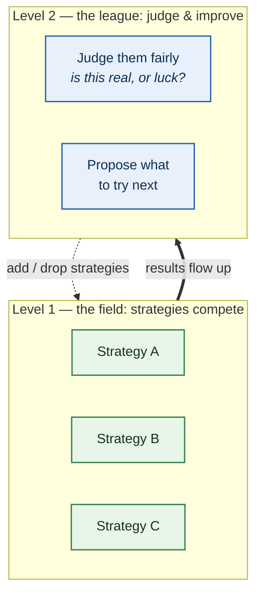
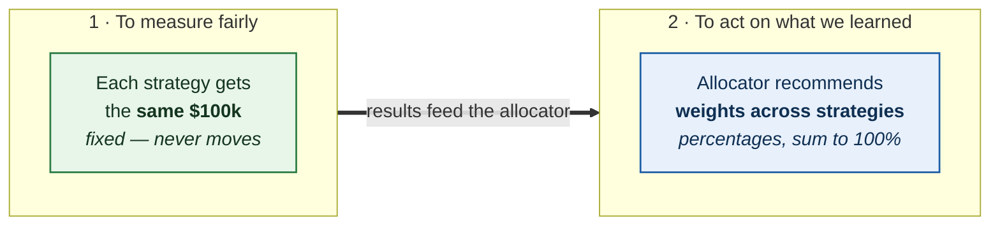
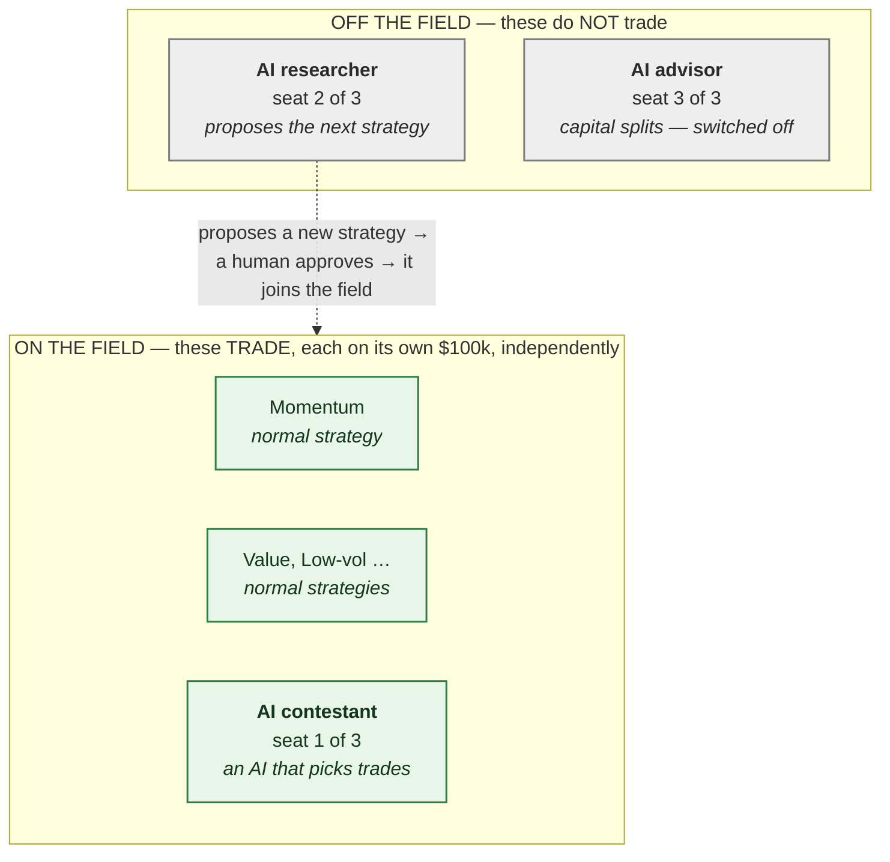
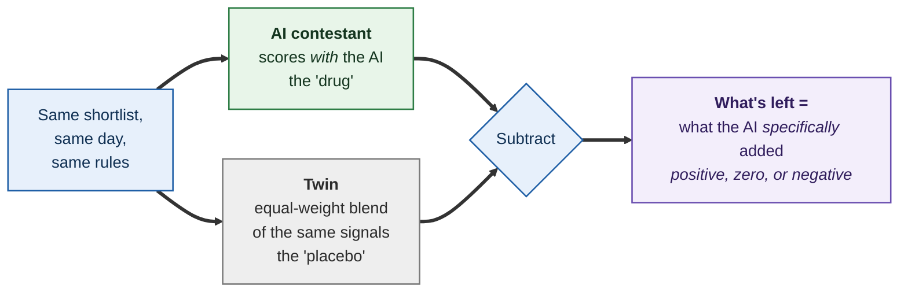
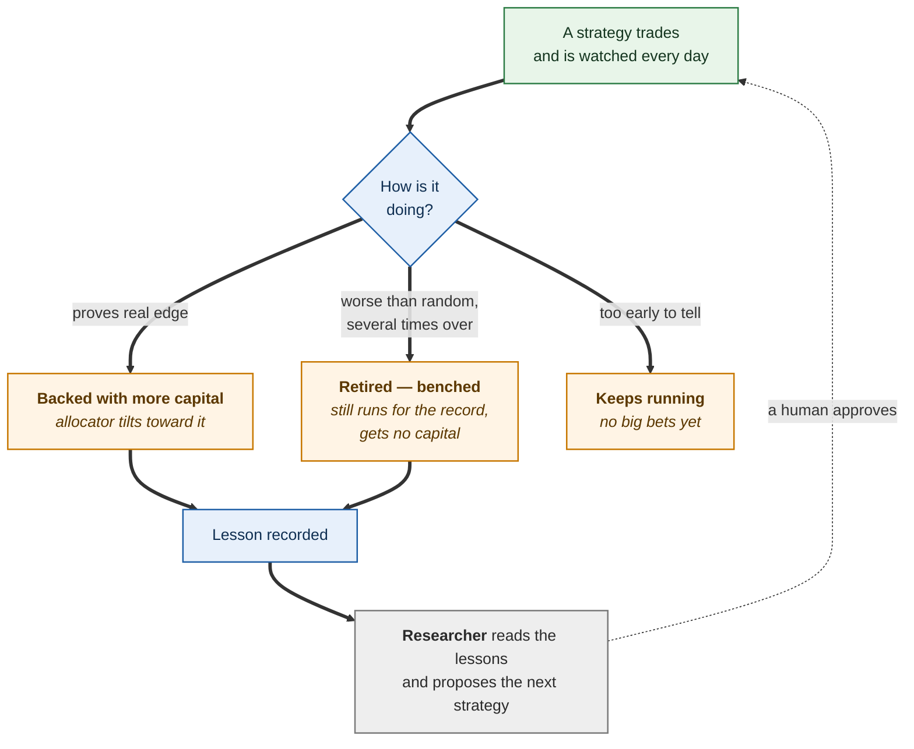

# AlphaLab — how to read this system

*A plain-language orientation. No code. Read this before the design documents; it gives you the mental model everything else hangs on. The detailed, authoritative specifications live in `MASTER_DESIGN_v1.9.md` and its companions — this file only exists so those read clearly.*

---

## What this is, in one paragraph

AlphaLab is a **paper-trading laboratory**. It trades no real money. Its purpose is not to run one clever strategy and hope it makes money — it is to run *many* investment strategies side by side against each other, in real time going forward, and to work out **which ones actually have an edge and which ones are only getting lucky**. Over time it uses those results to propose better strategies to try next. So it is two things at once: an experiment that judges strategies fairly, and a system that improves itself by learning from its own results. It begins on the S&P 500 and is designed to widen toward the full S&P 1500 — the target set by decision D87, contingent on a verified-depth historical membership feed for the mid- and small-cap tiers; absent that, it stays at the S&P 500.

The single most important thing to understand about it is that **it is built to tell the truth, including uncomfortable truths** — that a strategy has no edge, that it cannot yet tell whether a strategy has an edge, or that a clever idea is really just luck. That discipline is the point of the whole design, and it is what makes any positive result it eventually reports worth believing.

---

## The one idea that unlocks everything: two levels

Almost every question about this system becomes easy once you separate its **two levels**. They use some of the same words, which is the only reason they are ever confusing.

**Level 1 is the field.** Each strategy is a player. Each plays its own game independently — it makes its own trades, on its own money, and never consults the other players. Momentum does its thing; a value approach does its thing; they never coordinate.

**Level 2 is the league.** Nobody at this level trades. This level watches the players, judges which are genuinely good, decides how much to back each one, and proposes which new players to recruit.

When you read the rest of this document, always ask: *am I on the field, or in the league?* That question resolves nearly everything.

---

## Separation 1 — the money each strategy gets vs. how capital is split across strategies

This is the first place people get tangled, because the word "allocation" gets used for both.

Every strategy is given the **same fixed stake — $100,000 of paper money — to trade with.** This never changes. It is not a reward or a ranking; it is a level playing field. Each strategy must be judged on its own merits, and you cannot judge a strategy fairly if the money underneath it keeps moving. So the $100k is equal, fixed, and per-strategy. It exists purely so the *measurement* is fair.

Separately, there is a component called the **allocator**. Its job is the league-level question: *given what we have learned so far, how would we actually split one pool of capital across these strategies?* Its output is a set of **percentages that add up to 100%** — more toward strategies that have shown real, durable edge, less toward the ones that look like noise. So when you see a screen showing "Strategy A: 28%, Strategy B: 27%," those are **not** how much money each strategy has. They are the allocator's *recommendation* for how to weight the roster.

So: **the $100k is for fairness; the percentages are for decision-making.** Two different jobs, two different numbers.

One deliberate detail worth knowing, because it is unusual: the allocator is built to be **cautious**. When a strategy has only a short track record, its numbers could easily be luck, so the allocator deliberately holds its weight close to an equal split and even keeps some capital on a purely random "control" strategy. It only tilts hard toward a strategy once that strategy has genuinely proven itself. This restraint is intentional — it is the system refusing to chase a number it cannot yet trust.

---

## Separation 2 — which parts of the AI trade, and which do not

The system uses AI in **three distinct roles** ("seats"). They are easy to confuse because all three are "the AI." But only **one of them trades.** Keep this diagram; it is the one that removes the most confusion.

**The contestant (seat 1) trades.** It is an AI acting as an investor: it looks at a short list of candidate stocks each day, decides which to hold, and runs its own $100k account exactly like any other strategy — competing head to head with the human-designed strategies. This is "the AI that makes trades," and it is real.

**The researcher (seat 2) does not trade.** It reads the accumulated results of the whole lab and proposes **the next new strategy worth testing**. It is the idea generator. It cannot start anything on its own — a human approves each proposal — and once approved, that new strategy goes onto the field and trades independently like all the others. This seat is what makes the lab *improve itself*: instead of a person having to think up every new experiment by hand, the AI reads the evidence and suggests where to look next.

**The advisor (seat 3) is switched off.** It would eventually suggest how to split capital across strategies (the allocator's job), but it stays off until it can prove it beats the existing math-based allocator, and it is never allowed to move capital until then.

*When can you turn the advisor on?* There are three states, not two, and the distinction is the answer. **Off** is the default. **On to be measured** is a low-stakes toggle: the advisor produces its suggested splits, but they touch no capital — they run as a shadow comparison against the real allocator, the same paired A/B the AI trader runs against its twin, so its contribution can be tracked over time. You can enable this whenever there is an allocator to compare it against. **On to actually move capital** is not a preference you flip — it is an evidence gate the advisor has to clear first. It goes live only after that shadow comparison has shown, with the same rigor as any promotion, that its suggestions genuinely beat the math allocator by more than the margin of error, sustained. So your role is to decide when to start measuring it, and to register it live once the evidence supports it — never to hand it capital on unproven suggestions. The reason it is gated hardest of the three seats is that its mistakes are the most expensive: the trader only risks its own $100k account, but the advisor decides how capital flows across *every* strategy, so a bad advisor would corrupt the whole book at once. The cautious default is proportionate to what the seat controls.

So, in one line: **the AI trades through the contestant, and separately proposes new experiments through the researcher.** Two different jobs. The strategies on the field — the AI contestant included — always decide their own trades independently. The researcher never touches a trade.

---

## Separation 3 — how you know a strategy is actually good, not just lucky

This is the heart of the system, and it is the part an investor should care about most, because it is what makes any claimed edge believable.

The problem the whole design fights is simple: **if you run enough strategies, one of them will look brilliant purely by chance.** A coin-flipper on a hot streak looks like a genius until the streak ends. Most published market "edges," once you account for real trading costs, quietly disappear. AlphaLab is built to *catch* that, not to hide it.

It does this three ways.

**First, it compares every strategy to pure luck.** For each real strategy, the lab runs a large crowd of *random* strategies that trade with the same style and pay the same costs but pick names at random. That crowd is what "luck" looks like. A real strategy only earns credit for the amount it beats that random crowd — not for its raw return, which might just be a rising market lifting everything.

**Second, for the AI trader specifically, it runs a near-perfect control — the A/B twin.** This is the sharpest measurement in the whole system, and it is worth being precise about, because it is easy to misread.

The twin does **not** watch the AI contestant and copy its trades. If it did, it would be a pointless photocopy. Instead the twin runs the *entire decision independently, from the same starting inputs*, and differs in exactly one place: where the contestant asks the AI to score the day's candidate stocks, the twin scores them by a fixed, simple rule — an **equal-weight blend of the very same factsheet signals the AI is shown** (each signal put on a common scale and averaged, with no tuning). Everything else is forced to be identical — same candidate shortlist, same position sizing, same costs, same exit rules. Because the two score the names differently, they go on to hold different stocks and produce different results. The twin is a *separately living control*, not a mirror.

The cleanest way to picture it is a **drug trial**. The AI contestant is the patient on the real drug; the twin is the patient on a placebo. Both patients are matched in every other respect on purpose, so that when their outcomes differ, the difference can be attributed to the drug and nothing else. Without a placebo arm, a patient who improves proves nothing — they might have improved anyway. Without the twin, an AI trader that makes money proves nothing — the market might have been rising, and *any* picks would have made money. The twin is the placebo. Subtract the twin's results from the AI's, and because almost everything else cancels out — the market's direction, sector exposure, costs, sizing — what survives is a clean read on **what the AI's judgment specifically added, over the exact same strategy without it.**

This answers a question nothing else in the system can. Beating the random crowd tells you a strategy beat luck. Only the contestant-minus-twin comparison tells you whether the *AI* added anything over a simple mechanical rule making the same kind of decisions. An AI trader could beat the random crowd and still add nothing over its twin — meaning the AI was decoration and a plain rule would have done as well. It could also trail the crowd in a bad market yet still beat its twin — meaning the AI is adding value even while the whole style is out of favor. The twin is what separates "the AI helped" from everything else that was happening at the same time. If the AI adds nothing, this shows it plainly, which is itself a valuable finding.

**Third, it refuses to declare a winner before the evidence supports one.** Real edges in markets are small and slow. The lab computes *how long it would take* to distinguish a genuine small edge from noise — and until enough time has passed, its verdict is literally **"too early to tell."** For a long time, "too early" will be the most common verdict on the screen. That is not the system failing; that is the system respecting how hard this actually is. Its most frequent *truthful* products are "we can't yet tell this apart from luck" and "this performs worse than random, retire it" — not "this is a winner."

The investor-relevant takeaway: **this system is engineered to make a false positive hard.** It would rather tell you "we don't know yet" than sell you a mirage. When it eventually does crown something, that verdict has survived a deliberately harsh test.

---

## Separation 4 — what happens when a strategy wins, loses, or dies

Strategies are not run once and forgotten. The lab watches each one continuously and acts on what it sees. This is the self-improving loop.

A strategy that proves a durable edge gets **more capital** through the allocator. A strategy that decays or performs worse than random is **retired** — but "retired" here means *benched*, not deleted: it keeps trading quietly for the record so that if the retirement was a mistake, that shows up. It simply stops receiving capital and can no longer be crowned the best.

Crucially, a retired strategy is **never secretly tweaked until it looks good again.** That would be cheating — it is the classic way people fool themselves. Once a strategy's settings are fixed, they stay fixed. If you want to try a variation, that is a *brand-new* strategy that has to earn its place from scratch.

**What about a strategy that just had a terrible month?** This is the most important thing to get right, because it is the easiest to misread as the system being trigger-happy when it is in fact the opposite. A bad week or a bad month does **not** retire a strategy. Two things protect it. First, retirement requires sustained underperformance across *several consecutive* evaluations, not one bad stretch — a single rough patch cannot end anything. Second, and more importantly, a strategy is never judged against zero or against a fixed target; it is judged against a **crowd of random strategies trading the same universe in the same market conditions.** So when the market turns hostile to a given style, that random crowd suffers right alongside it, and the strategy is measured on whether it beats the crowd — not on whether it made money. A trend-following approach having an ugly month in a choppy, trendless market is *not* failing if random trend-following is having an equally ugly month; they are both just living through the wrong weather. A strategy is only retired when it does worse than *luck itself* would, repeatedly. That is a far higher bar than "lost money lately," and it is exactly what stops the lab from killing a sound strategy for hitting a market regime that does not suit it. Your instinct — that what fails in one regime can thrive in the next — is not a risk the system runs; it is a principle the system is built around.

And every ending — win or loss — **produces a lesson**, which is exactly what the **researcher** seat reads to propose the next thing to try. That is how the loop closes: results become lessons, lessons become the next experiment, a human approves it, and it joins the field. The lab gets smarter about *what to test* over time, which is the real meaning of "self-improving."

---

## How does it actually get better?

This is the question most worth answering plainly, because the intuitive picture — "an AI that learns to trade better and better over time" — is **not** how this system works, and the real design is more defensible than that picture, not less.

**The AI trader does not learn from its own profits and losses.** By default, the AI contestant's decision-making is deliberately **frozen** — a fixed instruction set, a fixed model, a fixed recipe for what information it sees. It never quietly rewires itself based on how its trades went. This sounds like a limitation; it is the opposite. A trader that adjusts itself in response to its own recent winnings is the single most common way people fool themselves in this field — it is how you manufacture a strategy that looks brilliant on the exact history it was tuned on and then falls apart live. The whole lab exists to *avoid* that trap, so it forbids its own AI from falling into it. A frozen trader can be measured cleanly against its no-AI twin; a self-adjusting one cannot.

**So how does the trader pick stocks at all?** It is handed, each day, a compact factsheet for each candidate stock — the same point-in-time signals the human-designed strategies see (recent trend, volatility, valuation measures, the current market regime, a short summary of what it already holds). It never reads raw market data or live news; it reasons over that prepared factsheet, the way an analyst would weigh a one-page brief, and returns a score per name. Its "skill," if it has any, is simply whether an AI's judgment over those signals beats a mechanical rule over the *same* signals. That is a real, testable question — and the twin comparison is precisely what answers it. There is no hidden genius here: the trader is only ever as informed as the factsheet it is given.

**Then where does improvement come from? From breeding better traders, not from teaching one trader.** When a trader's results are in, the researcher can propose a **new** trader with a changed recipe — a richer factsheet, a different instruction framing, a newer model. But proposing is not the same as launching: the researcher can only propose when it has evidence to justify it, **you approve each proposal by hand** (the AI never launches itself), and there must be budget for another experiment. Once approved, the new trader enters as a fresh contestant with its own twin and must earn its place from scratch. The old one is not upgraded in place; it is *superseded* by a better-specified sibling if the sibling proves better. Improvement is **generational** — the lineage of traders improves by selection over held-fixed individuals, the way a population improves through evolution, not the way a student improves through study. And there is one concrete place to check whether that generational process is actually working: if later cohorts of traders and strategies do better than earlier ones when compared at the same age, the loop is learning, and the cohort maturation curve on the research screen is where you read that signal.

Two things happen on separate, unrelated clocks, and it is worth not confusing them. A **new** trader is *born* only when the researcher proposes one and you approve it — there is no schedule and no automatic trigger for this. A trader is *retired* on a completely different rule: sustained underperformance against the random crowd across several evaluations. Birth is proposal-and-approval; death is failure-against-luck. Nothing "improves after N evaluations" — after enough bad evaluations a trader is benched, and separately, whenever the evidence and budget allow, a better-specified new trader may be proposed and approved.

```mermaid
flowchart LR
    G1["<b>Trader v1</b><br/><i>frozen recipe</i>"]:::trade
    G1 ==>|"results + lessons"| RES["<b>Researcher</b> proposes<br/>a better-specified v2"]:::notrade
    RES ==>|"a human approves →<br/>runs fresh vs its own twin"| G2["<b>Trader v2</b><br/><i>frozen recipe</i>"]:::trade
    G2 ==>|"if it wins,<br/>it supersedes v1"| DONE["<b>The lineage improves</b><br/>by <i>selection</i>,<br/>not self-teaching"]:::verdict

    classDef trade fill:#E8F5E9,stroke:#2E7D46,stroke-width:1.5px,color:#14351f;
    classDef notrade fill:#EEEEEE,stroke:#7A7A7A,stroke-width:1.5px,color:#2b2b2b;
    classDef machine fill:#E7F0FB,stroke:#1F5FA6,stroke-width:1.5px,color:#0f2f52;
    classDef outcome fill:#FFF4E5,stroke:#C77700,stroke-width:1.5px,color:#5c3800;
    classDef hub fill:#E2F5F1,stroke:#0F6E56,stroke-width:1.5px,color:#0a3b30;
    classDef verdict fill:#F3EEFB,stroke:#6A4FB0,stroke-width:1.5px,color:#301d5c;
```

**A permitted middle path.** The design does allow a trader to carry a *memory* that updates over the lab's own results — but only if the **rule** for updating the memory is the frozen, fixed thing (not the memory's contents), and the whole memory-carrying system is still judged against its twin. In plain terms: a trader may be allowed to adapt, but only through a pre-declared, auditable rule that anyone can reproduce — never through invisible, untracked drift. The simple frozen trader ships first; the adaptive one has to prove it beats the simple one. Either way, the principle holds: **what the trader *is* can never change silently.**

**And is the researcher just re-testing textbook strategies?** This is the fair worry — if it only pulls known ideas from the literature, the lab merely *confirms* what is already published. It works differently, in a way that is neither "picking from a fixed menu we decided on in advance" nor "scouring the internet for the latest strategy." Every proposal must cite a specific piece of **the lab's own evidence** — a closed result, a recorded lesson, a performance breakdown — or it is rejected outright. It cannot propose something just because a paper said so. So the proposals are new constructions built from your own results: take an approach that half-worked and add a filter your data suggested, blend two that each worked in different market conditions, restrict an idea to the corner of the market where it survived costs *here*. None of those is on a pre-made list, and none is imported from outside — they are combinations of building blocks the framework already has, steered by what this lab has measured. The boundary worth naming: the researcher can only propose things expressible in that framework of building blocks. It searches an open space of *combinations*, but the set of building blocks is fixed — so it gets better at searching its own space, not at expanding it. Adding genuinely new building blocks stays a human job. That is real, bounded discovery, not open-ended invention, and not mere confirmation of the textbook.

**How often does any of this happen?** Two different clocks, and it is worth not confusing them. The **trader** acts every trading day. The **researcher** wakes up on a slower cadence — roughly weekly, or on demand — reads the accumulated evidence, and *may* propose. But a proposal turning into a live new trader or strategy is **not** on a timer at all: it happens only when (1) there is real evidence to justify it, (2) **a human approves it** — the AI proposes, a person registers, always — and (3) there is budget left, because new experiments are deliberately rationed (a small fixed number of new candidates per year, only a few running at once) since every extra experiment makes the bar higher for *all* of them. So nothing auto-forks after a waiting period. It proposes; you decide; the budget caps the pace. And even once a new trader launches, the verdict on it is still months away, because the system refuses to rule until enough time has passed to tell edge from luck.

In one line: **the system does not contain an AI that gets better at trading by itself.** It contains a process that holds each trader fixed so it can be judged truthfully, kills the ones that are not real, and uses its own results to propose better-specified traders and strategies to test next — with a human approving each one and a strict ration on how fast new bets are placed. The improvement lives in the *process*, not inside any single trader. That is a stronger claim than "an AI that learns to trade," because "an AI that learns to trade on its own live results" is exactly the self-deception this lab is built to catch.

---

## The rules that keep it straight

A few hard rules run through the entire design. They are worth stating plainly because, for an investor, they *are* the product — the reason the numbers can be trusted.

**Costs are always charged.** Every trade pays realistic commissions, spreads, and market-impact costs. A strategy that only "wins" before costs has not won.

**No peeking at the future.** Every decision uses only information that was actually available at the moment it was made. This sounds obvious; it is the single most common way backtests lie, and the lab is built to make it structurally impossible.

**The AI never grades the AI.** No output from an AI seat is ever fed into the machinery that judges AI performance. The scorekeeping stays pure and independent; the AI competes inside it but never gets to mark its own homework.

**Practice runs never count as evidence.** The lab can replay history to test that its plumbing works, but nothing produced in a replay is ever allowed to count as proof that a strategy is good. Only real, forward, in-the-moment results count.

---

## What to expect if you watch it run

Set expectations correctly and the system looks like a success; set them wrong and it looks broken while working perfectly.

Expect most strategies to **lose to simply buying and holding the index**, after costs. That is the base rate in real markets, and the lab is designed to reveal it, not disguise it. Expect the verdict "too early to tell" to dominate for months at a time. Expect the AI contestant to possibly add little or nothing at first — and expect the system to say so plainly rather than flatter it.

The value the lab delivers is **not a promise of returns.** It is a trustworthy answer to the question "does this actually work?" — delivered slowly and conservatively across many strategies, with a mechanism that proposes better ideas as it learns. A rare, hard-won, believable "yes" is worth more than a fast, confident, fragile one, and this system is built for the former.

---

## Questions an investor is likely to ask

These are the questions a skeptical reader should ask, with straight answers, including the uncomfortable ones. A system whose whole purpose is rigorous self-assessment should be willing to answer them about itself.

**"Is this making money right now?"**
No — and that is by design, not by shortfall. It trades no real money at any point; it is a paper laboratory. Its output is *trustworthy verdicts about whether strategies work*, not returns. If someone eventually acts on a verdict with real capital, that is a separate decision made by a person, outside this system.

**"How much of this is actually built versus just designed?"**
Here is the split. The data foundation and the trading-and-accounting engine are built and tested — a strategy can trade a paper book against twenty years of validated market data with realistic costs, corporate actions, and recovery from outages. What is specified in full detail but **not yet built** is the judging layer (the fair-comparison scoring and verdicts), and above it the three AI seats. The AI trader and the researcher are designed down to the interface but are later phases of construction. So when this document describes the AI seats, it is describing *what the implementation will do when those phases are built*, from a complete specification — not something running today.

**"What stops this from being another 'AI finds alpha' pitch that falls apart?"**
The thing that makes those pitches fall apart is that they are built to *find* a winning result, and if you look hard enough you always find one by luck. This system is built the opposite way — to *disprove* its own strategies, by comparing every one against pure chance and refusing to call anything a winner until it clearly beats luck over time. Its most common output is "no edge" or "too early to tell." A system engineered to say "no" easily is a very different thing from one engineered to say "yes."

**"How do you know a good result isn't just luck?"**
Three defenses, covered above in full: every strategy is scored against a crowd of random strategies trading the same market, so a rising tide gives no credit; the AI trader is run beside a near-identical twin with no AI, so its true contribution can be isolated; and no verdict is declared until enough forward time has passed to tell a real edge from noise. Together these make a false "winner" hard to produce.

**"What could make the whole thing fail or mislead?"**
The real limits. It can only test ideas expressible in its own strategy framework — it cannot discover a mechanism the framework cannot represent, so its creativity is bounded. Real edges are small and slow, so verdicts take months, and someone impatient will misread "too early" as failure. Its conclusions are only as good as its data, which is why the design puts heavy weight on validated, point-in-time data sources. And it is a personal-scale research system, not an institutional platform — its ambition is trustworthy answers, not scale.

**"How is a struggling strategy handled — do you cut it too soon or hold it too long?"**
Neither, and this is deliberate. A strategy is never retired for a bad week or month; retirement requires sustained underperformance across several evaluations *against a benchmark that suffers in the same conditions it does*. A style that is simply in the wrong market regime is not punished for it. And a retired strategy is benched, not deleted — it keeps running for the record so a wrong call reveals itself. The system is built to give strategies regime-aware patience, not a hair trigger.

**"What does success look like a year in?"**
Not a big return number. Success is: a body of strategies each with a clear verdict; a handful that have genuinely separated from luck; a clear read on whether the AI trader adds anything real; and a research loop that has proposed and tested better ideas than it started with. The deliverable is *justified confidence*, including justified confidence that certain things do **not** work — which is itself valuable and rare.

**"What does it cost to run?"**
The trading and data machinery is inexpensive to operate. The AI seats, once built, run on a strict per-task budget with hard caps — the AI trader on the order of pennies per trading day, the researcher on a capped monthly budget — precisely so that cost stays bounded and predictable rather than open-ended.

---

## Where to go next

- The full architecture, decisions, and math: `MASTER_DESIGN_v1.9.md`.
- The specific strategies being tested and why: `STRATEGY_CATALOG_v1.9.md`.
- The AI seats in full detail: `MASTER_DESIGN_v1.9.md` §23.
- Current build status and what is finished vs. in progress: `PROGRESS.md`.

*This is a research and paper-trading system. Nothing in it is investment advice, and nothing in it trades real money.*
