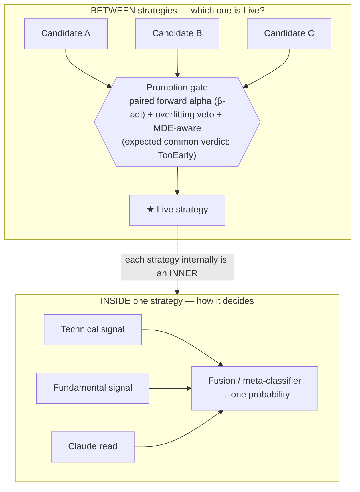
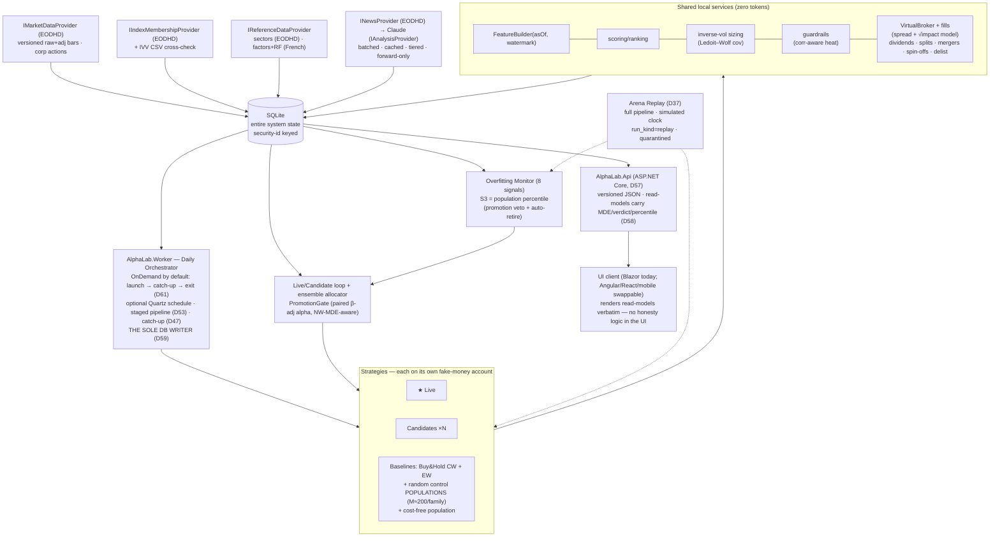
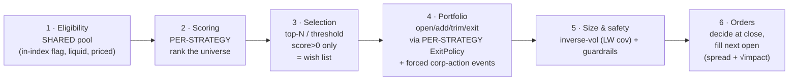

# AlphaLab — **Master Design Document v1.9** (Consolidated, pre-implementation)

*The single reference for the whole system. Consolidates every decision made during design. Deep-dive companions exist for strategies (STRATEGY_CATALOG_v1.9), design improvements & factor research (DESIGN_IMPROVEMENTS_v1.9), and the overfitting monitor (OVERFITTING_MONITOR_v1.9); this document is the map and points to them where detail lives.*

> *Design revision v1.9. Build status is live, not pre-implementation: Phase 0 and Phase 1 have shipped and Phase 2 (funnel + ledger) is merged. The full pass-by-pass history (v4/v5/v6 through the v1.9.21 AI-role pass, every CHANGELOG finding and decision D1-D82) lives in `docs/CHANGELOG_v1.9.md`; current phase, test count, and the open-item list live in `PROGRESS.md`. Consult those two rather than any count or status quoted inline, which may lag.*

> **What this is:** a personal, local, daily paper-trading **research laboratory** for discovering — honestly — **which trading strategies actually work, when, and why.** Pure C#/.NET, SQLite, a Blazor GUI, and Claude used only as a text-reading research assistant.
>
> **What it is not:** a product, a financial advisor, or a source of real-money trade recommendations. No real broker, no real orders, no real money. Simulated results do not predict real returns. **Not investment advice.**

> **What the v1.8 pass added over the prior design pass:** a second review pass closed seven residual gaps and merged the fixes directly into this document set. New decisions **D50–D56**: the PIT **regime-label algorithm** is now specified (D50, §20.1); the **ensemble allocator** — the primary improvement mechanism — is fully specified (D51, §20.2 and DESIGN_IMPROVEMENTS_v1.9 §3.5); the **research journal / hypothesis registry** exists as a real subsystem with a table, FRs, and screens (D52, §20.3); the daily run is **restaged** so the atomicity claim is physically implementable — fetch outside the transaction, one atomic write transaction per day, LLM batch post-commit (D53, §20.4); a **trading-calendar service** removes the last silent data dependency (D54, §20.5); manual **admin interventions** are first-class, typed-confirmed, and audited (D55, §20.6); and Monitor **S3's thresholds become track-length-aware trajectories** so the monitor stops contradicting §1.1's own power math (D56, §20.7). Errata merged: D43's liquidity buckets are keyed by **21-day ADV notional**; the control populations carry an explicit compute-vectorization requirement; the equal-weight benchmark convention is pinned. Four new FRs' worth of tests, three new UX rules (UX-9…11), and a fourth mockup (`allocation_journal_ops_ux_mockups.html`) ship with this.
>
> **Plus (UI-swappability pass) D57–D58:** the GUI is decoupled from the rest of the system behind a real HTTP boundary. A new **`AlphaLab.Api`** project (ASP.NET Core minimal-API, D57, §21) exposes every screen's data and every user command as versioned JSON endpoints; the Blazor front end is rebuilt as a **pure client of that API**, and any other front end (Angular, React, a mobile app) can consume the identical contract. All presentation logic that carries the honesty guarantees — MDE dimming, verdict tiers, population-percentile chips, allocation-clamp attribution, replay quarantine — moves out of the UI into **serializable read-model DTOs computed once in C# (D58, §22)**, so no front end can accidentally render a number the backend would have dimmed. Blazor becomes one interchangeable client; the honesty rails live server-side, under test, shared by all clients. **A follow-up coherence pass (D59–D60) re-homes the daily job in a dedicated `AlphaLab.Worker` process (the sole DB writer) now that AlphaLab.Web is a thin client, and pins the API contract conventions — versioning, a uniform error envelope, an async-job pattern for replay/LLM commands, read-models stamped with their `run_id`+watermark, and float-free money — so any second client is a genuine drop-in.**

> **What this revision (v1.9) added (verdict-economics + calibration-realism pass, D63–D65):** an internal review found that the design's own "falsification is fast" claim contradicted its own control construction — because the random populations are **turnover-matched and cost-inclusive** (D36), a merely edgeless strategy pays the same cost drag as its controls and sits at the **median** of its band, not below it; fast auto-retire only ever catches **anti-predictive** strategies. **D63** corrects the verdict economics: **`IndistinguishableFromRandom`** becomes a first-class, rendered outcome (§20.8, UX-12, FR-35), the §1.2 KPIs are re-split into *anti-predictive detection speed* and *indistinguishability honesty*, and fast-kill language is reserved for the two channels that genuinely deliver it (the trade-level expectancy track, which tests against zero rather than a cost-matched null, and S3/S6 breaches below `P_noise(t)`). **D64** specifies the previously unspecified **planted-strategy fixtures** on which all D56 calibration rests: regime-conditional, autocorrelated, lumpy edge injection (never constant drift), an explicit **anti-predictive plant**, multi-seed medians with bands, a mandatory naive-vs-realistic **plant-sensitivity check** archived with the calibration report, and a data-vintage caveat stamped on the curves themselves (§20.9, FR-36). **D65** sanctions the **thin vertical slice** as the build order: the strategic target is reaching Phase 4 (Arena Replay) fastest — S&P 100, API-only operation (via the Scalar UI), the D58 read-models fully built and tested on schedule (the honesty lives there), with Blazor screens as a deferrable parallel workstream due before Phase 7 exit (§17.1).

---

## 0. Design-refinement history (how the design reached v1.9)

*The design was hardened across several review passes; the earliest predate the build, later passes reconcile shipped phases back into the design. Historical labels below (v4/v5/v6) name the early passes, not shipped versions. This section summarizes the largest pass (the "v6" external-review pass); the subsequent gap-closure, UI-swappability, and verdict-economics/calibration-realism work is captured in the v1.8 and v1.9 banners above and in the decision log.*

### The external-review pass (historically "v6")

v5 closed the soft spots where phantom alpha could be manufactured *inside* the system. v6 is the response to an external design review, and it closes two different classes of gap: **(A) unhandled real-world data dependencies** that would have silently broken the system on contact with live data, and **(B) an honesty gap in the system's own stated purpose** — the power math in v5's Appendix C, taken to its conclusion, implies that "crowning a winning strategy" on forward daily data is a decades-scale problem, so the system's success criteria are now defined around what it *can* deliver on human timescales. In one list:

1. **Success criteria reframed around falsification (D38).** Detecting the realistic prize (1–3%/yr β-adjusted alpha, per the long-only haircut) at conventional confidence requires **years to decades** of forward data even with paired testing — the arithmetic is in §1.1. The system's measurable objectives are therefore: fast, trustworthy **falsification** of no-edge strategies; honest **`TooEarly`** verdicts; regime education; and factor attribution ("what is my strategy really?"). Binary promotion is expected to be a **rare, ceremonial event**, and the system's KPIs (§1.2) do not include "found a winner."
2. **EODHD becomes the named primary data provider (D35)** — daily bars (raw + adjusted), splits & dividends, **index membership with historical constituents**, **sector/industry classification**, and a news feed — one validated subscription closing three previously-silent data dependencies (membership, sectors, news) at once. Alpaca is retained behind `IMarketDataProvider` as the free cross-check/fallback provider. Every data feed now has a **named source, a validation method, and a fallback** (§13).
3. **Random controls become populations, not single twins (D36).** One seeded random twin is one noise path — comparing against it is itself a coin flip. Each cadence family now runs a **population of M seeded random controls (default M=200)** and Monitor S3 becomes a **percentile-rank test against the population's band**. Controls need no market-data budget and trivial compute; this is the cheapest large upgrade to the system's discriminating power.
4. **Arena Replay mode (D37):** the full pipeline — funnel, ledger, gate, monitor, allocator — can run over historical data on a simulated clock, clearly labeled `replay`, **never admissible as forward evidence**, used to (a) validate the judging machinery itself (do the gates promote randoms ≤ chance over 15 simulated years?), (b) calibrate monitor thresholds before years of wall-clock pass, and (c) shake out bugs. The v5 backtest engine is subsumed into this as the strategy-seeding special case.
5. **Security master with permanent identity (D39).** Symbols are not identities: ticker changes (FB→META), ticker reuse, spin-offs, and cash/stock/mixed mergers would have presented to the v5 pipeline as spurious delistings and unrelated new listings, corrupting held positions and the append-only guarantee's usefulness. v6 adds `security_id` as the permanent key, a ticker-history table, and full corporate-action coverage (dividend, split, ticker change, merger cash/stock/mixed, spin-off, delist) with defined ledger semantics for each (§13.6).
6. **Bar-revision policy (D40).** Providers correct bars after the fact; "append-only, never delete" collides with corrections unless revisions are first-class. Bars are now **versioned append-only** (`(security_id, date, version, observed_at)`); nothing is ever updated or deleted; each run pins a **data watermark** so determinism (NFR1) is defined as *same inputs + same data snapshot + seeds → identical outputs*, and any run is reproducible forever against the snapshot it saw.
7. **Factor-attribution and risk-free data sources named (D41).** The attribution regression (market, size, value, momentum, profitability-as-quality proxy) uses the **Ken French Data Library daily factor series** (free; updated with a publication lag), and the **risk-free rate is the French RF series** (FRED 3-month T-bill as fallback). Attribution is **diagnostic-only** — never a trading input — so the lag is acceptable and documented rather than silently ignored.
8. **Covariance estimator specified (D42):** the correlation-aware heat guardrail and inverse-vol sizing use **Ledoit–Wolf shrinkage** on 252-day daily returns (EWMA single-index fallback). A raw sample covariance of a 500-name universe is singular and of a 40-name book is noisy; "supplied covariance matrix" is no longer hand-waved.
9. **Slippage model parameterized (D43):** fills pay **half-spread by liquidity bucket + square-root market impact** `k·σ_daily·√(Q/ADV)` with stated defaults (k=0.1, participation cap 2% ADV) — because the cost model is the single most consequential number for whether momentum survives net, it cannot be an unstated shape.
10. **Trade-level evidence track (D44):** strategies with many short trades (fast mean reversion) accrue per-trade expectancy evidence far faster than daily-return alpha regressions; a per-trade expectancy test (block-corrected for clustering) is now a parallel evidence channel with its own MDE, so verdict speed matches each strategy family's natural sample rate.
11. **Regime evidence counter (D45):** every regime-conditional statement carries the **number of distinct regime episodes observed** ("momentum leads in bull markets — n = 1 bull episode" is an anecdote, and the UI now says so). Prevents the regime dashboard from becoming a story generator.
12. **LLM economics tightened (D46):** the daily read runs on the **Anthropic Message Batches API** (scheduled, non-interactive — half price), with **prompt caching** for the static instruction block and **per-task model tiering** (cheap model for news extraction/classification; stronger model for research briefs and skeptic reviews). The **news ingestion budget** is specified (the token sink was never the call count — it's how much raw text enters the prompt): article caps, per-article truncation, dedupe. The daily **sentiment score is demoted to experimental** status; the research-assistant roles (briefs, hypotheses, skeptic) are the primary LLM value, and the with/without-Claude blend A/B remains the mechanism that prices the score.
13. **Multi-day catch-up protocol (D47):** a laptop that was off for a week replays missed trading days **in order** — bars delta → corporate actions → membership refresh → funnel — one ACID transaction per day, using as-of membership reconstructed from EODHD's historical constituents. Idempotent single-day re-runs existed in v5; ordered multi-day recovery did not.
14. **MDE autocorrelation correction (D48):** Appendix C's formula assumed i.i.d. daily differences; active-return differences are autocorrelated, which understates σ and makes the honesty metric itself optimistic. The MDE now uses the **Newey–West long-run variance** of the paired difference series (OVERFITTING_MONITOR_v1.9 Appendix C).
15. **MVP discipline note (§17.1):** the biggest risk to the project is scope, not statistics. The Phase 0–3.5 stretch is the longest run of build before a real strategy exists; the phase gates are the protection, and `PROGRESS.md` is the most important document throughout.

Everything from v5 that the review endorsed is carried forward unchanged: the two-layer mental model, β-adjusted (Jensen's) alpha with IR (D26), dual benchmarks (D27), turnover matching (D28 — now applied to populations), per-strategy exits/horizons (D29), ledger realism (D30), paired tests + MDE (D31), inverse-vol default sizing (D32), the PIT fundamentals gate (D33 — now with EODHD named as the first candidate source to validate), and PIT regime labels (D34).

---

## 1. Purpose & guiding philosophy

The system exists to answer one question rigorously: *does a strategy have a real edge — and if so, when and why?* Everything is built around not fooling yourself.

- **Build to falsify, not to confirm.** Success is not "it showed an edge." Success is that you can **trust** what it tells you — including the very likely verdict that most strategies don't beat buy-and-hold after costs. A tool that can only confirm is a mirror; a tool that can falsify is a laboratory.
- **Forward paper P&L is the only judge.** Never backtest numbers, never in-sample results. (Arena Replay exists to judge the *machinery*, never the strategies — D37.)
- **Judge by expectancy and risk-adjusted return, never win rate.**
- **Comparisons must be fair before they can be honest.** Same eligibility pool, turnover-matched control populations, beta-adjusted alpha, benchmarks that match the portfolios' construction.
- **Know what the data can and cannot say — and say it.** Every comparison ships with its (autocorrelation-corrected) minimum detectable effect; `TooEarly` is a first-class verdict and the expected common case.
- **Every data feed has a named source, a validation method, and a fallback.** No silent dependencies (D35, D39, D40, D41). The v5 design correctly refused to fake fundamentals (D33); v6 applies that same standard to membership, sectors, factor returns, the risk-free rate, and news.
- **Local math does the work; Claude only reads text.** The numeric spine costs zero tokens; the LLM is a small, cached, batched, forward-only research aid.
- **Honesty rails are load-bearing, not ceremony:** costs always on with a parameterized impact model, β-adjusted alpha vs construction-matched benchmarks, random control **populations** as the noise floor, out-of-sample discipline, and an overfitting monitor wired to consequences.

### 1.1 The power reality (read this before expecting a winner)

Run the MDE arithmetic forward (formula in OVERFITTING_MONITOR_v1.9 Appendix C). The realistic prize for a long-only, large-cap factor tilt is **1–3% annualized β-adjusted alpha** (DESIGN_IMPROVEMENTS_v1.9 §2). With paired testing shrinking the daily active-return-difference volatility to an optimistic σ_d ≈ 0.2%/day, detecting a **2%** annualized alpha at 95% confidence / 80% power requires

`√T = 2.8 × 0.002 × 252 / 0.02 ≈ 70.6  ⇒  T ≈ 5,000 trading days ≈ 20 years.`

Even at one full year of track, the MDE is ≈ 9% annualized — three to five times the entire realistic prize. Only very tight pairing (σ_d ≈ 0.1%/day, achievable when Candidate and Live differ in one component) brings a 2%-alpha verdict inside ~5 years. **Therefore:** the `TooEarly` verdict will dominate the system's useful life, and binary promotion on a distinguishable alpha gap is expected to be **rare**.

**Be precise about the asymmetry (D63) — it is *not* "losers are retired in months."** Because the random control populations are turnover-matched and cost-inclusive (D36), a merely edgeless strategy pays the same cost drag as its controls and therefore sits at the **median** of its population band indefinitely: the population channel can never *falsify* it, only declare it **`IndistinguishableFromRandom`** (§20.8). That statement — "after N days, this idea cannot be told apart from coin flips with identical mechanics" — arrives in months, is rendered explicitly (never silently folded into `TooEarly`), and is the lab's honest, fast, and most common product. Genuinely *fast kills* exist on exactly two channels: **(a)** the **trade-level expectancy track (D44)**, which tests mean net P&L per trade against **zero** rather than against a cost-matched null — a high-turnover strategy with negative net expectancy is dead after a few hundred trades; and **(b)** **anti-predictive** behavior — a sustained percentile path below `P_noise(t)` (S3) or decay through the band (S6), i.e. performing *worse than random*, which triggers Suspect and auto-retire. The ensemble allocator — small continuous tilts under uncertainty — is the primary improvement mechanism precisely because it is the honest action under low power.

### 1.2 What "success" measurably means (D38)

The system's KPIs — the things it is graded on — are properties of the *laboratory*, not of any strategy:

| KPI | Measured how |
|-----|--------------|
| **Verdict honesty** | Every rendered comparison carries a correct, autocorrelation-corrected MDE; no gap smaller than its MDE is ever presented or acted on as a verdict |
| **Anti-predictive detection speed** | Median days for an injected *anti-predictive* strategy (worse than its matched population — the D64 anti-plant) to reach Suspect/auto-retire — measured in Arena Replay (D37) against the D64 plants, tracked live |
| **Indistinguishability honesty** | Every strategy whose percentile path has stayed inside its population's central band past `Verdicts.SeparationMinTrackDays` renders an explicit **`IndistinguishableFromRandom`** state (D63, §20.8) — never a silent, indefinite `TooEarly`; median days-to-statement for a no-edge plant recorded in replay |
| **Edge-plant survival (v1.9.7)** | Fraction of D64 *edge* plants (≥50 seeds) still in the promotable pool at 5y/10y of simulated track, measured in Arena Replay; Phase-4 DoD floor `Replay.EdgePlantSurvivalFloor5y` (default 0.90), every edge-plant auto-retire logged with its triggering signal — the lab must not auto-retire its own honest small winners |
| **Control calibration** | Random controls promoted ≤ chance; each population's gross alpha band centered on zero; net band offset ≈ its modeled cost drag |
| **Leakage integrity** | The leakage suite (incl. PIT regime labels, PIT fundamentals when present) permanently green in CI |
| **Attribution coverage** | Every strategy with ≥ 1y of track has a factor-attribution decomposition answering "what is this, really?" |
| **Operator learning** | The research journal accumulates pre-registered hypotheses with recorded outcomes |
| **Allocator value-add (v1.9.21)** | The D51-blended portfolio vs a static equal-weight-across-strategies portfolio, as a paired comparison with its own NW-MDE; validated in Phase-4 replay against the D64 plants (the allocator must overweight edge plants and shed anti-plants faster than equal weight) - D82(e), §23.4 |
| **Researcher yield (v1.9.21)** | AI-proposed hypotheses accepted / refuted / confirmed, each citing parent evidence; median days-to-kill; fork-budget spend rendered beside the deflated-Sharpe trials count - D82, §23.4 |

A rising equity curve appears nowhere in that table. If the lab produces trustworthy "no edge," "too early," and "this is just repackaged momentum" verdicts, it is succeeding.

---

## 2. Decisions log (what we chose, and why)

The decision numbers are stable identifiers used throughout the build; the version labels (v4/v5/v6) simply record *which design pass* introduced each group. D1–D25 come from the initial design ("v4"), D26–D34 from the first review pass ("v5"), **D35–D48 from the external-review pass ("v6")**, D50–D56 from the gap-closure pass, D57–D62 from the UI-swappability, coherence, and naming passes, **D63–D65 from the verdict-economics + calibration-realism pass, D66–D67 from the build-readiness pass, D68–D69 from the v1.9.1 consistency pass, D70 from the v1.9.2 consistency pass, D71 from the v1.9.3 multi-arena pass, D72–D73 from the v1.9.7 deep-dive pass, D74–D75 from the v1.9.9 Phase-1 reconciliation pass, and D76–D78 from the v1.9.13 pre-Phase-2 schema-decisions pass (corporate-action versioning, `data_quality_flags`, the cross-sectional bar read), and D79–D82 from the v1.9.21 AI-role pass (the three AI seats, the context-pack contract, contestant determinism/evidence rules, and the researcher loop + trials budget — §23)** — all consolidated here as revision **v1.9** (v1.9.1/v1.9.2 errata merged; D71 detailed in `ARENA_ARCHITECTURE_v1.9.3.md`). One-line summaries are retained so the *why* is never lost.

| # | Decision | Rationale |
|---|----------|-----------|
| D1 | Personal research tool, not a product | Reg/competition burden isn't worth it; value is idea generation + learning |
| D2 | Simulation, not advice | Avoids adviser classification; keeps it a lab |
| D3 | SQLite (one file) | Zero infra; upgrade only if hosting ever needed |
| D4 | Claude via the Anthropic API, not local Ollama | No GPU dependency; stronger reasoning; model is config |
| D5 | *(Hosting model superseded by D57/D67)* Blazor GUI from day one | Watch the lab run; pure C#. The client is now a **standalone Blazor WebAssembly** app consuming `AlphaLab.Api` (it can never hold secrets or domain references) |
| D6 | Daily cadence only; intraday deferred behind interfaces | Calmer, cheaper, cleaner to evaluate |
| D7 | Local math does all calculation; Claude only reads text | Deterministic and free |
| D8 | Live vs Candidate loop judged on forward P&L | Honest selection |
| D9 | Plain financial naming | Understandable to anyone |
| D10 | Metrics = expectancy, Sharpe/Sortino, alpha, drawdown, profit factor — not win rate | Win rate is uninformative |
| D11 | Factor-based roster with decay awareness | Decades of evidence; modest, decaying edges |
| D12 | Diversification + robustness over optimization | Knife-edge optima = noise |
| D13 | Overfitting Monitor as a first-class gate | Makes self-deception enforceable |
| D14 | Alpha vs benchmark; permanent Buy&Hold + Random controls | Skill vs drift vs noise floor |
| D15 | Meta-classifier is a fusion component, not the architecture | Scope containment |
| D16 | Claude reads are forward-only | Today's model knows past futures |
| D17 | Frozen-parameter rule; changes fork a new strategy | No tuning-until-green |
| D18 | Claude repositioned as research assistant | Higher value than a sentiment number |
| D19 | *(Superseded by D35)* Alpaca as first market-data provider | Was: genuinely free; retained as cross-check/fallback |
| D20 | Universe = current S&P 500, membership-over-time | Liquid default; membership is state, not filter |
| D21 | Append-only history — never delete bars | Survivorship, valuation, audit trail |
| D22 | ACID + WAL + file-copy backups + snapshot-before-migration; SQLite kept | Single-writer daily tool |
| D23 | Goodhart defense: trials registry + deflated Sharpe + controls + S8 + no-hand-tuning | The researcher is the deepest risk |
| D24 | Enforced LLM cost cap + shortlist cap + graceful degradation | Runaway cost structurally impossible |
| D25 | LM Studio as optional dev/test + A/B contestant, not auto-failover | Consistent signal beats cheap inconsistency |
| D26 | Alpha = beta-adjusted (Jensen's) alpha + IR; never a raw return gap | Low-beta strategies otherwise structurally rigged to lose |
| D27 | Dual permanent benchmark: cap-weight + equal-weight | Equal-weight/size effect otherwise reads as alpha |
| D28 | Turnover-matched random controls + cost-free reference | Control differs from strategy only in random picks |
| D29 | Exits/horizons are per-strategy spec (`ExitPolicy`); zero-score never selectable | Exits are strategy logic; Kelly's `b` undefined without horizons |
| D30 | Ledger conventions: raw prices, ex-date dividends, split share-adjustments, delist force-exit; signals on adj_close | ~1.5%/yr phantom alpha otherwise |
| D31 | Paired tests on daily active-return differences; MDE beside every comparison; ensemble weights primary | The cheapest large power upgrade; honest low-power action |
| D32 | Default sizer inverse-vol under a portfolio vol target; Kelly Phase 6+ opt-in | Kelly's inputs unestimable early; correlation ignored per-position |
| D33 | Fundamental strategies contingent on a named, validated PIT source (Phase 8) | Free PIT fundamentals essentially don't exist |
| D34 | Regime labels must be point-in-time computable + leakage-suite covered | Retrospective labels are look-ahead |
| **D35** | **EODHD is the primary data provider** — raw+adjusted daily bars, splits/dividends, **index constituents (current + historical since 2000)**, **sector/industry classification**, and news, on the All-World/Fundamentals tier — behind `IMarketDataProvider` / `IIndexMembershipProvider` / `IReferenceDataProvider` / `INewsProvider`. **Validation:** membership cross-checked daily against the free iShares IVV holdings CSV (divergence alerts; count sanity 495–510); bars cross-checked on a rotating sample against Alpaca's free tier. **Fallbacks:** Alpaca (bars), Wikipedia scrape (membership), static GICS snapshot (sectors, with staleness alarm) | One validated ~$20–30/mo subscription closes three previously **silent** data dependencies (membership, sectors, news) that Alpaca cannot provide, and restores the originally-intended source. Dual-source validation is what makes it "named and validated" per the D33 standard, not just named |
| **D36** | **Random control populations:** M seeded random controls per cadence family (default **M=200**; config), sharing the family's breadth, sizing mode, `ExitPolicy` shape, and cost model; Monitor **S3 becomes a percentile-rank test** of the strategy against its population's distribution; charts render the population's 5–95% band; one cost-free population (smaller, M=50) tracks pure noise for display. Controls are simulated as lightweight ledger-only accounts (no GUI accounts) | A single twin is one noise path — the v5 S3 two-sample test against it was itself noisy (the control could be a lucky or unlucky coin-flipper). A population gives a stable empirical null distribution at near-zero cost (randoms need no data and trivial compute); "the strategy sits at the 97th percentile of 200 matched randoms" is a far stronger and more stable statement |
| **D37** | **Arena Replay:** the entire pipeline (funnel, ledger, gate, monitor, allocator, populations) runs over historical windows on a simulated clock. Everything it produces is stamped `run_kind='replay'`, stored in parallel (`*_replay` scoping), **never admissible as forward evidence, never displayed beside forward numbers, never a promotion basis**. Its jobs: machinery validation (randoms promoted ≤ chance over 15 simulated years; anti-predictive detection-speed and days-to-indistinguishability KPIs, D63), **threshold calibration** for the monitor's config defaults, multi-day catch-up testing, and bug-shaking. The v5 walk-forward backtest engine becomes the strategy-seeding special case of this machinery | v5's monitor thresholds (`suspect_below: 0.25`, `auto-retire after 4`, …) were guesses that forward operation would take years to falsify; Phase 3's own acceptance test ("randoms promoted ≤ chance over a long simulation") already required full-arena simulation — v6 makes it a first-class, permanently-available, clearly-quarantined mode |
| **D38** | **Success criteria reframed around falsification and lab-level KPIs.** Detecting the realistic 1–3%/yr prize needs years-to-decades (§1.1), so the system is graded on §1.2's *laboratory* KPIs — verdict honesty, anti-predictive detection speed, indistinguishability honesty (per the D63 re-split), control calibration, leakage integrity, attribution coverage, operator learning — never on "found a winner"; `TooEarly` is the expected common verdict and binary promotion a rare, ceremonial event | The MDE arithmetic makes "crown a winner" a decades-scale objective; promising it would be exactly the class of overclaim the lab exists to prevent. Grading the lab on its own trustworthiness is the only honest success definition (§0 item 1, §1.1–1.2, Golden Rule 3) |
| **D39** | **Security master:** `security_id` is the permanent identity key everywhere (positions, bars, trades); tickers are time-ranged aliases in `ticker_history`. Corporate-action coverage extends to **ticker changes, cash mergers, stock mergers, mixed mergers, and spin-offs**, each with defined ledger semantics (§13.6). EODHD symbol-change and corporate-action feeds drive it; unmapped events fail closed (position frozen + operator alert, never silently mispriced) | Ticker changes (FB→META) and reuse would present to a symbol-keyed pipeline as a delisting plus an unrelated listing — corrupting held positions, history joins, and the audit trail within the first year of live running. Spin-offs create positions out of nothing; the v5 ledger had no way to express that |
| **D40** | **Versioned append-only bars:** bar corrections are inserted as new `(security_id, date, version, observed_at)` rows — **never UPDATE, never DELETE** (CI greps for both). Each run records a **data watermark** (max `observed_at` visible to it); reads resolve to the latest version ≤ the watermark; determinism (NFR1) is redefined as *same inputs + same watermark + seeds → identical outputs*, making every historical run reproducible forever against the exact data it saw | Providers revise bars after the fact. Silent in-place correction breaks determinism and the audit trail; refusing corrections keeps known-bad prints. Versioning gives both PIT purity ("what did we believe that day") and eventual accuracy ("what do we believe now"), explicitly |
| **D41** | **Factor & risk-free sources named:** attribution regresses on the **Ken French Data Library daily factors** (Mkt−RF, SMB, HML, UMD, RMW as the quality proxy; optional CMA), refreshed monthly with the library's publication lag; **RF = the French RF series** (FRED DGS3MO fallback). Attribution is **diagnostic-only** — never a trading input, never in the funnel — so the lag is acceptable and stated on the panel ("factor data through <date>") | §3.4's regression was specified with no data source — the same class of silent dependency D33 exists to prevent. Diagnostic-only framing is what makes a lagged free source acceptable |
| **D42** | **Covariance = Ledoit–Wolf shrinkage** on 252 trading days of daily returns over the relevant name set (held + wish-list); fallback: EWMA (λ=0.97) single-index model on numeric failure. Used by the correlation-aware heat guardrail and any portfolio-vol computation. Estimator + window are config and logged per run | A raw sample covariance is singular for 500 names and noisy for 40; "supplied covariance matrix" was hand-waved in v5, making the heat guardrail's "predicted portfolio vol" numerically fragile fiction |
| **D43** | **Slippage model parameterized:** per-fill cost = commission (config, default $0) + **half-spread by liquidity bucket** (keyed by **21-day ADV notional** — mega ≥ $400M/day: 1bp; large ≥ $100M/day: 2.5bp; other: 5bp) + **square-root impact** `k · σ_daily · √(Q/ADV)` with default `k=0.1`, and a **participation cap** Q ≤ 2% of 21-day ADV (excess quantity is rejected, logged, and surfaced — capacity awareness made concrete). All coefficients config; the cost model version is stamped on every fill | Whether momentum survives net of costs is the single most consequential number in the system; an unstated cost shape is an unfalsifiable one. Square-root impact is the standard, defensible retail-scale default |
| **D44** | **Trade-level evidence track:** strategies whose natural unit is the trade (fast mean reversion, breakout) additionally accrue a **per-trade expectancy test** — mean net P&L per trade with a moving-block bootstrap (trades cluster in time and regime), its own MDE, and the same `TooEarly` discipline. Rendered beside, never instead of, the daily-alpha track | A 5-day-holding strategy produces hundreds of trades while a monthly rebalancer produces dozens of daily-return observations' worth of information; forcing all families through the daily-return lens wastes the fast families' sample rate. Block correction keeps the extra power honest |
| **D45** | **Regime evidence counter:** every regime-conditional metric displays **n = number of distinct regime episodes observed** (not days), and any regime claim with n < 3 episodes is rendered with an explicit "anecdote" badge. Episode = a maximal contiguous run of one PIT label | A few years of forward data contains perhaps one bear market; "momentum leads in bulls" from n=1 episode is a story, not a finding. The regime dashboard must carry its own power honesty like every other screen |
| **D46** | **LLM economics:** daily reads run on the **Anthropic Message Batches API** (scheduled + non-interactive ⇒ half price); the static instruction block uses **prompt caching**; **per-task model tiering** (cheap/fast model for news extraction & classification; stronger model for research briefs, regime summaries, skeptic reviews) is config per task. The **news ingestion budget** is enforced upstream of the provider: max articles per read (default 25), per-article truncation (default 2,000 chars after local extraction), title-hash dedupe, universe/macro relevance filter. The daily sentiment **score is demoted to experimental** — the research-assistant roles are the primary LLM value; the with/without-Claude blend A/B remains the mechanism that prices the score, with the stated expectation that it may price near zero | Cost was already capped (D24); v6 optimizes within the cap and names the true token sink — raw news text entering the prompt, not call count. Honesty about the score: a single market-level number is a low-information feature, and the A/B that judges it faces the same MDE reality as everything else |
| **D47** | **Multi-day catch-up protocol:** on startup the orchestrator computes missed trading days and replays them **strictly in order** — per day: bars delta → corporate actions → membership refresh (as-of, reconstructed from EODHD historical constituents) → funnel — one ACID transaction per day, resumable, idempotent. A `catchup_log` records each recovered day | Personal systems fail here constantly; single-day idempotency (v5) does not compose into correct week-long recovery without ordered replay and as-of membership |
| **D48** | **MDE uses the Newey–West long-run variance** of the paired daily difference series (`σ_LR` replaces `σ_d`; lag by the strategy pair's max holding horizon, capped) in Appendix C; the same correction applies to the trade-level track's block bootstrap | Active-return differences are autocorrelated; the i.i.d. formula understates σ and makes the anti-overclaiming number itself overclaim. The honesty metric must be honest |
| **D49** | **Budget-tier launch configuration:** EODHD "All World" (~$19.99/mo) at launch — bars/splits/dividends/news from EODHD; **membership: IVV holdings CSV primary + Wikipedia cross-check** (dual free sources; D35's fail-closed validation unchanged); **sectors from the IVV CSV's GICS column**; replay as-of membership seeded from the free community CSV (caveat logged); the EODHD-constituents slot stays dormant behind `IIndexMembershipProvider`. **Phase 8 entry condition:** upgrade to a fundamentals-bearing tier for one trial month → run the §7.0 PIT protocol → keep the tier only on a pass. Secrets live in one gitignored `appsettings.Secrets.json` — never in the repo (D67; SETUP_v1.9 §5) | Phases 0–7 — the complete core laboratory — run properly on the cheapest tier; the only blocked phase (8) was already contingent, and the interface seams make the eventual upgrade a provider swap plus a config flip, not a rewrite |
| **D50** | **Regime labels specified:** PIT label = **trend × volatility** on the cap-weight proxy. Trend: `bull` if adj close > 200-day SMA else `bear`, with **hysteresis** (flip requires ≥1% beyond the SMA for 5 consecutive sessions; config). Volatility: `high_vol` if 21-day realized vol ≥ its own trailing 3-year 80th percentile (same 5-day confirmation) else `normal_vol`. Four labels; episodes (D45) run on the trend component. Full spec §20.1; params in CONFIG `Regime.*`; ships with F-LEAK + a hysteresis fixture | The label was load-bearing (S5, regime halts, dashboard, episode counter) but undefined — the one undocumented decision on the quant path. Hysteresis prevents label flapping from manufacturing spurious "episodes" |
| **D51** | **Ensemble allocator fully specified:** shrink each strategy's forward net β-adj alpha toward the roster mean by its own NW standard error (James–Stein-style; short tracks ⇒ ~equal weight), map shrunk alphas to targets via a bounded softmax (temperature config), then clamp in order: floor/ceiling → TooEarly tilt cap → Suspect freeze/decay → ±band movement → renormalize. Every input persisted to `allocation_log` (weight reconstructible, NFR-2). Full math §20.2 / DESIGN_IMPROVEMENTS §3.5 | The doc named the allocator the *primary* improvement mechanism, then specified it in one paragraph — the largest improvisation surface in the build. This uses only quantities the gate already computes and degrades to equal weight exactly when evidence is weak |
| **D52** | **Research journal / hypothesis registry:** new `journal_entries` table (kinds: hypothesis, observation, decision_note, skeptic_review, outcome). CandidateFactory **requires** a linked, immutable-once-locked hypothesis (falsifiable claim + confirm/refute metric + pre-declared evidence window) or an explicit `unregistered` flag rendered permanently on the strategy card; retirement/verdict triggers an outcome-closure nag. The §1.2 "operator learning" KPI is measured from this table | The KPI and Golden Rule 18 mandated pre-registration but no table, FR, or screen existed — a stated KPI was unimplementable. Mechanizing the link turns discipline into plumbing |
| **D53** | **Daily run restaged:** Stage 1 **fetch** (all provider HTTP, zero DB writes, payloads to raw-cache, quality gate on staged data; hard failure aborts before any row); Stage 2 **commit** (ONE atomic write transaction: bars → actions → membership → features → regime label → funnel+fills → metrics → cadence-day monitor/gate/allocator → run row); Stage 3 **LLM** (batch submitted post-commit; results land in their own small transaction whenever ready; late/missed = a no-read day). Invariant reworded: **one atomic write transaction per trading day** (Golden Rule 16). Catch-up = Stages 1–2 per missed day; no Stage 3 for past days (D16) | As previously written, a SQLite write transaction spanned third-party HTTP calls *and* an async batch that can take hours — stalling WAL readers and making atomicity hostage to network latency. Staging keeps the real correctness property and drops the impossible one |
| **D54** | **Trading calendar is a named, validated feed:** `trading_calendar(date, session∈{full,half}, close_time_local)` seeded ±30y from NYSE holiday rules, spot-validated vs ≥2 exchange notices; `ICalendarService` answers is-trading-day / prev-next session / sessions-between / close time. Consumers: orchestrator trigger (session close + config offset, ET-anchored so DST never shifts the run vs the market), D47 catch-up, decide-at-close/fill-at-open pairing, warm-up counting | "Missed trading days," T/T+1 pairing, and "18:30 local" all presupposed a calendar no document specified — exactly the silent-dependency class D35 exists to eliminate |
| **D55** | **Admin actions first-class & audited:** the two manual paths (insert a typed corporate action to unfreeze a position; override a persistent membership divergence) become GUI actions behind a **typed confirmation** (retype the symbol), passing the same validation as provider rows, writing the domain row (`source='manual'`) + an `admin_actions` audit row (who/when/what/why/affected accounts), then re-running the affected ledger step in its own transaction. No other manual write path exists (Golden Rule 29) | The runbook depended on an "admin tool" with no FR, no audit trail, and no UI — an unaudited write path into the ledger, the most dangerous surface in the app |
| **D56** | **S3 thresholds become track-length-aware trajectories:** Phase-4 replay calibration produces `P_noise(t)` (envelope below which a no-edge strategy falls at the configured false-alarm rate) and `P_edge(t)` (median trajectory of a planted 2%/yr edge — plants specified by D64). S3 at track length t: **Suspect** below `P_noise(t)` sustained; **Healthy** above `P_edge(t)` sustained; **Warning** between. Flat anchors (Healthy ≥ 95th sustained / Suspect < 25th sustained — the Suspect anchor is the *anti-predictive tail*, D63-aligned) remain only as pre-calibration anchors. The S3 panel plots the strategy's percentile path against both curves | The flat thresholds contradicted §1.1: a genuine 1–3%/yr edge sits in the 60th–90th percentile for years, so the arena's steady state would have been every honest strategy permanently Warning/Suspect, feeding S6's auto-retire. Trajectories keep anti-predictive detection fast while only demanding separation the horizon can deliver |
| **D57** | **`AlphaLab.Api` is the single UI boundary.** A new ASP.NET Core minimal-API project sits between the core/evaluation services and every front end, exposing (a) **read endpoints** — one per §15 screen — returning the D58 read-models as JSON, and (b) **command endpoints** for the handful of user-initiated actions (create/pre-register candidate, request a research brief / skeptic review, apply a D55 admin action, launch a replay). The API owns auth-less localhost binding by default (personal tool), input validation, and an OpenAPI document (Scalar UI). Blazor is re-scoped as a **client** of this API; it holds no direct references to `AlphaLab.Evaluation`/`AlphaLab.Data` domain services. Full spec §21 | The UI must be swappable (Blazor → Angular/React/mobile) without touching the quant core. Blazor Server's in-process SignalR calling of C# services is not a boundary another framework can consume; a JSON API is. This also makes the eventual hosted/multi-client story a deployment change, not a rewrite. Cost: one thin project and a serialization pass — cheapest before Phase 0, painful after Phase 3 |
| **D58** | **Serializable honesty read-models.** Every screen is served by a plain-DTO read-model computed in `AlphaLab.Core`/`AlphaLab.Evaluation` (not in the UI), in which the honesty rules are already *resolved into data*: an α field ships with `{value, display: normal|dimmed, prefix: ""|"~", reason: "inside_mde"|…}`; a strategy row ships its `verdict_chip`, `tier`, and `population_percentile`; an allocation row ships each `clamp_bound` on the arrow it affected; every replay artifact ships `quarantined: true`. The UI's only job is to render these fields verbatim — it computes no thresholds, sorts no tiers, and decides no dimming. Tests move from Blazor view-model tests to **read-model unit tests** in `AlphaLab.Evaluation.Tests` (framework-agnostic) | If the honesty logic lives in the UI, every new front end re-implements it and can silently violate it (an Angular screen showing a green number the Blazor screen dimmed). Computing it once, server-side, into serializable data makes the guarantees **un-bypassable and shared by every client**, and makes the UX rules testable without a browser. This is what actually makes the swap safe, not just possible |
| **D59** | **Process model after the API split.** Two processes, one solution: **(1) `AlphaLab.Worker`** — a .NET Generic Host that owns the daily staged pipeline (D53) and catch-up (D47) and is the **sole DB writer**; it runs **on-demand by default** (launch → catch up → exit, D61) with an optional resident Quartz scheduler behind `Worker.Mode`. **(2) `AlphaLab.Api`** — the read/command HTTP boundary; its command endpoints perform *small, bounded* writes (create candidate, journal outcome, admin action) but **long-running or scheduled work it does not run itself** — it enqueues an intent the Worker executes. `AlphaLab.Web` (or any UI) is a third, optional process. All three open the same SQLite file in WAL mode; the single-writer guarantee holds because scheduled runs and catch-up live only in the Worker, and the API's bounded writes take the write lock briefly and never overlap a daily run (the Worker exposes a `run_in_progress` flag the API checks; a command arriving mid-run is queued, not raced). Replaces the earlier "scheduler in-process inside AlphaLab.Web," which D57 invalidated by emptying AlphaLab.Web of domain logic | After D57 the daily job had no home — AlphaLab.Web is now a thin client and the API must stay a thin boundary. A dedicated Worker is the honest owner of the one writer, keeps the API stateless and fast, and makes "the API was down but the lab still ran last night" true. Two tiny hosts beat cramming a scheduler into either the UI or the request pipeline |
| **D60** | **API contract conventions (so any client is a drop-in).** (a) **Versioned base path** `/api/v1/…`; breaking changes bump to `/v2` and the OpenAPI doc carries the version. (b) **Uniform error envelope** `{ error: { code, message, details? } }` with conventional status codes (400 validation, 404, 409 conflict e.g. command-during-run or stale pre-registration, 422 domain-rule rejection e.g. missing hypothesis / bad admin token, 503 when a dependency like the LLM budget is exhausted). (c) **Long-running commands are async jobs:** `POST /api/v1/replay` and the two `POST /api/v1/analysis/*` calls return **202 + `{ job_id }`**; progress arrives on `GET /api/v1/stream/jobs/{job_id}` (SSE) with a `GET /api/v1/jobs/{job_id}` poll fallback; the eventual result lands in its normal table and read-model. (d) **Read consistency:** every read-model carries the `run_id` + `watermark` it was projected from, so a client can tell whether it is seeing today's committed state (ties to NFR-1). (e) **Money/ratios as strings or integer minor units** in JSON — never floats — to preserve ledger exactness across languages. (f) **Time is UTC ISO-8601**; the market calendar (D54) supplies session/close context. All conventions are in the OpenAPI doc | "Returning the read-model" left the failure and long-running paths unspecified — exactly where a second client (Angular, mobile) would diverge or a replay launch would block a request thread for hours. Pinning the envelope, the async-job pattern, versioning, and float-free money makes the contract genuinely portable and the honesty numbers exact on every client |
| **D61** | **On-demand run mode is the default; the scheduler is optional.** `AlphaLab.Worker` supports two modes via `Worker.Mode`: **`OnDemand` (default)** — the Worker performs catch-up-through-the-last-completed-session and **exits**; this is the "open it each evening, it updates and quits" path for a machine that is not always on. **`Scheduled`** — the Worker stays resident and Quartz triggers the run at session-close + offset (D54), for an always-on host. **Both modes do the identical work** through the same catch-up protocol (D47) and staged pipeline (D53); the only difference is the trigger (you vs. a timer). On launch, either mode: compute missed sessions from the calendar, replay them in order (idempotent — a second launch the same evening is a no-op), and — the one guard — process only through the **last *completed* session**, never a half-run of a day whose close hasn't happened yet. Forward-only LLM (D16) is unchanged: catch-up days get ledger/metrics but no back-dated news read, so intermittent use yields sparser (never incorrect) LLM coverage | Quartz on a laptop that sleeps is the awkward fit — it fires whether or not the machine is awake, misses the trigger when asleep, then falls back to catch-up anyway. Catch-up (D47) was always the real engine; the scheduler only *triggers* work it already does. Making OnDemand the default matches how a personal, sometimes-off machine is actually used, removes a dependency that mostly doesn't help, and keeps `Scheduled` one config flip away for a future always-on box — no rewrite |
| **D62** | **Project name: AlphaLab.** The system is named **AlphaLab** and the .NET solution uses **`AlphaLab.*`** as its root namespace (`AlphaLab.Core`, `AlphaLab.Data`, `AlphaLab.Strategies`, `AlphaLab.Evaluation`, `AlphaLab.Llm`, `AlphaLab.Worker`, `AlphaLab.Api`, `AlphaLab.Web`, and mirrored `*.Tests`). "Alpha" names the exact quantity the lab measures honestly (β-adjusted alpha vs. construction-matched benchmarks and a random-control null); "Lab" preserves the research-not-advice posture. **Before publishing a repo, do the availability pass** — GitHub org/repo, NuGet package prefix, and a finance/dev-tool collision check — since the name is attractive and may be partly taken; the namespace itself is unaffected by any external collision | The name should read as finance on sight (a research lab that measures alpha) without implying a broker, fund, or advisory service — consistent with D1/D2 (personal research tool, not advice). A single root namespace keeps the swap-the-UI story clean and the solution legible |
| **D63** | **Verdict economics corrected; `IndistinguishableFromRandom` is a first-class outcome.** Because D36's populations are turnover-matched and cost-inclusive, an edgeless strategy sits at the **median** of its band — the population channel can never falsify it, only declare non-separation. Consequences: (a) each strategy carries a **`separation_state ∈ {none, emerging, distinguishable}`**, computed in the D58 read-models from its percentile path (spec §20.8, FR-35); once track ≥ `Verdicts.SeparationMinTrackDays` (default 252) a state of `none` renders the **`IndistinguishableFromRandom` chip** with its day count on every screen, beside (never instead of) the gate verdict (UX-12); (b) §1.2's falsification-speed KPI splits into **anti-predictive detection speed** and **indistinguishability honesty**; (c) fast-kill language is reserved for the trade-level track (which tests vs zero, D44) and anti-predictive S3/S6 breaches | The design's own §1.1 previously claimed "no-edge strategies retired in months" — arithmetic its control construction cannot deliver, since an edgeless strategy is never *below* a cost-matched band. Selling falsification speed the lab cannot produce is the same class of overclaim D38 exists to prevent; naming the real products (indistinguishability — fast; anti-predictive kills — fast; confirmation — decades) keeps the operator's expectations honest through the multi-year `TooEarly` era |
| **D64** | **Planted-strategy fixtures specified — the foundation under every calibrated curve.** Three plant kinds (spec §20.9, FR-36): **no-edge** = the family's own population process with fresh seeds; **edge** = alpha injected as a **regime-conditional, autocorrelated overlay** on turnover-matched random picks — active sessions drawn from a persistent two-state process with stationary activity `Calibration.Plant.ActiveDayFrac` (default 0.25) and mean run length ≈ the family's holding horizon, per-active-day drift scaled so the annualized overlay nets to `Calibration.Plant.AlphaAnnualPct` (default 2.0), optional regime multipliers (default bull 1.25 / bear 0.5, renormalized) — **never constant daily drift**; **anti-predictive** = the mirrored negative overlay (`AntiAlphaAnnualPct`, default −2.0). Each curve = per-t **median over ≥ `SeedsPerPlant` (default 50) seeds**, archived with its 25–75% band. **Mandatory plant-sensitivity check:** calibrate against both the realistic plant and a naive constant-drift plant; if `P_edge(t)` diverges by > `SensitivityMaxGapPts` (default 10 percentile points at any t ≥ 126d), the realistic plant's curves are adopted and the divergence is a permanent section of the calibration report. Curves are stamped with their replay data vintage (membership source + survivorship caveat, §13.4) | A naive constant-drift plant separates from its band smoothly and early; a realistic lumpy factor edge spends years inside it. Calibrating `P_edge(t)` on the naive plant would flag every honest strategy Warning for years — recreating exactly the failure D56 was written to fix, but now invisibly, *inside the calibration itself*. The plants are the most consequential number-generating process in the system; specifying them, multi-seeding them, and measuring their influence (instead of assuming it) is what makes the D56 curves trustworthy |
| **D65** | **Thin vertical slice is the sanctioned build order.** The strategic target is reaching **Phase 4 (Arena Replay) fastest**, because replay is where the machinery is proven and where the D63 verdict economics are *measured* instead of assumed — every screen built before that is speculative. Concretely: S&P 100 universe through Phase 4; the lab is **operated API-only (via the Scalar UI) until Phase 4 sign-off**; the D58 read-models and `AlphaLab.Api` endpoints are built and tested on schedule in Phase 3 (the honesty lives there — non-negotiable), but **Blazor screens become a deferrable parallel workstream** — start any time after Phase 3, hard deadline Phase 7 exit. Phase 0 still stands up the empty Blazor client (cheap; proves the wiring); per-phase *screen* obligations move to the UI workstream (§17.1, BUILD §2) | Phases 0–4 are the highest-abandonment-risk stretch of a multi-month solo build; every week spent on rendering before the machinery is validated raises that risk, and calibration may invalidate what was rendered. D57/D58 already made the UI a swappable client of tested read-models — deferring it costs nothing the architecture hasn't already paid for, and the read-model tests (not browser tests) were already the enforcement point |
| **D66** | **Read-model stamp is a discriminated union, not a nullable flat stamp.** `ReadModelStamp` is always a present object carrying `status: "no_run_yet" | "stamped"`; `run_id`, `watermark`, and `as_of` are non-null **iff** `status == "stamped"`. Empty/pre-first-run state is `{status:"no_run_yet", run_id:null, watermark:null, as_of:null}` — Phase 0's universal case. **Semantics:** the discriminant is about *run-context presence only* — a strategy that exists but has zero trades is still `"stamped"` (a run happened; its collections are just empty); `"no_run_yet"` means no run has ever been committed to the system. Replay quarantine is orthogonal — replay read-models are `"stamped"` with `quarantined:true`, never a third status. `status` serializes as a string. **Test (Phase 3):** before any run every screen is `"no_run_yet"`; after the first committed run every *forward* read-model is `"stamped"` with non-null run_id+watermark and never reverts | D60 requires every read-model to be "always stamped," but pre-first-run there is genuinely nothing to stamp. A nullable flat stamp would push the guarantee into a doc note ("null only before the first run") that consumers can ignore — the exact convention-over-type failure D58 exists to prevent. A status discriminant makes "always stamped" unforgeable: every client must branch on `status`, so the empty case cannot silently rot into "nullable forever." A flat discriminant (not polymorphic subtypes) keeps JSON deserialization trivial for any D60 client |
| **D67** | **Secrets: one gitignored `appsettings.Secrets.json`; no environment variables, no User Secrets store.** This is a local-only, single-machine tool, so the config builder is exactly `AddJsonFile("appsettings.json").AddJsonFile("appsettings.Secrets.json", optional:true)` in **AlphaLab.Api and AlphaLab.Worker** — the WASM AlphaLab.Web client never loads secrets (its browser-served `wwwroot/appsettings.json` carries only the non-secret `Arenas` registry — D71). No `AddEnvironmentVariables`, no `AddUserSecrets`. Keys (`Secrets:EodhdApiToken`, `Secrets:AnthropicApiKey`, optional Alpaca pair) live only in the gitignored `appsettings.Secrets.json`; the committed `appsettings.json` holds non-secret config only. `.gitignore` lists `appsettings.Secrets.json`; the Phase-0 CI grep still scans committed files for key patterns. No `UserSecretsId` in `Directory.Build.props`. Supersedes the earlier env/User-Secrets guidance (changelog finding 33), NFR-4, and golden rule 11 | Env vars and a separate User Secrets store were operational ceremony aimed at multi-user/CI/deployment scenarios this lab does not have. A single layered JSON file, gitignored, gives the same protection that actually matters (keys never enter git) with the one-file simplicity a personal local tool wants; the CI grep on committed files remains the real leak guard |
| **D68** | **Equal-weight benchmark convention pinned: self-built equal weight of the eligible universe, monthly rebalance**, running through the same funnel/ledger/cost machinery as every other account. An EW ETF proxy is *not* used | The EW benchmark must match the construction the random populations and LowVol are judged against and must embed the D43 cost model; an ETF proxy embeds the fund's own rebalance timing and expense drag instead. Closes the open item in STRATEGY_CATALOG §5.1 (previously "record as a D-number at Phase 2") |
| **D69** | **Ledger money is C# `decimal` end-to-end, persisted as TEXT** (EF Core's default SQLite `decimal` mapping — exact decimal strings) in every ledger money column: fill prices, commissions/spread/impact costs, cash-event amounts, cost basis, equity/cash, starting cash, and corporate-action cash legs. Market-data prices (`bars`) and derived statistics (alpha, Sharpe, MDE, expectancy CIs, …) remain REAL. The API serializes money as strings/minor units per D60 — now backed by an exact store | D60 promises "the ledger's exactness survives the JSON boundary," which is empty if the ledger itself is IEEE doubles: REAL money columns accumulate binary rounding across thousands of fills and dividends. TEXT-decimal costs nothing at this scale (all statistics compute in C# on in-memory arrays anyway) and makes the exactness claim true from the first fill |
| **D70** | **The S&P 100 slice is sourced and scoped; Arena Replay always runs on S&P 500 as-of membership.** (a) The D65 forward universe through Phase 4 sign-off is the **S&P 100**, and it is a real named feed like every other (Golden Rule 25): **iShares OEF holdings CSV primary** (same BlackRock ajax pattern as IVV) + **Wikipedia S&P 100 list cross-check**, fail-closed on divergence, count sanity 99–103, config `Universe.Bootstrap.*`. After Phase 4 sign-off the universe widens to the S&P 500 (D20) by a config flip + a backfill delta — no code change. (b) **Replay never runs on the 100-name slice:** replay and threshold calibration always use **S&P 500 as-of membership** (the fja05680/sp500 community CSV at launch per D49; EODHD historical constituents post-upgrade), with bars backfilled for **every historical member inside the replay window, including delisted names**, as a **Phase 4 entry prerequisite** |
| **D71** | **Multi-arena isolation via the multi-instance model** (full spec: `ARENA_ARCHITECTURE_v1.9.3.md`). An **arena** is a single-universe lab isolated at the storage layer: its own SQLite file, Worker+Api instances, and snapshot/backup dirs, all derived from one `Arena.Id`. **Calibration is arena-scoped and never shared** (cost model D43, covariance D42, control populations D36, verdict curves D56/D63, EW benchmark D68, replay report — all stamped `Arena.Id`). The **frontend selects one active arena**; leaderboards never merge across arenas (side-by-side panels only). A **cross-arena meta-allocator is out of scope**. **No SCHEMA change** — the arena boundary lives in config, storage paths, and process instances, not row shape. Start with `sp500`; adding an arena later is a config + instance operation, not a rewrite | Physical isolation buys correctness (no accidental pooling of large- and small-cap competitions, which have different cost models and control populations) and near-zero new code (the DB path is already config-driven). Merging leaderboards across universes is the same category error as ranking a daily strategy against a monthly one. The membership machinery (D20/D39/D70) already moves a security between universes over time, independent of arenas |
| **(D71 note)** | The vertical slice (D65) left "S&P 100" without a named source — violating Golden Rule 25 — and silently implied a 15-year replay on a universe with no historical-membership feed (every named source is S&P 500-based). Calibrating the D56 curves on a 100-name slice would also calibrate thresholds for a universe the lab will not run forward. Sourcing the slice keeps the fail-closed standard; pinning replay to S&P 500 membership keeps the calibration honest and matches §14.2's storage math (~1,000 historical ids ≈ 5M rows) |
| **D72** | **The Worker's process model is completed: OnDemand executes queued jobs, and the run flag is crash-safe.** (a) The OnDemand launch order is **schema → catch-up → drain queued `jobs` (replay, analysis) → backup → exit** (`Worker.DrainQueuedJobsOnLaunch`, default true); catch-up always precedes job execution (a replay must see a caught-up store) and jobs never run inside a daily write transaction; the Api's 202 body states the execution model ("queued — runs at the next Worker launch, or start the Worker now") and `GET /jobs/{job_id}` shows queue position. (b) The running Worker writes `worker_state.heartbeat_at` at least every `Worker.HeartbeatSeconds` (default 30); on launch it clears any `run_in_progress=1` whose heartbeat is older than `Worker.StaleRunThresholdSeconds` (default 300), marks the orphaned `runs` row `failed`, and logs the recovery; the Api treats a stale heartbeat as not-in-progress for its 409 decision and surfaces "stale run detected" on Data-health | As specified through v1.9.6, a replay launched from the UI on the default OnDemand deployment sat `queued` until an unspecified future launch (D59 says the Worker executes jobs; D61's default Worker exits) — unusable exactly where the vertical slice needs it, since Phase 4 iterates replay launches. And `run_in_progress` is necessarily written outside the daily transaction (the Api must see it mid-run), so a mid-run crash left it 1 forever, 409-ing every command. Drain-on-launch keeps the "open it each evening" posture with zero new processes; heartbeat staleness is the standard cure for an orphaned advisory flag |
| **D73** | **The regime proxy is a named, validated feed (closing the last silent data dependency).** Primary: **EODHD `GSPC.INDX` EOD series** (the membership index symbol, reused — ⚠VERIFY index EOD availability on the launch tier). Validation: rotating cross-check vs `SPY.US` daily returns (tolerance alarm; SPY's daily tracking error is negligible for a trend/vol label). Fallback: a **self-built cap-weight index** over the backfilled universe bars with as-of membership (the D68 benchmark machinery, cap-weighted), stored with a stable `security_id` so `regime_labels.inputs_hash` keys a real row. **Backfill prerequisite:** ≈3.8 years of proxy history (200-day SMA + trailing 3-year vol distribution) before the first regime label; the full replay window before Phase 4. **The S&P 500 proxy is pinned even during the D70 S&P 100 slice** — regimes are market-level facts, and switching proxies at the Phase-4 widen would fabricate a label discontinuity. Wired as FR-38; feed spec INTEGRATIONS §9 | D50's label is load-bearing (S5, regime halts, D45 episodes, the regime dashboard) **and sits on the calibration critical path**: the D64 edge plant modulates its drift by the PIT label, so an unnamed or degenerate proxy silently mis-calibrates the D56 curves the whole monitor trusts. Golden Rule 25 (named source, validation method, fallback) applied to the one feed every prior pass missed — `Regime.ProxySecurityId: null // set at Phase 1` named no source, no validation, no fallback, and no warm-up requirement |
| D74 | **Index-membership drop ≠ delisting.** A name leaving the index stamps `index_membership.removed_on` only — it does **not** write `corporate_actions(type='delist')` or set `securities.delisted_on`. `type='delist'` is reserved for a **true delisting** detected from the exchange symbol-list drop-out (`exchange-symbol-list/US?delisted=1`) / acquisition feed (dormant at launch per D49), landing with Phase 2's "corporate-action semantics complete" (§13.6). Implemented in checkpoints 1.4/1.5 | A universe exit (cap threshold, replacement) is not a security-lifecycle event — most dropped names keep trading — and forcing a synthetic delist would fire a Stage-4 close outside `ExitPolicy`, breaching hard rule 7 (D29). The canonical TEST_PLAN FR-4 fixtures never assert a delist CA on an index drop |
| D75 | **Canonical ticker identity = EODHD dash form (`BRK-B`).** All source dialects normalize into it via `SymbolNormalizer`: mechanical `.`→`-` for the historical-CSV/Wikipedia dot form (`BRK.B`), plus a curated alias map for the iShares IVV/OEF no-separator forms that cannot be split mechanically (`BRKB`→`BRK-B`, `BFB`→`BF-B`). Anchored to the EODHD market-data provider so bar joins need no translation on the hot path; the alias map is a **stop-and-report seam** (extend it if a live backfill surfaces another no-separator class share). Implemented in checkpoints 1.4/1.5 (FR-3) | The three feeds spell class shares three ways (IVV/OEF `BRKB`, historical/Wikipedia `BRK.B`, EODHD `BRK-B`); without one canonical form Berkshire/Brown-Forman silently drop from every roster and bar joins mismatch. Anchoring to the market-data provider's form keeps the highest-volume join (bars) translation-free |
| **D76** | **`corporate_actions` is versioned append-only + read-at-watermark, like bars (extends D40 to the feed the ledger prices on).** A `version` column (DEFAULT 1); a value-diff restatement of the same `(security_id, type, effective_date)` appends `version = MAX(version)+1` — never an UPDATE/DELETE. `observed_at` is the point-in-time key; the read rule is "per (type, effective_date), latest version WHERE `observed_at ≤ watermark`" (`ICorporateActionReadService`, mirroring `BarReadService`). Ingestion changes from existence-skip to value-diff-append; a `ux_corporate_actions_identity(security_id, type, effective_date, version)` unique index enforces it (ex_date excluded — SQLite NULL-distinct would break split dedupe). §13.5's bars rule extended to §13.6. **Known limitation (documented):** two genuinely-distinct actions on one identity (a regular + a special dividend on the same ex-date) collapse to one versioned line — a stop-and-report seam; any future discriminator must be feed-supplied, not amount-based. Pre-Phase-2 (before the ledger builds on it) | Without versioning, an EODHD dividend **restatement is silently discarded** (first-write-wins) and **Phase-4 replay leaks the future** — the ledger would price a dividend from an action observed years after the replay watermark, breaking NFR1 (same inputs + watermark + seeds → identical outputs), the exact property D40 exists to buy. §13.5 stated the read rule for bars; it was never extended to the feed the ledger prices on |
| **D77** | **A `data_quality_flags` table persists the FR-6 gate's findings.** `DataQualityGate` is pure and its `QualityFlag`s (issue/severity/symbol/date/detail) were computed and discarded. A `data_quality_flags` table (bare `flag_id` PK, `run_id`, nullable `security_id`, `symbol`, nullable `date`, CHECK-constrained `issue`+`severity`, `detail`, `observed_at`) + an `IDataQualityFlagStore` seam (`Save`/`GetForRun`) land the sink; a "flags" slot is added to the §15 Data-health screen. Persists BOTH warn and reject flags (the audit trail). Gate→store wiring is Phase 2; the read-model projection is Phase 7 — this lands the table so there is something to persist into. Pre-Phase-2 (before the gate is wired) | In a lab whose thesis is that a number is never shown without the honesty that qualifies it, **an alarm nobody can see is not an alarm.** The gate computed gap/outlier/unexplained-adjustment warns with nowhere to go and no Data-health surface; deciding the table before Phase 2 wires the gate avoids re-shaping the sink mid-build |
| **D78** | **A date-major (cross-sectional) bar read + `ix_bars_date`.** `IBarReadService` gains `GetCrossSection(date, watermark)` — every security's latest visible version on one date — served by a new `ix_bars_date` on `bars(date)`; the watermark/version resolution mirrors `GetSeries`. The consumer (the six-stage funnel, Phase 2; replay, Phase 4) is not built yet — this is additive-ahead-of-need. Pre-Phase-2 | The funnel and replay are **date-major** ("every name at date D at watermark W"), but `bars`' PK leads with `security_id` and the only secondary index is on `observed_at`, so a `WHERE date = ?` cross-section **full-scans** (~488k rows at sp100, ~5M at sp500, per date, per stage). Cheaper to decide the index + read shape now than to retrofit them after the funnel is built against the per-security contract |
| **D79** | **AI occupies exactly three seats, and the arena prices every seat (§23.1).** (a) **Researcher** (primary): reads locally stored verdicts, separation states, attribution, monitor statuses, regime episodes, and closed journal outcomes, and proposes the next pre-registered hypotheses and forks (D82). (b) **Contestant:** an LLM decision layer runs as a first-class `IModel` over a deterministic local pre-filter, on its own account, always paired with a mechanics-identical no-LLM twin (D81). (c) **Advisor** (deferred, opt-in): LLM allocation advice evaluated as a paired A/B against the D51 allocator, never wired to applied weights until it has priced positive. New golden rule 32: no AI output is an input to any component that judges AI outputs | The lab's stated goal is a self-improving decision system driven by AI over locally stored data. The seats put AI where current models are strong (evidence-based reasoning, idea generation and criticism, judgment over compact structured facts) while the machinery nobody should trust an AI to grade stays pure. The seats are separable - the researcher improves the lab even if the contestant prices at zero - and the twin construction makes "does AI add value?" the fastest honest alpha question the lab can answer (M.1 pairing) |
| **D80** | **The context-pack contract: every byte the AI sees is assembled locally, compressed, watermarked, and persisted (§23.2).** Packs are built only through the versioned read services / `IFeatureView` at (asOf, watermark), persisted to `ai_context_packs` with a SHA-256 hash and token estimate; **raw series never enter a prompt** - only locally derived features. Prompts are layered for cache stability (L0 static instructions, prompt-cached; L1 lesson set, cache-stable between policy versions; L2 the small daily fresh block). D24 budgets apply per seat; on exhaustion the contestant **abstains** (empty score map), never a padded or stale decision. **No vector store** (§14.2 reaffirmed): pack assembly is SQL over relational facts at a watermark; semantic recall over journal text, if ever wanted, lands as sqlite-vec in the same .db | The operator's requirement is that data stored in the DB is never re-bought as tokens - and it doesn't have to be, because the numeric spine already computes every feature locally, so the model needs a few KB of judgment-relevant derivatives, not history (~$0.01-0.03/trading day at Batches pricing, §23.2). The persisted hashed pack is the AI analog of NFR-1 (what did it see, exactly?), makes leakage testable, and makes the cache layering honest |
| **D81** | **Contestant rules: the persisted output is the decision; policy is frozen; evidence is forward-only; the twin is mandatory (§23.3).** One API call per (strategy, asOf); the response persists to `ai_decisions` before use and every re-run replays the row (determinism = f(inputs, watermark, seeds, stored AI outputs)). Prompt text, model id, pack recipe, and shortlist size are D17 frozen params - any change forks (rule 24 extended). Forward-only per D16: no replay seeding, no S1, nothing contributed to Phase-4 calibration. A contestant never enters without its mechanics-identical no-LLM twin; the paired difference is the headline number. **Memory: Option A (default)** - the lesson set is part of the frozen policy, updating only at forks; **Option B** (permitted, pre-registered) - a rolling memory updated by a frozen rule R over locally stored outcomes, state derivable at the watermark, judged whole via the twin | Persist-before-use makes a nondeterministic sampler compatible with F-DET and the audit trail; frozen policy stops prompt-tweaking becoming the new p-hacking; forward-only refuses the single most seductive leak in this design space structurally (today's model has read about past futures); the twin converts "the AI made 8%" into "the AI added 0.7% over identical mechanics, MDE ±2.4%" - the actual question. The A/B memory split keeps D17's spirit while giving "improves from locally stored past data" a legitimate, declared home |
| **D82** | **The researcher seat closes the generative loop, under a trials budget (§23.4).** FR-23's "hypotheses" action is resolved KEPT: `POST /api/v1/analysis/hypotheses` joins brief/skeptic (`jobs.kind` CHECK extended by migration); output is a **draft** `journal_entries` hypothesis - the AI proposes, **only the operator pre-registers** (rule 30 unchanged). Every proposal must cite parent evidence (an outcome id, finding, or attribution row; 422 without one). `Research.ForkBudgetPerYear` (default 6) + `Research.MaxConcurrentCandidates` (default 3); spend renders beside the deflated-Sharpe trials count. Measured by the two new §1.2 KPIs (researcher yield; allocator value-add) | The Phase-2 review found the self-improvement loop's generative step entirely manual and unspecified - everything downstream of a candidate existing was specced, nothing about how verdicts feed the next one. The parent-evidence rule makes it a loop; the budget reconciles "self-improvement by forking" with S2 (every trial spends everyone's significance); operator-as-registrar keeps a human veto on every experiment without making the human the generator |

---

## 3. The two-layer mental model

Almost all confusion dissolves once you separate the system's two independent jobs:

- **Inside a strategy:** how one model turns inputs into a probability, holds it for its declared horizon, and exits by its declared policy. If it fuses several signals, the combiner is the **meta-classifier** — a component, present only from Phase 6.
- **Between strategies:** which whole strategy is "Live," and how capital tilts across the roster. This is the Live-vs-Candidate loop plus the ensemble allocator, judging each strategy as a black box on forward, cost-inclusive, beta-adjusted alpha, with an overfitting veto, explicit power limits, and (v6) random **populations** as the null.

---

## 4. Technology stack

| Component | Choice |
|-----------|--------|
| Language | C# / .NET 10 (LTS) |
| Database | SQLite (EF Core, one file) |
| LLM | Claude via the Anthropic **Message Batches API** for scheduled reads (Messages API for interactive research-assistant use), behind `IAnalysisProvider` (per-task model tiering = config; key from the gitignored `appsettings.Secrets.json`, D67; prompt caching on the static block) — D46 |
| ML (Phase 6+) | ML.NET — logistic regression first for the meta-classifier; LightGBM as a later candidate; every retrain is a new candidate + a new trial |
| Market & reference data | **EODHD (primary, D35)** behind `IMarketDataProvider` (raw+adjusted bars, splits/dividends), `IIndexMembershipProvider` (current + historical constituents), `IReferenceDataProvider` (sector/industry), `INewsProvider` (news). **Alpaca (free)** retained as bar cross-check/fallback. **iShares IVV holdings CSV** as the free membership cross-check. See §13 |
| Factor & risk-free data | **Ken French Data Library** daily factors + RF (D41), monthly refresh job, diagnostic-only |
| Fundamentals (Phase 8, contingent) | **EODHD Fundamentals is the first candidate source to validate** against the D33 PIT protocol (as-reported values? as-of availability dates? restatement handling? ≥3y quarterly depth?); SEC EDGAR/XBRL ingestion and a verified paid PIT feed remain the alternatives. **Phase 8 still does not start until validation passes** |
| Backtesting / replay | **Arena Replay** (D37) behind `IArenaReplay`; the walk-forward seeding engine (`IBacktestEngine`) is its special case; never judges promotions |
| Covariance | Ledoit–Wolf shrinkage service (D42) |
| Scheduling / daily job | **`AlphaLab.Worker`** — .NET Generic Host owning the D53 staged pipeline and D47 catch-up; **the sole DB writer** (D59). **Default `Worker.Mode=OnDemand`** (D61): run catch-up-through-last-close and exit — the "open it each evening" path. `Scheduled` mode (optional, Quartz.NET) is one config flip for an always-on host |
| API | **`AlphaLab.Api` — ASP.NET Core minimal-API (D57)**: versioned (`/api/v1`) JSON read + command endpoints under the D60 conventions (uniform error envelope, 202+job_id for long-running commands, read-models stamped with run_id+watermark, float-free money); the single boundary every UI talks to; OpenAPI published + Scalar UI |
| UI | **Blazor — standalone WebAssembly — as a *client of `AlphaLab.Api`* (D57/D67)** — swappable for Angular/React/mobile against the same contract; all honesty-carrying presentation logic lives in serializable read-models (D58), not in the UI |
| Config / secrets | `appsettings.json` (non-secret) + a gitignored `appsettings.Secrets.json` for keys (`Secrets:EodhdApiToken`, `Secrets:AnthropicApiKey`, optional Alpaca pair) — no env vars, no User Secrets store (D67) |

---

## 5. System architecture

**Key principle:** market data, features, scoring, sizing, guardrails, fills, corporate actions, P&L, the promotion gate, the ensemble allocator, the control populations, and the overfitting checks are **all local calculation**. Claude is a once-a-day, batched, cached, forward-only text read plus an on-demand research assistant. Everything persists to SQLite, keyed by permanent `security_id`. **Every UI reaches this system only through `AlphaLab.Api` (D57); the honesty guarantees are computed once, server-side, into read-model DTOs (D58) that any front end renders as-is — so the UI is a swappable presentation layer, never a place where a verdict can drift. The scheduled daily pipeline runs in `AlphaLab.Worker`, the sole DB writer (D59); `AlphaLab.Api` serves reads and enqueues bounded commands under fixed contract conventions (D60).**

---

## 6. The daily decision funnel (how each strategy picks stocks)

Every strategy runs the same funnel once per day after the close; they differ at **Stage 2 (scoring)** and at the **exit policy consulted in Stage 4**.

- **Stage 1 is shared** (same eligible pool for everyone) so any difference in results is genuinely about the strategy.
- **Stage 2 is per-strategy** — momentum and mean-reversion hand back nearly opposite wish lists from the same 500 names. That divergence is the point.
- **Stage 3 invariant:** a name with score `= 0` (or `< minScore`) is **never selectable**. Sparse days mean fewer names / more cash. No padding, ever.
- **Stage 4 consults the strategy's `ExitPolicy`:** shared mechanics, per-strategy exit logic. "Fell off today's wish list" is never an implicit sell. **Forced events** (delist force-exit, merger conversion/cash-out, spin-off receipt — §13.6 — and guardrail circuit-breakers) are the only other closes/opens.
- **Decide at close `T`, fill at next open `T+1`** — a strategy never trades on a bar it couldn't have acted on. Fills pay the D43 cost model; quantity above the participation cap is rejected and logged.

---

## 7. Local math vs Claude — division of labor & token economics

**Almost everything is free local C#.** Claude only reads unstructured text (news/regime context) and returns compact structured output, plus on-demand research assistance.

| Job | Who | Tokens |
|-----|-----|:------:|
| Eligibility, scoring, selection, portfolio decision, exits, corp actions | local math | none |
| Sizing, guardrails, fills, P&L, gate, MDE, populations, monitor | local math | none |
| Reading news → structured regime brief (+experimental score) | **Claude (batched, tiered)** | small |
| Research briefs, hypotheses, skeptic reviews (on demand) | **Claude (interactive)** | small |
| Strategy-level decisions: propose the next hypotheses/forks from arena evidence (researcher seat, D82) | **Claude (budgeted, §23.4)** | small |
| Trade-level decisions over a locally pre-filtered shortlist (contestant seat, D81) | **Claude (batched, cached, §23.3)** | small |

**Token cost ≈ (days) × (news text admitted to the prompt) × (per-token price ÷ 2 via Batches)** — the call count was never the sink; the admitted text is (D46). Controls upstream of the provider:

- **News ingestion budget (D46):** max 25 articles/read, 2,000 chars/article after local extraction, title-hash dedupe, relevance filter (universe symbols + macro tags). `INewsProvider` (EODHD news) enforces these before any token is spent.
- **Batches + caching:** the daily read is a scheduled, non-interactive job ⇒ **Message Batches API at half price**; the static instruction block is **prompt-cached** so only the day's news is fresh tokens.
- **Model tiering:** extraction/classification on a cheap fast model; briefs/skeptic on a stronger model. Per-task model = config.
- **Scope levels unchanged:** Level 1 (one market-level read/day, shared) is the start; Level 2 (shortlist ~10–20 names) only after the A/B earns it; Level 3 (whole universe) is structurally unreachable (hard shortlist cap, D24).
- **Enforced budget & graceful degradation (D24):** hard daily budget (tokens/calls/cost); cache hits free; on exhaustion, priority order (held positions first), cached served free, neutral fallback only for overflow — never a blackout.
- **LM Studio (D25):** optional local provider for dev/test and as an honest A/B contestant; never an automatic mid-day failover.

**Claude's real role (D46, sharpened):** the daily **score is experimental** — expect the with/without-Claude blend A/B to be the thing that prices it, and be prepared for the honest outcome that it prices near zero. The durable value is the **research assistant**: structured bull/bear briefs on surfaced names, regime-shift summaries, hypotheses to encode and forward-test, and the **skeptic** — feed it a strategy's stats and ask "what leakage or overfitting story explains this?" Always forward-only; always barred from replay/backtests.

---

## 8. Live vs Candidate — the self-improvement loop

- An **account** = a strategy + its own fake money + its ledger. **Live** = the one you trust/display. **Candidates** = strategies on probation, shadow-trading in parallel.
- **Daily:** every account runs the funnel in isolation; record trades + equity. Control populations run as lightweight ledger-only accounts.
- **Periodically (config cadence, default 21 days — no daily p-value shopping):** the `PromotionGate` promotes a Candidate over Live **only if** it wins on forward, cost-inclusive, **β-adjusted alpha**, in a **paired test on daily active-return differences**, by a margin **exceeding the window's Newey–West-corrected MDE (D48)**, over a minimum window, **and** the Overfitting Monitor doesn't flag it Suspect. Verdicts: `Promoted` / `Refused` / **`TooEarly`** — and per §1.1, `TooEarly` is the expected common case. **Revert** if a promotion regresses.
- **Trade-level track (D44):** for high-trade-count strategies, the per-trade expectancy test runs in parallel with its own MDE — the genuinely *fast* kill channel (D63: it tests expectancy against **zero**, not against a cost-matched null), never a promotion shortcut on its own.
- **Primary improvement mechanism = the ensemble allocator** (§12): continuous, banded, logged capital weights — small tilts are the honest action under low power. Binary promotion is the rare event for large, sustained, monitor-clean separations.
- **The generative step is specified (v1.9.21, D82):** the AI researcher seat proposes the next pre-registered hypotheses and forks from locally stored verdicts, attribution, and outcomes, under `Research.ForkBudgetPerYear`; the operator remains the registrar (rule 30). The loop closes: propose → forward-test → verdict → outcome → next proposal (§23.4).
- **Recency-bias guard:** conservative thresholds; non-promoted candidates keep running; the control populations must not be promoted more than chance.
- **How many candidates:** start **1 Live + 2–3 Candidates**. Bounded by statistical honesty, not compute.

---

## 9. Strategies (roster + what the research says)

*Full detail in STRATEGY_CATALOG_v1.9. Factor-research backing in DESIGN_IMPROVEMENTS_v1.9 §2.*

Strategies implement `IModel` (features in → `[0,1]` signal per security, point-in-time, plus a declared holding horizon and `ExitPolicy`). Roster, by evidence and build order:

- **Baselines (first):** `BuyAndHoldModel` ×2 — cap-weighted and equal-weight benchmarks · **Random control populations** — M≈200 per cadence family (daily / banded / monthly), turnover-matched in breadth, sizing, exits, and costs (D36), plus a smaller cost-free population as the pure-noise display band.
- **Price-only (Phase 3 dummies → Phase 6 real):** `Momentum` (N≈40 with rank hysteresis, skip-month, vol-targeting overlay; long-only haircut expectations), `MeanReversion` (trend-filtered, explicit exits, fast RSI(2–4) sibling — the flagship of the **trade-level evidence track**, D44), `LowVol` (252-day window, monthly rebalance, **sector caps fed by EODHD classification data**, judged β-adjusted or it can never win).
- **Fundamental (Phase 8, contingent):** `Value`, `Quality` — **EODHD Fundamentals is the first source to run through the D33 PIT validation protocol** (STRATEGY_CATALOG_v1.9 §7); the phase still does not start until a source passes.
- **Blended/Meta (Phase 6+):** logistic-first fusion; the place to add the (experimental) Claude sub-signal and let the arena price it via the paired A/B.

**Four research truths that shape everything:** factors **decay**; **diversification across factors** is the real edge; **robustness beats optimization**; and **long-only large-cap implementations keep perhaps a third to a half of published premia** — the realistic prize is small β-adjusted alpha, which is exactly why §1.1 exists.

**Recommended day-one arena (end of Phase 3):** Buy&Hold (CW + EW) · random populations (matched ×3 cadences + cost-free) · then Momentum and MeanReversion as the first real candidates in Phase 6.

---

## 10. Metrics & evaluation

*Full detail in DESIGN_IMPROVEMENTS_v1.9 §1.* Per strategy, forward and net of costs:

- **β-adjusted alpha (Jensen's)** with t-stat (Newey–West errors) and **Information Ratio**. "Alpha" on any screen means this (D26). RF from the French series (D41).
- **Expectancy**, **profit factor**, **Sharpe/Sortino**, **max drawdown/Calmar**, **turnover**; win rate only paired with avg win/avg loss.
- **MDE — Newey–West corrected (D48)** — beside every comparison; the gate never acts inside it.
- **Trade-level expectancy track (D44)** for high-trade-count strategies, block-bootstrapped, with its own MDE.
- **Regime-tagged performance** with PIT labels (D34) **and the episode counter (D45)** — "n = 1 bull episode" renders with an anecdote badge.
- **Statistical honesty** — deflated Sharpe over the honest trials count; population percentile vs the matched random band (D36); paired tests for head-to-heads.
- **Factor attribution (D41)** — regress on French daily factors (market, size, value, momentum, profitability; size also catches the equal-weight effect) — diagnostic-only, lag stated on the panel. Answers "is my clever strategy just repackaged momentum?"

**Metric integrity (Goodhart's Law).** Defenses unchanged and now sharper: trials registry + deflated Sharpe; the **population** noise floor; S8 cross-metric divergence; and the un-codeable one — researcher discipline. Pre-register hypotheses; never hand-tune against the metrics (Golden Rule 18).

---

## 11. Overfitting Monitor

*Full spec in OVERFITTING_MONITOR_v1.9.* Eight signals — backtest-vs-forward degradation, deflated Sharpe, **separation-from-population (percentile-rank, D36)**, parameter robustness (incl. exit params), feature/regime PSI, rolling edge decay vs the population band, calibration drift, and cross-metric divergence — combine into Healthy/Warning/**Suspect**. Wiring: **Suspect vetoes promotion regardless of P&L**; a gap inside the **NW-corrected MDE** returns **`TooEarly`**; sustained decay **auto-retires**. **Thresholds are calibrated in Arena Replay (D37)** before they are trusted live — the calibration report is part of Phase 4's Definition of Done. **Meta-guard:** live parameters (including exits and sizing mode) are frozen; changes fork a new strategy and increment the trials registry; `TooEarly` is not an invitation to re-shop p-values (evaluations run on the configured cadence).

---

## 12. Sizing, safety & portfolio construction

- **Default sizer: inverse-volatility under a portfolio volatility target**, with the covariance from the **Ledoit–Wolf service (D42)**. Equal-weight acceptable for dummies.
- **Kelly is a Phase 6+ opt-in variant** — calibrated `p` over the declared horizon, `b` shrunk toward 1.0 below 30 trades, shrink-to-zero on unknown calibration; a Kelly-sized variant is a separate candidate.
- **Guardrails (fail closed):** min score, max position, **correlation-aware heat** (cap predicted portfolio vol from the LW covariance — fifteen 0.25-capped correlated mega-caps are not fifteen bets), max concurrent, cooldown, regime halts (PIT triggers), **participation cap** (D43 — order size ≤ 2% ADV, excess rejected + logged). Missing input → reject.
- **Portfolio construction:** rank hysteresis / rebalancing bands ship *with* momentum; sector caps ship *with* low-vol (classification from EODHD, D35); drawdown circuit-breaker; the full exposure system generalizes in Phase 7.
- **Ensemble allocator (primary "improves over time" layer):** continuous weights, shrunk toward equal, banded/slow, every change logged with its reason; Suspect ⇒ freeze/decay only; `TooEarly` caps tilt size.

---

## 13. Data sourcing & universe management

### 13.1 Providers (D35) — every feed named, validated, with a fallback

| Feed | Primary | Validation | Fallback |
|------|---------|-----------|----------|
| Daily bars (raw + adjusted) | **EODHD** EOD API | Rotating-sample cross-check vs Alpaca free tier (tolerance alarm); data-quality gate (gaps/NaNs/outliers) | Alpaca |
| Splits & dividends | **EODHD** corporate-actions/dividends APIs | Reconciliation: adjusted/raw ratio implied events vs the event feed | Alpaca corporate actions |
| Index membership (current + history) | **EODHD** constituents (GSPC.INDX; historical snapshots since 2000) | **Daily cross-check vs iShares IVV holdings CSV** (free, official, ~1-day lag); divergence alert; count sanity 495–510 | Wikipedia scrape |
| Sector / industry | **EODHD** classification fields | Spot-check sample vs a second source at setup; change-log monitored | Static GICS snapshot + staleness alarm |
| News | **EODHD** news API | n/a (input to Claude only; budgeted per D46) | none (degrade to no-read day) |
| Factor returns + RF | **Ken French Data Library** (D41) | Checksum + date-continuity checks on refresh | FRED (RF only) |
| Fundamentals (Phase 8) | **EODHD Fundamentals — candidate, must pass the PIT validation protocol** (STRATEGY_CATALOG_v1.9 §7) | The D33 protocol: as-reported? availability-dated? restatements? depth? | SEC EDGAR/XBRL ingestion; paid PIT feed |

Everything sits behind interfaces (`IMarketDataProvider`, `IIndexMembershipProvider`, `IReferenceDataProvider`, `INewsProvider`, `IFundamentalsProvider`), so swapping providers is a new class, not a rewrite. Keys from the gitignored `appsettings.Secrets.json` (`Secrets:EodhdApiToken`; optional Alpaca pair) — D67.

**Cost note:** the EODHD tier required (All-World / Fundamentals-inclusive) is ~$20–30/mo — the one paid data dependency, consciously accepted because it closes membership + sectors + news + a fundamentals path in a single validated subscription (D35). Confirm current plan boundaries on EODHD's pricing page at setup.

### 13.2 The backfill-then-delta pattern
Unchanged in shape: **backfill once** (full daily history per universe security into SQLite), then a **daily delta** (one new bar per security). API-call volume sits comfortably inside EODHD's plan limits. Backtests/replay read SQLite, never the API.

### 13.3 Universe = full pool, not "a few stocks"
- **Universe** = the full set with local data. **Start: the S&P 100 slice through Phase 4 sign-off (D65/D70 — sourced from the iShares OEF holdings CSV with a Wikipedia S&P 100 cross-check), then widen to the S&P 500 (D20) via config flip + backfill delta.** History backfilled for all. **Arena Replay is the standing exception (D70): replay always runs on S&P 500 as-of membership, with bars backfilled for every historical member in the replay window before Phase 4 begins.**
- **Daily shortlist** = the ~10–50 names a strategy chooses today, computed locally on top of stored data.

### 13.4 Membership over time — never delete history
- Membership refresh (daily): pull EODHD constituents → **cross-check vs IVV CSV** → on agreement, flip `in_index` + stamp dates on the **security** row; on divergence, alert and hold yesterday's state (fail closed). **Never delete rows or bars.**
- Eligibility (Stage 1) reads the flag; a dropped name stops being eligible for *new* entries.
- Keep pulling bars for any security that is in-index **or held**; a held name whose bars stop and whose corporate-action feed shows a terminal event follows §13.6; bar-stoppage with *no* mapped event freezes the position and alerts (fail closed, D39).
- **As-of membership for catch-up/replay** is reconstructed from EODHD's historical constituents (D47/D37). Pre-2000 history carries residual survivorship bias — logged, and noted in Monitor S1's interpretation.

### 13.5 Bar revisions & the data watermark (D40)
- Corrections arrive as **new versions**: insert `(security_id, date, version+1, observed_at)`. No UPDATE, no DELETE — CI greps for both.
- Each run (daily, catch-up, replay) records its **watermark** = max `observed_at` visible; all reads resolve "latest version ≤ watermark."
- **Determinism (NFR1) = f(inputs, watermark, seeds).** Any historical run is reproducible forever against exactly the data it saw; the GUI can also show "as currently known" views, labeled.

### 13.6 Security master & corporate actions (D39)
- `securities(security_id PK, current_symbol, name, first_seen, delisted_on, …)`; `ticker_history(security_id, symbol, valid_from, valid_to)`. **All internal keys are `security_id`;** tickers are display aliases resolved through the history table. **Canonical ticker form is the EODHD dash form (`BRK-B`, D75)** — every source dialect (IVV/OEF `BRKB`, historical/Wikipedia `BRK.B`) normalizes into it via `SymbolNormalizer` (mechanical dot→dash + a curated alias map for the no-separator class shares), so bar joins need no on-the-fly translation.
- **Corporate actions are versioned append-only + read at the watermark (D76), exactly like bars (§13.5).** A restatement of the same `(security_id, type, effective_date)` inserts a new `version` (never an UPDATE/DELETE); every read resolves, per `(type, effective_date)`, the **latest version whose `observed_at ≤ run.watermark`** (`ICorporateActionReadService`). So the ledger prices only what was observable at its run's watermark — a replay pinned to the past never sees a later-observed action or a correction, preserving **NFR1** (the determinism §13.5 buys for bars, now for the feed the ledger prices on). Ingestion is value-diff-append (an identical re-fetch is a no-op; a changed value appends a version), guarded by `ux_corporate_actions_identity(security_id, type, effective_date, version)`. **Known limitation:** two genuinely-distinct actions sharing one identity (a regular + a special dividend on one ex-date) collapse to a single versioned line — a stop-and-report seam; a future discriminator must be **feed-supplied, not amount-based** (an amount change is a *correction*, which must remain a new version).
- Corporate-action ledger semantics (all forced events, all logged to `cash_events`/`trades` with the action id):
  - **Dividend** → cash credit on ex-date (D30).
  - **Split** → share count × ratio; raw price basis adjusted; equity unchanged.
  - **Ticker change** → alias update only; position, history, and identity continuous.
  - **Cash merger** → position closed at deal cash per share on effective date (standard costs waived — corporate action, not a trade).
  - **Stock merger** → shares converted at the exchange ratio into the acquirer's `security_id`; cost basis carries.
  - **Mixed merger** → cash portion credited + stock portion converted.
  - **Spin-off** → **new position created** in the spun-off `security_id`; cost basis allocated by the action's ratio (fallback: first-print relative value); the new name enters the account even if not in-index (eligible for exit-only management by the owning strategy's `ExitPolicy` or a scheduled liquidation rule, config).
  - **Delisting (terminal, no successor)** → force-exit at last available print; bankruptcy haircut configurable (D30).
  - **Index-membership drop ≠ delisting (D74).** A name leaving the index stamps `index_membership.removed_on` only — never a `delist` action and never `securities.delisted_on`. A *true* delisting (the bullet above) is derived **separately** from the exchange symbol-list drop-out (`exchange-symbol-list/US?delisted=1`, INTEGRATIONS §1) / acquisition feed — dormant at launch (D49), landing with Phase 2's corporate-action semantics. A universe exit (cap threshold, replacement) is not a lifecycle event and must never force a Stage-4 close outside `ExitPolicy` (hard rule 7 / D29).
  - **Unmapped event / bar stoppage without an event** → **fail closed:** freeze valuation at last print, flag the position on the Risk screen, alert the operator. Never silently mispriced.

### 13.7 Multi-day catch-up (D47)
On startup: compute missed trading days from `runs`; for each, strictly in order: bars delta (versioned) → corporate actions → membership refresh (as-of) → funnel for that day — **one ACID transaction per day**, resumable mid-sequence, each recovered day appended to `catchup_log`. Idempotent: re-running a recovered day is a no-op. Missed sessions are computed from the **trading calendar (D54)**; catch-up runs Stages 1–2 of the D53 pipeline only — the LLM stage is never run for past days (D16).

### 13.8 Data caveats to respect
- **Adjusted vs raw (D30)** — both stored; signals on adjusted, ledger on raw. Never mixed within an account.
- **Survivorship** — forward membership exact from launch; pre-launch residual bias logged; inflates backtest Sharpe ⇒ S1 reads stricter than truth (conservative; noted).
- **Data-quality gate (Phase 1)** — gaps/NaNs/outliers; rotating cross-provider sample checks; dividend/split event streams included; completed-day bars only.

---

## 14. Data model (SQLite)

Core: `securities` + `ticker_history` (D39) · `bars` (**versioned**: security_id, date, version, observed_at, raw + adjusted OHLCV — D40) · `corporate_actions` (typed per §13.6) · `index_membership_log` (source, cross-check result, diff applied) · `features` · `strategies` (incl. `exit_policy_json`, `holding_horizon_days`) · `accounts` · `positions` · `trades` (cost-model version stamped) · `cash_events` · `equity_curve` · `decisions` · `go_live_log` · `allocation_log` · `analysis_cache` · `news_items` (post-budget, hashed) · `factor_returns` (French series + refresh log) · `runs` (**with watermark**, `run_kind ∈ {live, catchup, replay}`) · `catchup_log` · `config` · `ai_context_packs` + `ai_decisions` (v1.9.21, D80/D81 — the AI seats' persisted inputs and outputs, §23.5).
Controls & monitor: `control_populations` (family, M, seeds) · `control_equity` (compact per-member equity) · `trials_registry` · `overfitting_checks` · `overfitting_status` · `parameter_scans` · `feature_baselines` · `power_reports` (NW-corrected) · `trade_evidence` (D44) · `regime_episodes` (D45).
Replay scoping: every judged artifact carries `run_kind`; replay rows are **never** joined into forward views (enforced by query layer + a test).

### 14.1 Data integrity & resilience
Unchanged five disciplines — ACID per daily run, WAL, nightly file-copy backup, snapshot-before-migration, and no-delete enforcement — extended by D40: **no `UPDATE bars` either**; CI greps for `DELETE FROM bars` *and* `UPDATE bars`; corrections are insert-only versions.

### 14.2 Why SQLite is sufficient — capacity analysis, and why there is no vector database (D3, revisited for v6)

**The numbers.** The largest table is versioned bars: a 20-year backfill across every security that ever passed through the universe (~1,000 distinct ids with membership churn) is ≈ 5M rows ≈ 400–600MB. Forward accrual is ~126K bar rows/year (500 × 252) plus ~164K control-equity rows/year (650 population members × 252) plus trades/decisions/features in the low hundreds of thousands — call it **well under 2GB for the first several years**, against SQLite's comfortable multi-tens-of-GB practical range. The single heaviest event is a full 15-year Arena Replay (~2.5M control-equity rows per run); replay detail is prunable by design (keep the validation summary and calibration report; a config flag drops per-member replay ledgers after sign-off).

**The access pattern is the real argument.** SQLite's known weakness is concurrent *writers*; this system has exactly one — the daily orchestrator, inside one ACID transaction — with the Blazor GUI as a read-concurrent consumer, which is precisely what WAL mode exists for. All statistical work (regressions, percentiles, bootstraps, covariance) happens in C# on in-memory arrays, not in SQL, so the database is a durable ledger, not a compute engine. A client-server database would add an installation, a service, credentials, and backup complexity while removing nothing this design does. **Migration trigger (unchanged from D3):** multi-user hosting or intraday tick ingestion — neither on the roadmap.

**Why there is no vector database.** Vector databases exist to do approximate nearest-neighbor retrieval over *embeddings*. Nothing on this system's hot path produces or retrieves embeddings: features are numeric relational columns (tabular data is not "vectors" in the retrieval sense — a common conflation); the daily news is budgeted, read once, and persisted as *structured output*; there is no RAG loop, and Claude reads are forward-only and cached by key, not retrieved by similarity. Two plausible future wants — semantic search over an accumulated research journal / skeptic reviews, and regime-similarity lookup via embeddings — arrive at a scale of thousands of documents, for which the answer is the **sqlite-vec extension inside the same .db file** (or brute-force cosine over a few thousand vectors in C#), not a second database. Decision: **no vector store in v6; if a semantic-search feature is ever built, it lands as sqlite-vec in the existing file** — new capability, zero new infrastructure.

---

## 15. GUI (a swappable client of `AlphaLab.Api`, from day one)

**The UI is a client, not the system (D57/D58).** Everything below describes *screens*; each screen is served by a `AlphaLab.Api` endpoint returning a D58 read-model in which the honesty rules are already resolved into data. Blazor is the reference implementation; Angular/React/a mobile app can render the identical read-models. No screen computes an MDE, a tier, a percentile, or a dimming decision — it renders what the API sends. The mockups show what the reference Blazor client looks like; the *rules* (UX-1…UX-13) are enforced in the read-models, so they hold for any client. **Every screen is arena-scoped (D71/UX-13):** the client renders one active arena at a time against that arena's Api, and no view ever merges arenas into a single ranking.

Screens: **Live strategy** · **Strategies** (Live gold, Candidates ranked by forward β-adj alpha, baselines dimmed, **population band shading on every equity/alpha chart**, MDE line under every comparison) · **Why this trade** (signal contributions, Claude's read, size/safety path, exit plan + horizon, calibration) · **Overfitting health** (per-strategy status + trials counter + which population it was ranked against) · **Allocation** · **Go-live log** · **Trades** · **Analysis** · **Risk** (sector concentration from EODHD classes, correlation-aware heat, **frozen/flagged positions from §13.6**) · **Regimes** (PIT labels, **episode counter + anecdote badges, D45**) · **Data health** (cross-check status, watermark, catch-up log, factor-data freshness, calendar, API headroom, **data-quality flags — gap/outlier/unexplained-adjustment/reject, from `data_quality_flags`, D77**) · **Journal** (D52) · **Admin interventions** (D55) · **Activity**.

v1.8 gives full build specs to the previously unspecified surfaces: **Allocation** (UX-9 — every weight's derivation on screen with the binding clamp), **Analysis & Journal** (UX-10 — research-assistant actions with pre-dispatch cost, the hypothesis registry, the pre-registration modal), and **Data health / Replay control / Admin** (UX-11) — rendered in `allocation_journal_ops_ux_mockups.html`.

**Legibility over spotlight:** status beside every number; **NW-MDE beside every comparison** ("gap +1.8% · MDE ±4.6% — too early to judge"); **population percentile beside every strategy** ("97th pct of 200 matched randoms"); **separation state beside every strategy past its minimum track** — the `IndistinguishableFromRandom` chip with its day count ("no separation from 200 matched randoms after 417 days" — D63, UX-12); regime claims carry episode counts; replay artifacts are visually quarantined (distinct badge + never co-plotted with forward). Every screen renders cleanly against an empty database.

---

## 16. Golden rules (the behavioral contract)

1. Forward paper P&L is the only judge — never backtest/replay numbers.
2. Judge by expectancy/risk-adjusted return, never win rate.
3. Build to falsify, not to confirm — **and grade the lab on §1.2's KPIs, never on "found a winner" (D38).**
4. Local math does the work; Claude only reads text.
5. Claude reads are forward-only — never in a backtest or replay.
6. Costs always on — via the **parameterized spread + √impact model (D43)**; net ≤ gross everywhere; participation cap enforced.
7. Alpha means **β-adjusted (Jensen's) alpha with t-stat and IR** (D26); RF from the named source (D41).
8. Determinism = same inputs + **same data watermark (D40)** + seeds → identical outputs.
9. Fail closed on risk — missing input → reject; **unmapped corporate action → freeze + alert (D39).**
10. Isolated books — every account's money is separate.
11. Secrets from one gitignored `appsettings.Secrets.json` — no env vars (D67).
12. Frozen parameters — never tune a live strategy to beat the monitor.
13. Prove on dummies first — the loop must behave on pure noise before real strategies enter.
14. Append-only history — never delete **or update** a bar row; corrections are new versions (D40).
15. Keep updating data for any held security until no account holds it; terminal events follow §13.6's defined semantics.
16. **Each trading day's state change commits in one atomic write transaction (D53)** — provider fetches are staged outside it; the LLM batch lands post-commit in its own transaction; multi-day recovery replays days in order, one write transaction each (D47).
17. Snapshot the `.db` before every migration; nightly backups; versioned migrations only.
18. Never optimize against the metrics by hand; pre-register hypotheses; the trials registry counts every attempt.
19. **Fair controls only — every strategy is ranked against its turnover-matched random population (D36)**; the cost-free population is display-only.
20. No strategy enters the arena without a declared horizon and `ExitPolicy`; zero-score names are never selectable (D29).
21. Ledger realism per D30 + full corporate-action semantics per §13.6 (D39).
22. Never display a head-to-head gap without its **Newey–West-corrected MDE (D48)**; the gate never promotes inside it.
23. Regime labels are PIT-computable (D34) **and every regime claim carries its episode count (D45).**
24. Every meta-classifier retrain is a new candidate and a new trial.
25. **Every data feed has a named source, a validation method, and a fallback (D35/D41)** — a feed that loses its validation fails closed, never silently degrades.
26. **Replay is quarantined (D37):** `run_kind='replay'` artifacts never enter forward records, views, or promotion inputs; replay exists to judge the machinery and calibrate thresholds.
27. **All identity is `security_id` (D39);** tickers are time-ranged aliases.
28. **The LLM's daily score is experimental (D46)** until the paired A/B prices it; research-assistant use is the primary value; the news budget is enforced upstream of every token.
29. **No manual writes outside the D55 admin actions** — typed-confirmed, validated like provider rows, audited to `admin_actions`. Direct DB edits are a rule violation.
30. **Every candidate is pre-registered (D52)** — CandidateFactory requires a linked hypothesis (claim + metric + evidence window) or an explicit `unregistered` flag that renders on the card forever; retirement/verdict demands an outcome entry.
31. **Verdict language matches the channel (D63):** the population channel yields `IndistinguishableFromRandom`, never “proven no edge”; fast-kill claims belong only to the trade-level expectancy track and to anti-predictive S3/S6 breaches; and no calibrated curve is trusted without its **D64 plant-sensitivity check** archived in the calibration report.
32. **No AI output is an input to any component that judges AI outputs (v1.9.21, D79).** An LLM score may enter a funnel; it may never enter a metric, a verdict, a threshold, a population, or a read-model computation — and every prompt, model-version, or pack-recipe change forks a new candidate and a new trial (rule 24 extended).

---

## 17. What "improvement over time" can and cannot mean

**Can improve:** your *selection* (converging on robust, diversified strategies), *regime-adaptive allocation* (the primary mechanism), and *your understanding* (the real output — including trustworthy negative results and attribution findings). **Cannot reliably improve:** the raw returns of a fixed strategy (factor decay), or win rate as a target. A system whose performance climbs forever is a red flag for a leak, not a triumph. **And per §1.1: a system that spends years saying `TooEarly` while quickly retiring losers is *working*, not failing.** **v1.9.21:** the previously manual generative step - which candidate to test next - is now a specified subsystem (the researcher seat, D82/§23.4): what improves is *selection pressure*, while the frozen-parameter rule stays intact.

### 17.1 MVP discipline (the non-statistical risk)
The Phase 0–3.5 stretch is the longest run of build before a single real strategy exists. The completeness of these documents makes cathedral-building tempting; the phase gates are the protection. Concretely: do not touch Phase 6 code while Phase 3's fairness tests are red; do not add strategies while the arena can't yet prove randoms are promoted ≤ chance; keep `PROGRESS.md` truthful — it is the most important document in month one. The lab's first falsification target is the builder's scope discipline.

**The vertical slice (D65).** The counter-move to cathedral-building is not just gates — it is a *route*: S&P 100, API-only (via Scalar), straight to Phase 4. Replay sign-off is the point where the project stops being speculative: the machinery is proven, the D56 curves exist, and the D63 verdict economics (how fast anti-predictive plants die; how long a no-edge plant takes to earn its `IndistinguishableFromRandom` chip) are *measured* instead of assumed. The D58 read-models and their tests are built on schedule in Phase 3 — the honesty guarantees are never deferred — but Blazor screens are a parallel workstream with a Phase 7 deadline. Building them earlier is permitted; it is also exactly the temptation this section exists to warn about.

---

## 18. Glossary & companion index

**Strategy** = an `IModel` that scores securities and declares its horizon + exit policy. **Account** = strategy + fake money + ledger. **Live/Candidate** = trusted / on probation. **Population** = the M seeded, turnover-matched random controls for a cadence family (D36). **Watermark** = the data-version snapshot a run saw (D40). **Replay** = the quarantined full-pipeline historical mode (D37). **Security master** = permanent `security_id` identity + ticker history (D39). **Alpha** = β-adjusted (Jensen's) alpha. **IR** = Information Ratio. **MDE** = Newey–West-corrected minimum detectable effect (D48). **Episode** = one contiguous run of a PIT regime label (D45). **Expectancy** = avg net P&L per trade.

**Companion documents:** STRATEGY_CATALOG_v1.9 · DESIGN_IMPROVEMENTS_v1.9 · OVERFITTING_MONITOR_v1.9 · BUILD_AND_PROMPTS_v1.9 · CHANGELOG_v1.9 (review-item → decision → doc-section traceability).

---

## 19. Appendix M — the mathematics, in plain language

*Every mathematical device in this system, explained from intuition first so this document stands alone. Formal detail lives in DESIGN_IMPROVEMENTS_v1.9 §1/§3 and OVERFITTING_MONITOR_v1.9 Appendix C.*

**M.1 Paired testing (D31).** To compare strategies A and B, don't compare their separate track records — compare them *on the same days*: form the daily difference `d_t = (A's active return) − (B's active return)`. Everything the two accounts share — the market's mood, sector moves, shared holdings — cancels out of `d_t`, leaving only their disagreement. The noisier series you'd otherwise test (each account alone) has volatility dominated by the market; the difference series can be 5–10× quieter, and statistical power scales with the *square* of that quieting. This is why near-twin comparisons (the Claude A/B) reach verdicts in a year while loose comparisons need decades.

**M.2 The MDE — minimum detectable effect (D31/D48).** The mean of T noisy observations has standard error `σ/√T` — average more days, the estimate sharpens, but only with the square root. To *conclude* the mean is nonzero you need it to clear two hurdles at once: the confidence hurdle (95% ⇒ z = 1.96: "only 5% chance noise alone looks this big") and the power hurdle (80% ⇒ z = 0.84: "if the effect is real, we'd catch it 80% of the time"). Added: 1.96 + 0.84 = **2.8**. So the smallest annualized effect the data can honestly detect is `MDE = 2.8 · σ · 252/√T`. Anything smaller than that is *invisible at this sample size* — not absent, not present: **unjudgeable**, hence the `TooEarly` verdict. Displaying the MDE beside every gap is the mechanical enforcement of "know what the data cannot say."

**M.3 Autocorrelation and Newey–West (D48).** The `σ/√T` logic assumes each day is fresh, independent evidence. It isn't: positions persist for days, so today's difference resembles yesterday's — 252 correlated days carry the information of far fewer independent ones. Newey–West repairs σ by adding the lagged autocovariances of `d_t` with fading (Bartlett) weights: `σ²_LR = γ₀ + 2Σ(1 − k/(L+1))γ_k`. Intuition: it measures how much each day's evidence is a rerun of recent days and discounts accordingly. Using plain σ would make the MDE flatter — the honesty metric would itself overclaim, which is why the i.i.d. version is banned operationally (a CI test feeds in a synthetic autocorrelated series and asserts the corrected MDE comes out larger).

**M.4 Beta, Jensen's alpha, and IR (D26).** Regress a strategy's daily excess return on the benchmark's: `r_s − r_f = α + β(r_b − r_f) + ε`. **β** is how much of the strategy is just amplified/damped market (β = 0.7 ⇒ it's 70% "the market, smaller"). **α** is what's left after paying for that exposure — the only number that means *skill*. Raw return gaps are rigged: a β = 0.7 low-vol strategy loses every bull-market raw comparison *while working exactly as designed*. The **Information Ratio** = mean active return ÷ tracking error answers the companion question: per unit of deviation from the benchmark, how much did deviating pay? The regression's standard errors are Newey–West for the same reason as M.3.

**M.5 Sharpe and deflated Sharpe (D23).** Sharpe = excess return ÷ volatility: reward per unit of risk. Its failure mode here is selection: run 20 skill-free strategies and the *best* Sharpe among them looks impressive by construction — max-of-N is biased upward. The deflated Sharpe asks: given N honest trials (the `trials_registry` — every fork, sibling, and retrain), how big a Sharpe would the *luckiest of N noise strategies* show? Only the excess over that bar counts. This is why the registry counting every attempt is load-bearing: each trial you run spends everyone's significance.

**M.6 The population percentile (D36).** Instead of asking "is the alpha's t-stat significant?" (which leans on distributional assumptions), build the null *empirically*: 200 seeded random strategies identical in every respect — breadth, cadence, sizing, exits, costs — except that their picks are coin flips. Where the real strategy ranks in that distribution is a model-free answer to "could dumb luck with the same mechanics have done this?" 97th percentile of 200 matched randoms needs no normality assumption; it *is* the probability statement.

**M.7 Ledoit–Wolf shrinkage (D42).** A covariance matrix for p names has p(p+1)/2 free parameters — for 500 names, ~125,000 numbers estimated from 252 days: hopeless (singular matrix, garbage portfolio-vol predictions). Shrinkage blends the noisy sample estimate with a simple structured target (constant correlation): `Σ̂ = δ·Target + (1−δ)·Sample`, with δ chosen analytically to minimize expected error — heavy shrink when data is scarce relative to names, light when plentiful. Intuition: an honest compromise between "trust the data" and "trust a prior," with the blend weight itself estimated rather than guessed.

**M.8 The cost model (D43).** Three parts. *Commission:* flat, config. *Half-spread:* crossing the bid-ask costs half its width; bucketed by liquidity (1bp mega-cap → 5bp elsewhere). *Impact:* your own order moves the price against you, and the empirical regularity across decades of institutional data is that impact grows with the **square root** of your participation: `k·σ_daily·√(Q/ADV)` — trading 4× the size costs ~2× the impact per share. The participation cap (Q ≤ 2% of ADV) marks where the model stops being trustworthy; orders beyond it are rejected, which doubles as a live capacity readout. Why parameterized: whether momentum survives net *is* this model's coefficients, so they must be stated, versioned, and falsifiable — an unstated cost shape can never be wrong, which is what's wrong with it.

**M.9 Block bootstrap (D44).** Bootstrapping estimates uncertainty by resampling your own data. Naively resampling individual trades assumes they're independent — but trades cluster (a bad regime produces a *streak* of correlated losers), so naive resampling understates variance and overclaims. The moving-block bootstrap resamples contiguous *blocks* (length ≥ the holding period), preserving the clustering inside each block. Same honesty repair as M.3, applied to trade-level evidence.

**M.10 PSI — population stability index (S5).** Bin a feature's values (e.g. deciles at baseline), then compare today's bin shares `p_i` with baseline shares `q_i`: `PSI = Σ(p_i − q_i)·ln(p_i/q_i)`. Zero = identical distributions; industry rules of thumb: > 0.10 the input world has shifted noticeably, > 0.25 the strategy is operating in a world it wasn't built in — grounds for suspicion *before* the P&L says anything.

**M.11 Inverse-vol sizing and vol targeting (D32).** Weight positions ∝ 1/σ so each contributes comparable risk (a 40%-vol name gets half the weight of a 20%-vol name), then scale the whole book so *predicted portfolio* volatility (from M.7's Σ, which accounts for correlations — fifteen correlated mega-caps are not fifteen bets) meets the account's target. Deterministic and estimable from day one — everything Kelly is not, early.

**M.12 Kelly, and why it waits (D32).** Kelly's optimal fraction `f* = (p·b − q)/b` maximizes long-run growth *if* you know the win probability p and payoff ratio b. Early on you know neither: p needs a calibrated model, b needs ≥ ~30 realized trades per regime-ish context, and full Kelly's error-sensitivity is brutal (overbetting is punished superlinearly). Hence: Phase 6+ opt-in, fractional cap 0.25, b shrunk toward 1.0 under small samples, shrink-to-zero on unknown calibration — and a Kelly-sized variant competes as its own candidate rather than silently replacing the sizer.

---

## 20. Gap-closure specifications in full (D50–D56, D63–D64)

*The gap-closure pass, merged. Each subsection is the complete buildable spec; FR numbers live in BUILD_AND_PROMPTS §1 (FR-26…FR-31, FR-35…FR-36); tables in SCHEMA; keys in CONFIG_REFERENCE.*

### 20.1 Regime labels (D50, FR-26)

The daily PIT regime label is the cross product **trend × volatility**, computed in Stage 2 of the daily run from index-proxy data `<= asOf` at the run's watermark:

- **Trend:** `bull` if the cap-weight proxy's `adj_close` > its 200-day SMA, else `bear` — with **hysteresis**: a flip is only accepted when the close has been beyond the SMA by ≥ `Regime.TrendHysteresisPct` (default 1%) for `Regime.TrendConfirmDays` (default 5) consecutive sessions; otherwise yesterday's trend label holds. Rationale: without hysteresis, a market oscillating around its SMA manufactures dozens of spurious "episodes," corrupting the D45 counter and firing regime-halt guardrails on noise.
- **Volatility:** `high_vol` if the proxy's 21-day realized vol ≥ the 80th percentile (`Regime.VolPercentile`) of its own trailing 3-year (`Regime.VolLookbackYears`) daily distribution, else `normal_vol` — same 5-day confirmation.
- **Labels:** `bull/normal_vol`, `bull/high_vol`, `bear/normal_vol`, `bear/high_vol`. `regime_labels.inputs_hash` = hash(proxy security_id, parameter set, watermark) for provenance. **Episodes (D45)** are maximal runs of the *trend* component; the vol component renders as a sub-badge. Regime-halt guardrails may key on either component, per strategy config.
- **Tests:** F-LEAK (labels at asOf byte-identical under both watermarks) and `FX-RegimeHysteresis` (±0.5% oscillation around the SMA ⇒ zero flips).
- **Proxy feed (D73, v1.9.7):** the proxy is a named feed per INTEGRATIONS §9 — EODHD `GSPC.INDX` EOD primary, `SPY.US`-returns cross-check, self-built cap-weight fallback — backfilled ≈3.8 years before the first label (SMA + trailing-3y vol warm-up) and for the full replay window before Phase 4. `Regime.ProxySecurityId` resolves from `Regime.ProxySource` at Phase 1; the S&P 500 proxy is pinned across the D70 slice. Label computation **fails closed** (refuses + logs, never fabricates) until the warm-up history exists (`FX-RegimeProxyBackfill`).

### 20.2 Ensemble allocator (D51, FR-27)

Inputs per promotable strategy *i* at each evaluation (all already computed for the gate): forward net β-adjusted alpha `α̂_i`, its Newey–West standard error `se_i`, monitor status, gate verdict vs Live.

1. **Shrinkage:** `α̃_i = w_i·α̂_i + (1−w_i)·ᾱ`, where `ᾱ` = cross-sectional mean of `α̂` over the promotable roster, and `w_i = τ² / (τ² + se_i²)` with `τ` = cross-sectional dispersion of the `α̂` (floored at `Allocator.TauMinPctAlpha`). Interpretation: a short/noisy track has large `se_i` ⇒ `w_i → 0` ⇒ it shrinks to the roster mean ⇒ ~equal weight — James–Stein in spirit. Equal weight when evidence is weak *is* the honest low-power action (§1.1).
2. **Weight map:** target `t_i = softmax(α̃_i / λ)` with temperature `λ = Allocator.TemperaturePctAlpha` (default 2.0 — a 2%/yr shrunk-alpha gap moves relative weight by ~e-fold before clamps).
3. **Clamps, in order:** per-strategy floor/ceiling (`WeightFloorPct`/`WeightCeilingPct`, defaults 5%/60%) → `TooEarly` vs Live ⇒ |t_i − current_i| ≤ `TooEarlyTiltCapPts` → Suspect ⇒ t_i = current_i × (1 − `SuspectDecayPctPerEval`), no new tilt → movement only if |t_i − current_i| > `BandPts`, and then **to the band edge**, not to t_i (banded, slow) → renormalize. Baselines and control populations never receive weight. **Floor feasibility (v1.9.7, finding 116):** floors apply pre-renormalization and scale down proportionally whenever Σfloors would exceed 100% (equivalently, the promotable roster is capped at ⌊100 / `WeightFloorPct`⌋ — 20 at the default), so the clamp chain is never asked for an infeasible vector; renormalization never pushes a floored weight back below its (scaled) floor.
4. **Persistence (NFR-2):** every evaluation writes `allocation_log` with the full vector `{α̂, se, α̃, w, target, applied, clamps_bound}` per strategy — any weight on screen reconstructs from the log.
5. **Tests:** short-track strategy lands ~equal weight; Suspect decays and never gains; TooEarly cap binds; sub-band targets don't move weights; reconstruction test.

### 20.3 Research journal & pre-registration (D52, FR-28)

`journal_entries` (SCHEMA) holds five kinds: `hypothesis`, `observation`, `decision_note`, `skeptic_review`, `outcome`. **Pre-registration is mechanized:** CandidateFactory's create path requires either (a) a linked `hypothesis` entry — the falsifiable claim, the confirm/refute metric, and a pre-declared evidence window — which becomes **immutable once linked** (`locked=1`), or (b) an explicit `unregistered` flag persisted in `strategies.config_json` and rendered permanently on the strategy's card. **Outcome closure:** retirement, auto-retire, or any gate verdict other than TooEarly flips the linked hypothesis to `outcome due`; the GUI nags until an `outcome` entry (confirmed / refuted / inconclusive + one lesson line) is recorded. Skeptic reviews (FR-23) persist as linked `skeptic_review` entries. The §1.2 **operator-learning KPI** = count of pre-registered hypotheses with recorded outcomes.

### 20.4 The staged daily pipeline (D53, FR-29)

- **Stage 1 — fetch (no DB writes):** all provider calls; raw payloads archived to `tools/raw-cache/{source}/{date}/`; the FR-6 quality gate validates *staged* data; any hard failure aborts before a single row is written (tomorrow's catch-up recovers).
- **Stage 2 — commit (one atomic write transaction):** bars (versioned) → corporate actions → membership + cross-check → features → regime label (D50) → per-account funnel + fills (all strategies + populations) → metrics/MDE → on cadence days: monitor, gate, allocator → run row `ok` with watermark.
- **Stage 3 — LLM (post-commit):** the Batches job is submitted after Stage 2 commits; results land whenever ready in a **separate small transaction** writing `analysis_cache`; a late or failed batch is a no-read day (D24 degradation) — never a blocker. Forward-only (D16) makes late arrival safe by construction: the read informs subsequent days.
- **Invariant:** one atomic **write** transaction per trading day (Golden Rule 16). Catch-up (D47) = Stages 1–2 per missed day, strictly in order; Stage 3 never runs for past days.

### 20.5 Trading calendar (D54, FR-30)

`trading_calendar(date PK, session ∈ {full, half}, close_time_local)` covers NYSE sessions, seeded at setup ±30 years by a generation script encoding NYSE's published holiday rules and known half-days (13:00 ET closes), spot-validated against ≥ 2 recent exchange notices; fallback = regenerate from rules. `ICalendarService`: is-trading-day, previous/next session, sessions-between (the catch-up computation), close time. The orchestrator triggers at **session close + `Calendar.RunAfterCloseOffsetMinutes`**, anchored in ET and converted to machine-local at runtime, so DST never shifts the run relative to the market. Fixtures: `FX-HolidayOutage` (outage spanning a holiday weekend — catch-up must not fabricate a session), `FX-HalfDay` (run triggers off the 13:00 close).

### 20.6 Admin interventions (D55, FR-31)

Exactly two manual paths exist, both GUI actions on the Risk screen's "manual intervention" panel: **(a)** insert a typed corporate action (to clear a §13.6 freeze), **(b)** apply a membership override after a persistent divergence (confirmed against the S&P press release). Both: typed confirmation (operator retypes the symbol) → preview of the exact rows to be written → validation identical to provider rows (fail closed on nonsense ratios/dates) → write the domain row with `source='manual'` **plus** an `admin_actions` audit row (who/when/what/why/affected accounts/resulting row ref) → re-run the affected ledger step for the affected account(s) in its own transaction. Golden Rule 29: no other manual write path exists.

### 20.7 S3 trajectory thresholds (D56)

Phase-4 replay calibration produces two percentile-versus-track-length curves from the **D64 plants** (§20.9): `P_noise(t)` — the envelope below which a **no-edge** strategy falls with the configured false-alarm rate — and `P_edge(t)` — the **median trajectory of a planted 2%/yr edge**. S3 status at track length *t*: **Suspect** below `P_noise(t)` sustained (anti-predictive detection stays fast at every horizon); **Healthy** above `P_edge(t)` sustained; **Warning** between. The flat anchors in OVERFITTING_MONITOR Appendix A (Healthy ≥ 95th sustained / Suspect < 25th sustained — the Suspect anchor is the anti-predictive tail per D63, so a merely edgeless strategy sitting near its band's median can never trip it) apply only until calibration; the calibrated curves are stored as versioned config rows with the archived report. The S3 panel plots the strategy's percentile path against both curves, so "too early for this band to mean anything" is *visible* rather than punished. Why: a genuine 1–3%/yr edge sits in the 60th–90th percentile of its noise band for years (§1.1); flat cuts would have made permanent Warning/Suspect the arena's steady state for every honest strategy. **Slice caveat (v1.9.7, finding 120):** while the forward universe is the D70 S&P 100 slice, the S3 panel and the curves' read-models carry the caveat string *"curves calibrated on S&P 500 as-of membership; forward universe is the S&P 100 slice until the Phase-4 widen"* — the same vintage honesty the D64 stamp applies to data.

---

### 20.8 Verdict economics & the separation state (D63, FR-35)

**Why this exists.** D36's control populations are deliberately turnover-matched and cost-inclusive so that comparisons are fair — but fairness has a corollary the design must state rather than hide: an edgeless strategy pays exactly the cost drag its controls pay, so its percentile path hovers around the **median** of its band. The population channel therefore *cannot* falsify a merely edgeless strategy; it can only report **non-separation**. Left unstated, this produces the worst outcome for a multi-year tool: strategies that read `TooEarly` forever with no visible progress signal, and an operator who was promised "losers retired in months."

**The separation state.** At each evaluation, every promotable strategy's read-model (D58) carries `separation_state`:

- **`distinguishable`** — the percentile path has been sustained above `P_edge(t)` (mirroring S3 Healthy), or a gate verdict other than `TooEarly` has been earned.
- **`emerging`** — the path is sustained outside the population's central band (`Verdicts.SeparationBandCentralFrac`, default 0.50 — i.e. outside the 25th–75th percentile region) but does not yet meet `distinguishable`.
- **`none`** — the path remains inside the central band. Once track length ≥ `Verdicts.SeparationMinTrackDays` (default 252), a state of `none` renders the **`IndistinguishableFromRandom` chip** with its day count: *"no separation from 200 matched randoms after 417 days."*

**Semantics and wiring.**
- The chip renders **beside, never instead of,** the gate verdict. `TooEarly` + chip together say precisely: *too early to confirm an edge, and so far indistinguishable from luck.* The two answer different questions (power vs. position) and must not be conflated.
- The state is **not** a monitor status and carries **no veto or allocation consequence** of its own (the allocator's shrinkage already sends an inseparable strategy toward equal weight, D51). It is information for the operator's beliefs and the journal: retiring a chip-carrying strategy is an operator decision, closed with a D52 `outcome` entry (`inconclusive — never separated from its population` is a legitimate, expected outcome).
- Computed in `AlphaLab.Evaluation` read-model builders — never in the UI (D58); config under `Verdicts.*`; days-to-statement for a no-edge plant is a §1.2 KPI, measured in replay.
- **Tests:** `FX-SeparationChip` (a no-edge plant renders `none` + chip at the threshold; the D64 edge plant transitions `none → emerging → distinguishable` along its median path; state reconstructs from persisted percentile rows, NFR-2).

### 20.9 Planted-strategy fixtures & calibration realism (D64, FR-36)

**Why this exists.** Every D56 curve — and therefore S3's statuses, S6's auto-retire, and the §1.2 replay KPIs — derives from planted strategies. The plants are the most consequential number-generating process in the system, and v1.8 left them unspecified: "a planted 2%/yr edge" admits implementations whose calibration outcomes differ enormously.

**The three plants.** All plants are population members plus an overlay — they share the family's breadth, sizing, `ExitPolicy` shape, and cost model (D36), so the only difference from a control is the injected signal:

1. **No-edge plant** — the family's population process with fresh seeds (no overlay). Grounds `P_noise(t)` and the days-to-indistinguishability KPI.
2. **Edge plant** — a **regime-conditional, autocorrelated** alpha overlay on the member's realized daily active return, applied before ledger metrics:
   - **Active sessions** are drawn from a persistent two-state (on/off) process with stationary activity `Calibration.Plant.ActiveDayFrac` (default 0.25) and mean run length ≈ the family's declared holding horizon (persistence `Calibration.Plant.PersistencePhi`, default 0.9, scaled to horizon) — the edge arrives in **streaks**, as factor edges do.
   - **Per-active-day drift** is scaled so the overlay's expected annualized contribution equals `Calibration.Plant.AlphaAnnualPct` (default **2.0**, matching §1.1's realistic prize).
   - **Regime multipliers** (`Calibration.Plant.RegimeMultipliers`, default bull 1.25 / bear 0.5) modulate the drift by the PIT regime label (D50) and are renormalized so the unconditional annualized target is preserved.
   - **Constant daily drift is prohibited** as the calibration plant — it is retained only as the *naive comparator* below.
3. **Anti-predictive plant** — the mirrored negative overlay (`Calibration.Plant.AntiAlphaAnnualPct`, default **−2.0**). Grounds the anti-predictive detection-speed KPI and the `FX-S3Trajectory` Suspect assertion (a *no-edge* plant must **not** be the Suspect fixture — under the null it breaches `P_noise(t)` only at the false-alarm rate, which is the point of D63).

**Seeds and bands.** Each curve is the per-track-length **median over ≥ `Calibration.Plant.SeedsPerPlant` (default 50) independently seeded plants**; the 25–75% band across seeds is archived with the curve. A single-seed plant is one noise path — the same fallacy D36 removed from the controls.

**The plant-sensitivity check (mandatory).** Calibration runs twice: once against the realistic plant, once against the naive constant-drift plant. If the resulting `P_edge(t)` curves diverge by more than `Calibration.Plant.SensitivityMaxGapPts` (default 10 percentile points) at any t ≥ 126 trading days, the realistic plant's curves are adopted and the divergence chart is a **permanent section of the calibration report** — the plant's influence on the thresholds is thereby measured, never assumed. `FX-PlantRealism` asserts the expected direction: the realistic plant's `P_edge(t)` sits materially **below** the naive plant's at the one-year mark (a lumpy edge separates later).

**Vintage stamp.** Calibrated curves are versioned config rows (D56) that additionally record the replay window, the membership source used for as-of reconstruction, and the §13.4 survivorship caveat — a curve is only ever interpreted against the data vintage that produced it.

**Tests:** `FX-PlantRealism`, updated `FX-Replay15y` (three plant kinds, KPIs split per D63), updated `FX-S3Trajectory` (anti-plant → Suspect; no-edge plant → mid-band + chip; edge plant ≥ Warning at every horizon). **v1.9.7 (findings 113–114):** `FX-Replay15y` additionally records the **edge-plant survival** fraction at 5y/10y against `Replay.EdgePlantSurvivalFloor5y` (every edge-plant auto-retire logged with its triggering signal; a floor failure recalibrates S6's *patience*, never the plant) and the **joint any-signal false-alarm** fraction for no-edge plants against `Replay.JointFalseAlarmMaxFrac`, with per-signal contribution as a permanent report section.

---

## 21. `AlphaLab.Api` — the UI boundary (D57)

*The one project every front end talks to. ASP.NET Core minimal-API, referenced only by `AlphaLab.Web` (and any future client), referencing `AlphaLab.Core`/`AlphaLab.Evaluation`/`AlphaLab.Data` inward. Nothing downstream of the API knows a UI framework exists. The API does **not** host the scheduler or run the daily pipeline — that is `AlphaLab.Worker` (D59), which runs on-demand by default (D61); the API reads its results and enqueues bounded intents.*

**Posture.** Binds to `localhost` only by default (personal tool; no auth needed on the loopback). The bind lives in the committed `Urls` key (finding 94); changing its host is the (future) LAN-exposure switch — the earlier separate `Api.Bind` flag is retired (v1.9.5 finding 103). Auth is deferred behind an `IApiAuth` seam that is a no-op today. Publishes an **OpenAPI** document (Scalar UI at `/scalar/v1`; `/swagger` redirects) so any client (or a codegen tool) has a typed contract.

**Read endpoints — one per §15 screen**, each returning the matching D58 read-model as JSON. The canonical set:
`GET /api/v1/strategies` · `GET /api/v1/strategies/{id}` · `GET /api/v1/live` · `GET /api/v1/allocation` · `GET /api/v1/go-live-log` · `GET /api/v1/trades` · `GET /api/v1/why-trade/{strategyId}/{date}` · `GET /api/v1/health/overfitting` · `GET /api/v1/regimes` · `GET /api/v1/risk` · `GET /api/v1/data-health` · `GET /api/v1/journal` · `GET /api/v1/admin/interventions` · `GET /api/v1/activity` · `GET /api/v1/replay` (quarantined artifacts, always flagged). Read endpoints are pure projections over SQLite — no side effects. (The Analysis screen's read side is served by `/journal`; its actions are the command endpoints below.)

**Command endpoints — the only user-initiated writes** (all under `/api/v1`, D60). Two kinds:

*Bounded synchronous writes* (small, take the write lock briefly, return the updated read-model): `POST /candidates` (create + D52 pre-registration; body carries the hypothesis or the explicit `unregistered` flag — **422** if neither) · `POST /journal/{hypothesisId}/outcome` · `POST /admin/actions` (D55 — body must carry the typed-confirmation token matching the target symbol; validated exactly like a provider row before the domain service runs — **422** on bad token/ratio).

*Long-running commands* (return **202 + `{ job_id }`**, executed by `AlphaLab.Worker`, progress via `GET /stream/jobs/{job_id}`): `POST /analysis/brief` · `POST /analysis/skeptic` (each surfaces its pre-dispatch budget cost in the 202 body and lands a linked `journal_entry` on completion; **503** if the D24 budget is exhausted) · `POST /replay` (launch a quarantined replay; progress + final calibration report via the job stream). **Execution model (D72, v1.9.7):** on an OnDemand deployment the 202 body states when the job runs — at the next Worker launch (the drain step) or immediately if a resident Worker is up — and `GET /jobs/{job_id}` shows queue position; the SSE stream is simply silent until an executing Worker starts.

The daily pipeline is **not** an endpoint — it is `AlphaLab.Worker`'s scheduled job (D53/D59); the API only reads its results and enqueues the intents above. A command arriving while `run_in_progress` is true returns **409** (or is queued, per D59), never racing the daily write transaction.

**Live updates.** The API exposes **Server-Sent Events** (framework-neutral, any client): `GET /api/v1/stream/{topic}` for standing pushes (e.g. `attention`, `data-health`) and `GET /api/v1/stream/jobs/{job_id}` for a specific long-running command's progress. Every stream has a polling fallback (`GET` the corresponding read endpoint, or `GET /api/v1/jobs/{job_id}`), so no client is forced to implement SSE.

**What the API must not do.** No business logic, no statistics, no threshold decisions, no scheduling, no long-running work on the request thread — it is a thin projection + command-dispatch + job-enqueue layer. If an endpoint is tempted to compute a verdict or a dimming rule, that logic belongs in the D58 read-model; if it is tempted to *run* a replay or an LLM batch, it enqueues a Worker job (D59/D60).

**Conventions (D60), in the OpenAPI doc:** versioned base path `/api/v1`; uniform error envelope `{ error: { code, message, details? } }` with status codes 400/404/409/422/503 as above; money and ratios serialized as strings or integer minor units (never floats); timestamps UTC ISO-8601; every read-model stamped with the `run_id` + `watermark` it was projected from (NFR-1). The envelope is uniform for **every** non-2xx, including **unknown routes**: a catch-all fallback (`app.MapFallback`) returns `404 { error: { code: "not_found", … } }` — never a bare framework 404 page — so a client parses one shape always. (Phase 0 wires this fallback + an unhandled-exception → `500 { code: "internal_error" }` handler; test `UnknownRoute_ReturnsD60ErrorEnvelope_404`; BUILD Phase-0 checkpoint 0.5.)

`AlphaLab.Api.Tests`: each read endpoint returns the declared read-model shape **stamped with run_id+watermark**; a create without hypothesis-or-`unregistered` returns 422; an admin action without a matching token returns 422; a command during `run_in_progress` returns 409; `POST /replay` and `POST /analysis/*` return 202+job_id (not a blocking result); a budget-exhausted analysis call returns 503; money fields serialize without floating-point.

## 22. Read-models — where the honesty lives (D58)

*Plain serializable DTOs produced by `AlphaLab.Core`/`AlphaLab.Evaluation`, consumed by `AlphaLab.Api`, rendered verbatim by any UI. The honesty rules (UX-1…UX-13) are resolved into fields here so no client can violate them.*

The contract, by example (names illustrative; JSON):

- **A displayed metric** never ships as a bare number. It ships as `MetricCell { value, formatted, display: "normal"|"dimmed", prefix: ""|"~", reason: null|"inside_mde", mde: {estimate, band} }`. UX-1's "dim the α and prefix a tilde when the head-to-head gap is inside the MDE" is thus a property of the data; the UI just honors `display`.
- **A strategy row** ships `StrategyRow { id, name, is_live, verdict_chip: "earned"|"too_early"|"suspect_vetoed", tier: "distinguishable"|"not_yet"|"below_or_flagged"|"reference", population_percentile: {pct, n}, separation: {state: "none"|"emerging"|"distinguishable", days, min_track_days}, alpha: MetricCell, … }`. Tier and chip come from the gate/monitor, and the separation state from the D63 evaluation (§20.8) — never from the UI sorting by return (UX-1/UX-2/UX-12).
- **An allocation row** ships `AllocationRow { strategy, α̂, se, α̃, target, applied, clamps_bound: ["band"|"too_early_cap"|"suspect_decay"|"floor"|"ceiling"] }` so UX-9's "render each clamp on the arrow it affected" is data-driven.
- **The population band** ships as `{ p5, p50, p95, n }` per chart series (UX-4); the **cost-free population** carries `role: "reference"`.
- **Every replay artifact** ships `quarantined: true` and is served only from `/api/replay`; the read-models for forward screens **cannot** contain a replay row by construction (the same query-layer quarantine that D37 already mandates, now also a read-model invariant). UX-8's "replay never co-plotted with forward" becomes impossible to violate in *any* client.
- **Regime claims** ship their `episode_count` and an `anecdote: true` flag when n is small (UX-8b).
- **Every read-model is stamped** with a discriminated `ReadModelStamp { status: "no_run_yet"|"stamped", run_id, watermark, as_of }` (D60/D66): the object is always present, and `run_id`/`watermark`/`as_of` are non-null iff `status=="stamped"`. This lets a client tell which committed daily state it is showing — and forces it to branch on `status` rather than trust a nullable field, so "always stamped" cannot decay into "nullable forever." `"no_run_yet"` = no run has ever committed (Phase 0); a strategy with zero trades is still `"stamped"` (run-context presence, not row count). Two screens can never silently mix days.
- **Money and ratios are exact** (D60): the DTOs carry decimal/minor-unit types that serialize as strings or integers, never IEEE floats — the ledger's exactness survives the JSON boundary into any client/language.

**Testing.** The testable UX rules move to `AlphaLab.Evaluation.Tests` as read-model assertions — e.g. `UX1_InsideMde_MetricCell_IsDimmedWithTilde`, `FR33_ForwardReadModel_ContainsNoReplayRow`, `UX9_ClampBound_AppearsInAllocationRow`, `UX12_SeparationChip_RendersWhenTrackExceedsMinAndStateNone`, `NFR1_ReadModelStamp_NoRunYet_BeforeFirstRun_ThenStampedAndStable`. These are framework-agnostic: they prove the honesty guarantees hold regardless of whether Blazor, Angular, or a mobile app renders them. (The old Blazor view-model test names in TEST_PLAN §8 are re-pointed here.)

---

## 23. The AI seats (v1.9.21, D79-D82)

*The complete buildable spec for the three-seat AI design. Restated intent (the operator's, 2026-07-18): all decision inputs live in the local SQLite store and are passed to an AI, which makes the decision; over time the decision system improves from the same locally stored past data. What does not change anywhere in this section: the honesty rails stay purely local math, the arena prices every seat, and rule 32 holds - no AI output is an input to any component that judges AI outputs.*

### 23.1 The three seats (D79)

- **Researcher (primary).** Reads locally stored verdicts + separation states, factor attribution, monitor statuses with triggering signals, regime episodes, closed journal outcomes with lesson lines, and the trials ledger - all D80-compressed - and proposes the next pre-registered hypotheses and forks (§23.4). This is the subsystem that makes the self-improvement loop a loop: the generative step, previously manual and unspecified, now runs on arena evidence.
- **Contestant.** An LLM decision layer as a first-class `IModel`: a deterministic local pre-filter hands it a shortlist (`Ai.Contestant.ShortlistSize`, default 25 - Level-3 whole-universe scoring stays structurally unreachable per D24), it returns scores, and it trades its own account under every existing rail (costs, guardrails, populations, gate, monitor). It never enters without its **mechanics-identical no-LLM twin** (same pre-filter, breadth, sizing, exits, costs, seed); the paired daily difference vs the twin is the headline number (M.1 - the fastest honest alpha verdict the lab can produce).
- **Advisor (deferred, opt-in).** LLM allocation advice evaluated as a paired A/B against the D51 allocator; never wired to applied weights until it has priced positive. Struck or scoped at the operator's discretion - nothing else in this section depends on it.

The daily D46 market-level news read and its with/without A/B continue unchanged; they neither depend on nor replace the seats.

### 23.2 The context-pack contract (D80) and token economics

A `ContextPackBuilder` produces the pack for a given (seat, strategy, asOf, watermark) **exclusively through the versioned read services / `IFeatureView`** (hard rule 4), then persists it to `ai_context_packs` with a SHA-256 hash, a token estimate, and its recipe version. The pack is the complete, auditable record of what the AI saw - the AI analog of NFR-1 - and it can only contain watermark-visible facts, testably (`FX-PackWatermark`).

**Raw series never enter a prompt.** The numeric spine already computes every feature locally, so the model receives judgment-relevant derivatives: per-name one-line stat rows, the PIT regime label, compact book and outcome summaries. A 20-year, ~500k-row history reaches the model as a few hundred numbers. Prompts are layered for cache stability:

| Layer | Content | ~Tokens | Cost behavior |
|---|---|---|---|
| L0 | static instructions + output schema | 1,500 | prompt-cached: ~free after first call |
| L1 | lesson set (memory Option A) | 1,000 | cache-stable between forks: ~free |
| L2 | regime line + shortlist rows + book summary | ~1,800 | fresh daily |
| out | scores + one-line rationales | ~600 | fresh daily |

At Batches pricing on a mid-tier model this is on the order of **$0.01-0.03 per trading day** for the contestant; the researcher runs weekly/on-demand with a larger pack (~5-8k fresh) under a monthly budget. Hard caps per seat (`Ai.Contestant.DailyBudgetUsd`, `Ai.Researcher.MonthlyBudgetUsd`, D24); **on exhaustion the contestant abstains** - an empty score map, the funnel's honest "nothing scored today" - never a padded or cached-stale decision, and the researcher's job simply queues.

**No vector store** (§14.2 reaffirmed and extended to the AI seats): pack assembly is SQL over relational facts at a watermark, not similarity search. If semantic recall over accumulated journal/skeptic text is ever wanted, it lands as **sqlite-vec inside the same .db file** - new capability, zero new infrastructure, never a second database.

### 23.3 Contestant rules (D81)

1. **The persisted output is the decision.** One API call per (strategy, asOf); the response persists to `ai_decisions` (pack_hash, prompt_version, model_version, output_json, usage) **before** use; the funnel consumes the stored row, and any re-run replays the row, never re-calls (`FX-AiDecisionIsTheRow`). Determinism for AI strategies: **f(inputs, watermark, seeds, stored AI outputs)**.
2. **Frozen policy (D17).** The prompt text, model id, pack recipe, and shortlist size are frozen params in `config_json`; any change forks a new candidate and increments `trials_registry` (rule 24 extended, rule 32).
3. **Forward-only (D16).** No replay seeding, no S1 signal, no contribution to Phase-4 calibration - today's model has read about past futures, so a replayed LLM decision is inadmissible **by construction**: `IArenaReplay` rejects an AI-seated strategy (`FX-ContestantReplayRefused`). Evidence channels: the population percentile (S3 is signal-agnostic), the trade-level track where turnover warrants (D44), and above all the twin.
4. **The twin is mandatory** (`FX-TwinPairing`): registration without a mechanics-identical no-LLM twin is refused.
5. **Memory.** **Option A (default): the lesson set is part of the frozen policy** - it updates only at fork points, so evidence per version is clean and L1 stays cache-stable. **Option B (permitted as its own pre-registered shape):** the strategy is declared as "LLM + rolling memory updated by frozen rule R over locally stored outcomes", where **R - not the memory contents - is the frozen parameter**; the memory state must be derivable from the store at the watermark (reproducible), and the twin A/B judges the whole adaptive system. A ships first; B is measured against it. What may never happen is silent, unversioned drift in what the strategy *is*.

### 23.4 The researcher loop (D82)

- **FR-23 resolved KEPT:** `POST /api/v1/analysis/hypotheses` joins brief/skeptic; the `jobs.kind` CHECK gains `analysis_hypotheses` by snapshot-gated migration (finding 121's rule). Output is a **draft** `journal_entries` row (`kind='hypothesis'`, unlocked): **the AI proposes; only the operator pre-registers** (locks) - rule 30 unchanged.
- **Parent evidence is required:** every proposal cites an outcome id, a finding, or an attribution row; a proposal with no parent is rejected at the endpoint (422). This is what makes the loop grow from measured outcomes rather than vibes.
- **Trials budget:** `Research.ForkBudgetPerYear` (default 6) and `Research.MaxConcurrentCandidates` (default 3); the seat surfaces remaining budget with every proposal, rendered beside the deflated-Sharpe trials count - the improver rations itself because every trial spends everyone's significance (S2).
- **Measured by** the two §1.2 KPIs added in this pass: **researcher yield** (proposals accepted / refuted / confirmed, median days-to-kill) and **allocator value-add** (the D51 blend vs static equal weight across strategies, paired with its own NW-MDE; validated in Phase-4 replay against the D64 plants - the allocator must overweight edge plants and shed anti-plants faster than equal weight).

### 23.5 Data model and configuration

Two tables plus one CHECK extension, snapshot-first (rules 14/17):

- **`ai_context_packs`** - `pack_id` INTEGER PK · `seat` TEXT CHECK IN ('researcher','contestant','advisor') · `strategy_id` TEXT NULL · `as_of` TEXT · `watermark` TEXT · `recipe_version` TEXT · `pack_json` TEXT · `pack_hash` TEXT · `token_estimate` INTEGER · `created_at` TEXT; unique (seat, strategy_id, as_of, recipe_version); append-only.
- **`ai_decisions`** - `decision_id` INTEGER PK · `strategy_id` TEXT · `as_of` TEXT · `pack_hash` TEXT · `prompt_version` TEXT · `model_version` TEXT · `output_json` TEXT · `tokens_in`/`tokens_out` INTEGER · `cost_usd` TEXT (D69) · `created_at` TEXT; unique (strategy_id, as_of, prompt_version); append-only; **the funnel reads this row, never the API**.
- **`jobs.kind`** CHECK gains `'analysis_hypotheses'` (migration).

CONFIG_REFERENCE gains `Ai.Contestant.ShortlistSize` (25) · `Ai.Contestant.Model` / `Ai.Researcher.Model` (per-task tiering, D46 pattern) · `Ai.Contestant.DailyBudgetUsd` / `Ai.Researcher.MonthlyBudgetUsd` · `Ai.PackRecipeVersion` · `Research.ForkBudgetPerYear` (6) · `Research.MaxConcurrentCandidates` (3). Per-strategy frozen params (prompt hash, model id, shortlist size, memory option + rule R) live in `config_json`, never appsettings (key rule 1). Budgets are arena-scoped like everything else (D71).

### 23.6 Phasing

- **Phase 3:** one additive read-model field - `StrategyRow.seat` ('math' | 'ai') - so screens can badge rosters; the honest arena itself stays LLM-free.
- **Phase 5:** `ContextPackBuilder` + the two tables; the researcher seat (hypotheses endpoint, parent-evidence rule, budget). The D46 news read is unchanged.
- **Phase 6:** the contestant + its twin under memory Option A; the strategy registry becomes config-driven. **Prerequisite:** the funnel cash-constraint fix from the Phase-2 review lands first, so no seat trades on free implicit leverage - the twin A/B depends on it.
- **Later, opt-in:** memory Option B as a new pre-registered candidate measured against A; the advisor seat.

### 23.7 Tests (TEST_PLAN additions)

`FX-PackWatermark` (a pack at watermark W is byte-identical regardless of later bars/actions; any post-watermark fact fails construction) · `FX-AiDecisionIsTheRow` (re-runs consume the stored row; the provider seam proves zero API calls on re-run) · `FX-ContestantReplayRefused` · `FX-TwinPairing` · `FX-BudgetAbstain` (exhausted budget ⇒ empty score map ⇒ sparse wish list, never stale or padded) · the hypotheses-endpoint suite (no parent evidence ⇒ 422; accepted proposal lands unlocked; only the operator's lock registers; budget decrements and renders).

---

*A personal laboratory for discovering, through honest forward paper trading on validated real-world data, which strategies actually work and why. Its success is measured by whether you can trust it when it says there is no edge, whether it says "too early to judge" when that is the truth — and now, whether every number it shows stands on a named, validated, versioned data source. Research/paper-trading only — not investment advice.*
