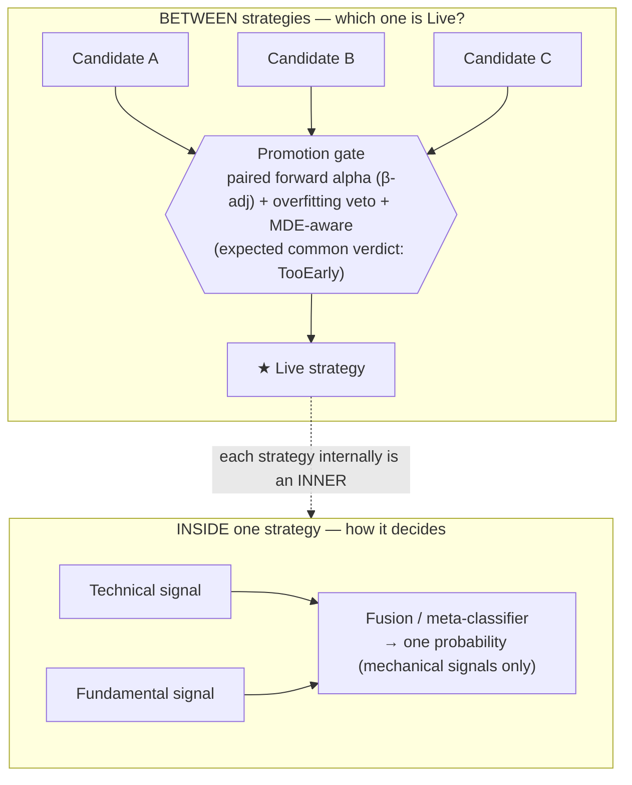
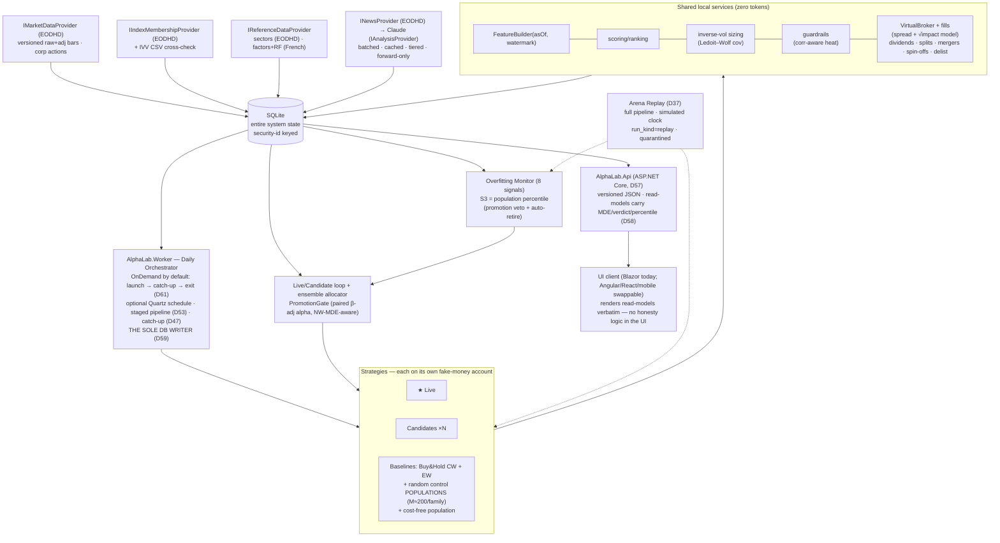
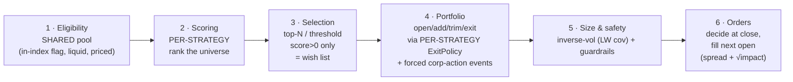

# AlphaLab — **Master Design Document v1.9** (Consolidated)

*The single reference for the whole system. Consolidates every decision made during design. Deep-dive companions exist for strategies (STRATEGY_CATALOG_v1.9), design improvements & factor research (DESIGN_IMPROVEMENTS_v1.9), and the overfitting monitor (OVERFITTING_MONITOR_v1.9); this document is the map and points to them where detail lives.*

> *Design revision v1.9. Build status is live, not pre-implementation. The full pass-by-pass history (v4/v5/v6 onward, every CHANGELOG finding and every decision) lives in `docs/CHANGELOG_v1.9.md`; current phase, test count, and the open-item list live in `PROGRESS.md`. The decision register AND the count live in `docs/DECISIONS_v1.9.md` — no range is restated here. Consult those rather than any count or status quoted inline, which may lag.*

> **What this is:** a personal, local, daily paper-trading **research laboratory** for discovering — honestly — **which trading strategies actually work, when, and why.** Pure C#/.NET, SQLite, a Blazor GUI, and Claude used only as a text-reading research assistant.
>
> **What it is not:** a product, a financial advisor, or a source of real-money trade recommendations. No real broker, no real orders, no real money. Simulated results do not predict real returns. **Not investment advice.**

> **What the v1.8 pass added over the prior design pass:** a second review pass closed seven residual gaps and merged the fixes directly into this document set. New decisions **D50–D56**: the PIT **regime-label algorithm** is now specified (D50, §20.1); the **ensemble allocator** — the primary improvement mechanism — is fully specified (D51, §20.2 and DESIGN_IMPROVEMENTS_v1.9 §3.5); the **research journal / hypothesis registry** exists as a real subsystem with a table, FRs, and screens (D52, §20.3); the daily run is **restaged** so the atomicity claim is physically implementable — fetch outside the transaction, one atomic write transaction per day, LLM batch post-commit (D53, §20.4); a **trading-calendar service** removes the last silent data dependency (D54, §20.5); manual **admin interventions** are first-class, typed-confirmed, and audited (D55, §20.6); and Monitor **S3's thresholds become track-length-aware trajectories** so the monitor stops contradicting §1.1's own power math (D56, §20.7). Errata merged: D43's liquidity buckets are keyed by **21-day ADV notional**; the control populations carry an explicit compute-vectorization requirement; the equal-weight benchmark convention is pinned. Four new FRs' worth of tests, three new UX rules (UX-9…11), and a fourth mockup (the Allocation / Journal / Ops screens, now part of the consolidated `alphalab_ux_mockups.html`) ship with this.
>
> **Plus (UI-swappability pass) D57–D58:** the GUI is decoupled from the rest of the system behind a real HTTP boundary. A new **`AlphaLab.Api`** project (ASP.NET Core minimal-API, D57, §21) exposes every screen's data and every user command as versioned JSON endpoints; the Blazor front end is rebuilt as a **pure client of that API**, and any other front end (Angular, React, a mobile app) can consume the identical contract. All presentation logic that carries the honesty guarantees — MDE dimming, verdict tiers, population-percentile chips, allocation-clamp attribution, replay quarantine — moves out of the UI into **serializable read-model DTOs computed once in C# (D58, §22)**, so no front end can accidentally render a number the backend would have dimmed. Blazor becomes one interchangeable client; the honesty rails live server-side, under test, shared by all clients. **A follow-up coherence pass (D59–D60) re-homes the daily job in a dedicated `AlphaLab.Worker` process (the sole DB writer) now that AlphaLab.Web is a thin client, and pins the API contract conventions — versioning, a uniform error envelope, an async-job pattern for replay/LLM commands, read-models stamped with their `run_id`+watermark, and float-free money — so any second client is a genuine drop-in.**

> **What this revision (v1.9) added (verdict-economics + calibration-realism pass, D63–D65):** an internal review found that the design's own "falsification is fast" claim contradicted its own control construction — because the random populations are **turnover-matched and cost-inclusive** (D36), a merely edgeless strategy pays the same cost drag as its controls and sits at the **median** of its band, not below it; fast auto-retire only ever catches **anti-predictive** strategies. **D63** corrects the verdict economics: **`IndistinguishableFromRandom`** becomes a first-class, rendered outcome (§20.8, UX-12, FR-35), the §1.2 KPIs are re-split into *anti-predictive detection speed* and *indistinguishability honesty*, and fast-kill language is reserved for the two channels that genuinely deliver it (the trade-level expectancy track, which tests against zero rather than a cost-matched null, and S3/S6 breaches below `P_noise(t)`). **D64** specifies the previously unspecified **planted-strategy fixtures** on which all D56 calibration rests: regime-conditional, autocorrelated, lumpy edge injection (never constant drift), an explicit **anti-predictive plant**, multi-seed medians with bands, a mandatory naive-vs-realistic **plant-sensitivity check** archived with the calibration report, and a data-vintage caveat stamped on the curves themselves (§20.9, FR-36). **D65** sanctions the **thin vertical slice** as the build order: the strategic target is reaching Phase 4 (Arena Replay) fastest — S&P 100, API-only operation (via the Scalar UI), the D58 read-models fully built and tested on schedule (the honesty lives there), with Blazor screens as a deferrable parallel workstream due before Phase 7 exit (§17.1).

---

## 0. Design-refinement history (how the design reached v1.9)

*Moved verbatim to `docs/DECISIONS_v1.9.md` (v1.9.90), where it leads the decision register it narrates.*

---

## 1. Purpose & guiding philosophy

The system exists to answer one question rigorously: *does a strategy have a real edge — and if so, when and why?* Everything is built around not fooling yourself.

- **Build to falsify, not to confirm.** Success is not "it showed an edge." Success is that you can **trust** what it tells you — including the very likely verdict that most strategies don't beat buy-and-hold after costs. A tool that can only confirm is a mirror; a tool that can falsify is a laboratory.
- **Forward paper P&L is the only judge.** Never backtest numbers, never in-sample results. (Arena Replay exists to judge the *machinery*, never the strategies — D37.)
- **Judge by expectancy and risk-adjusted return, never win rate.**
- **Comparisons must be fair before they can be honest.** Same eligibility pool, turnover-matched control populations, beta-adjusted alpha, benchmarks that match the portfolios' construction.
- **Know what the data can and cannot say — and say it.** Every comparison ships with its (autocorrelation-corrected) minimum detectable effect; `TooEarly` is a first-class verdict and the expected common case.
- **Every data feed has a named source, a validation method, and a fallback.** No silent dependencies (D35, D39, D40, D41). The v5 design correctly refused to fake fundamentals (D33); v6 applies that same standard to membership, sectors, factor returns, the risk-free rate, and news.
- **Local math does the work; Claude only reads text.** The numeric spine costs zero tokens; the LLM is a small, cached, batched, forward-only research aid.
- **Honesty rails are load-bearing, not ceremony:** costs always on with a parameterized impact model, β-adjusted alpha vs construction-matched benchmarks, random control **populations** as the noise floor, out-of-sample discipline, and an overfitting monitor wired to consequences.

### 1.1 The power reality (read this before expecting a winner)

Run the MDE arithmetic forward (formula in OVERFITTING_MONITOR_v1.9 Appendix C). The arena's detectable band is MEASURED, not assumed (**D122**): read α*(H) from the frozen `Calibration.DetectionPower` row and the ceiling from D116 — the gate refuses a claim below the measured floor AND above the top swept rung × the ladder's own geometric step (the plausibility ceiling) — so sp500 at generation 2 admits **[6.95 %, 32 %]/yr** at the detectability horizon of ten years (D121; raised from the 3 originally issued; both stated in full in §20.3). The figure used below is a WORKED EXAMPLE showing the shape of the arithmetic, not a claim about the expected prize. With paired testing shrinking the daily active-return-difference volatility to an optimistic σ_d ≈ 0.2%/day, detecting a **2%** annualized alpha at 95% confidence / 80% power requires

`√T = 2.8 × 0.002 × 252 / 0.02 ≈ 70.6  ⇒  T ≈ 5,000 trading days ≈ 20 years.`

Even at one full year of track, the MDE is ≈ 9% annualized — far larger than the effects this arena is built to adjudicate at that track length, and larger than the floor its own frozen curves put at ten years. The band is MEASURED per construction and arena (**D122**), never assumed. Only very tight pairing (σ_d ≈ 0.1%/day, achievable when Candidate and Live differ in one component) brings a 2%-alpha verdict inside ~5 years. **Therefore:** the `TooEarly` verdict will dominate the system's useful life, and binary promotion on a distinguishable alpha gap is expected to be **rare**.

**Be precise about the asymmetry (D63) — it is *not* "losers are retired in months."** Because the random control populations are turnover-matched and cost-inclusive (D36), a merely edgeless strategy pays the same cost drag as its controls and therefore sits at the **median** of its population band indefinitely: the population channel can never *falsify* it, only declare it **`IndistinguishableFromRandom`** (§20.8). That statement — "after N days, this idea cannot be told apart from coin flips with identical mechanics" — arrives in months, is rendered explicitly (never silently folded into `TooEarly`), and is the lab's honest, fast, and most common product. Genuinely *fast kills* exist on exactly two channels: **(a)** the **trade-level expectancy track (D44)**, which tests mean net P&L per trade against **zero** rather than against a cost-matched null — a high-turnover strategy with negative net expectancy is dead after a few hundred trades; and **(b)** **anti-predictive** behavior — a sustained percentile path below `P_noise(t)` (S3) or decay through the band (S6), i.e. performing *worse than random*, which triggers Suspect and auto-retire. The ensemble allocator — small continuous tilts under uncertainty — is the primary improvement mechanism precisely because it is the honest action under low power.

### 1.2 What "success" measurably means — D38 (superseded by D122)

The system's KPIs — the things it is graded on — are properties of the *laboratory*, not of any strategy:

| KPI | Measured how |
|-----|--------------|
| **Verdict honesty** | Every rendered comparison carries a correct, autocorrelation-corrected MDE; no gap smaller than its MDE is ever presented or acted on as a verdict |
| **Anti-predictive detection speed** | Median days for an injected *anti-predictive* strategy (worse than its matched population — the D64 anti-plant) to reach Suspect/auto-retire — measured in Arena Replay (D37) against the D64 plants, tracked live |
| **Indistinguishability honesty** | Every strategy whose percentile path has stayed inside its population's central band past `Verdicts.SeparationMinTrackDays` renders an explicit **`IndistinguishableFromRandom`** state (D63, §20.8) — never a silent, indefinite `TooEarly`; median days-to-statement for a no-edge plant recorded in replay |
| **Edge-plant survival (v1.9.7; v1.9.42 two-pass)** | Fraction of the min-alpha D64 *edge* cohort — plants are regime-conditional, autocorrelated, streaky alpha overlays on population members, never constant drift (§20.9), and "min-alpha" selects the base rung of the per-cadence ladder — (≥50 seeds) that survives 5y/10y, measured in Arena Replay; Phase-4 DoD floor `Replay.EdgePlantSurvivalFloor5y` (default 0.90). **v1.9.42 (D100):** during calibration a plant is never actually retired, so this reads the WOULD-BE-retire log (`would_be_edge_survival`) — every would-be retire still logged with its triggering signal — and the curve-based `curve_based_edge_survival` (own key) is the independent out-of-sample analogue. The lab must not auto-retire its own honest small winners |
| **Control calibration** | Random controls promoted ≤ chance; each population's gross alpha band centered on zero; net band offset ≈ its modeled cost drag |
| **Leakage integrity** | The leakage suite (incl. PIT regime labels, PIT fundamentals when present) permanently green in CI |
| **Attribution coverage** | Every strategy with ≥ 1y of track has a factor-attribution decomposition answering "what is this, really?" |
| **Operator learning** | The research journal accumulates pre-registered hypotheses with recorded outcomes |
| **Allocator value-add (v1.9.21)** | The D51-blended portfolio vs a static equal-weight-across-strategies portfolio, as a paired comparison with its own NW-MDE; validated in Phase-4 replay against the D64 plants (the allocator must overweight edge plants and shed anti-plants faster than equal weight) - D82(e), §23.4 |
| **Researcher yield (v1.9.21)** | AI-proposed hypotheses accepted / refuted / confirmed, each citing parent evidence; median days-to-kill; fork-budget spend rendered beside the deflated-Sharpe trials count - D82, §23.4. *Days-to-kill derivation (v1.9.23): `strategies` has no status-transition timestamp — kill dates come from the monitor's auto-retire events in the `overfitting_status` log and `go_live_log` demotions, joined to the strategy's `created_on`; a dedicated `status_changed_at` column would be a migration + D-number (not added now)* |
| **Cohort maturation (v1.9.34)** | Promotable strategies grouped into admission-vintage cohorts (`strategies.created_on` bucketed by `Kpi.CohortBucketMonths`; optional fork-generation grouping via `parent_strategy_id`); each cohort's median D36 population percentile (the S3 source, reused verbatim) plotted against track length t in trading days - age-aligned, never wall-clock, retired members retained (no survivorship). Rising later cohorts mean the researcher loop is learning what to test; flat or declining means recombination without gain. A diagnostic, not a promotion criterion - never a gate, monitor, or allocator input; meaningful only once several forward admission cohorts have accrued track length - D88, §22, FR-39 |
| **Proposal quality (v1.9.57)** | Per proposal, two numbers published side by side and never blended: the **detectability margin** (`expected_effect_ann` ÷ the D89 admission floor — the smallest effect the gate will admit, since CandidateFactory refuses a claim that could not clear the NW-MDE within the horizon (§20.3) — recorded from the first proposal, but NOT read as a quality signal until the control arm exists, because that floor RISES with the trials tax) and **calibration skill** (a proper log score on the pre-registered `prior_prob` against the leave-one-out confirmation base rate; `inconclusive` scores 0, and is tax-robust where the margin is not; scored only on admitted proposals — D113). Chained — proposal *n* against *n−1* — through a trend publishing its own **minimum detectable improvement rate**, so *not improving* and *too early to tell* stay distinguishable. Descriptive only; **the researcher never reads its own score** - D110 (as amended by D124: structurally silent for the current signal set), §23.4 |
| **Contestant-minus-twin paired difference (v1.9.91)** | The contestant-vs-twin paired daily difference, published with its OWN Newey–West-corrected MDE and its track length, always together — the gap is never rendered without the smallest gap currently readable beside it (UX-18). Descriptive only: NEVER a gate, monitor-verdict, or allocator input (S8 consumes it as a divergence tripwire, not a verdict). A separate instrument from the benchmark-relative gate channel — finding 370's bar does not apply to it - D125, §23.3 |

A rising equity curve appears nowhere in that table. If the lab produces trustworthy "no edge," "too early," and "this is just repackaged momentum" verdicts, it is succeeding.

---

## 2. Decisions log (what we chose, and why)

*The decision register — its preamble, the pass-index table, and every row — moved verbatim to `docs/DECISIONS_v1.9.md` (v1.9.90). That file is the register AND the count; a row there is changed only by another row (rule 25 / D109, enforced by `tools/check-register.ps1`).*

---

## 3. The two-layer mental model

Almost all confusion dissolves once you separate the system's two independent jobs:

```mermaid
flowchart TB
    subgraph OUTER["BETWEEN strategies — which one is Live?"]
        direction LR
        C1["Candidate A"] --> GATE
        C2["Candidate B"] --> GATE
        C3["Candidate C"] --> GATE
        GATE{{"Promotion gate<br/>paired forward alpha (β-adj) + overfitting veto + MDE-aware<br/>(expected common verdict: TooEarly)"}} --> L["★ Live strategy"]
    end
    subgraph INNER["INSIDE one strategy — how it decides"]
        direction LR
        S1["Technical signal"] --> FUSE
        S2["Fundamental signal"] --> FUSE
        FUSE["Fusion / meta-classifier<br/>→ one probability (mechanical signals only)"]
    end
    L -.->|"each strategy internally is an INNER"| INNER
```

- **Inside a strategy:** how one model turns inputs into a probability, holds it for its declared horizon, and exits by its declared policy. If it fuses several signals, the combiner is the **meta-classifier** — a component, present only from Phase 6, over **mechanical signals only**. The LLM never fuses into a strategy's probability — it competes as the **contestant seat** on its own account, priced by its no-LLM twin (§23.1/§23.3, rule 32).
- **Between strategies:** which whole strategy is "Live," and how capital tilts across the roster. This is the Live-vs-Candidate loop plus the ensemble allocator, judging each strategy as a black box on forward, cost-inclusive, beta-adjusted alpha, with an overfitting veto, explicit power limits, and (v6) random **populations** as the null.

---

## 4. Technology stack

| Component | Choice |
|-----------|--------|
| Language | C# / .NET 10 (LTS) |
| Database | SQLite (EF Core, one file) |
| LLM | Claude via the Anthropic **Message Batches API** for scheduled reads (Messages API for interactive research-assistant use), behind `IAnalysisProvider` (per-task model tiering = config; key from the gitignored `appsettings.Secrets.json`, D67; prompt caching on the static block) — D46 |
| ML (Phase 6+) | ML.NET — logistic regression first for the meta-classifier; LightGBM as a later candidate; every retrain is a new candidate + a new trial |
| Market & reference data | **EODHD (primary, D35)** behind `IMarketDataProvider` (raw+adjusted bars, splits/dividends), `IIndexMembershipProvider` (current + historical constituents), `IReferenceDataProvider` (sector/industry), `INewsProvider` (news). **Alpaca (free)** retained as bar cross-check/fallback. **iShares IVV holdings CSV** as the free membership cross-check. See §13 |
| Factor & risk-free data | **Ken French Data Library** daily factors + RF (D41), monthly refresh job; dual role (D83): diagnostic for attribution + availability-lagged signal input for residual momentum (§6.5) only |
| Fundamentals (Phase 8, contingent) | **EODHD Fundamentals is the first candidate source to validate** against the D33 PIT protocol (as-reported values? as-of availability dates? restatement handling? ≥3y quarterly depth?); SEC EDGAR/XBRL ingestion and a verified paid PIT feed remain the alternatives. **Phase 8 still does not start until validation passes** |
| Backtesting / replay | **Arena Replay** (D37) behind `IArenaReplay`; the walk-forward seeding engine (`IBacktestEngine`) is its special case; never judges promotions |
| Covariance | Ledoit–Wolf shrinkage service (D42) |
| Scheduling / daily job | **`AlphaLab.Worker`** — .NET Generic Host owning the staged daily pipeline (D53: fetch outside the transaction → ONE atomic write transaction per trading day → LLM batch post-commit; §20.4) and catch-up (D47: missed sessions replayed in order, one transaction per day, idempotently; §13.7); **the sole DB writer** (D59). **Default `Worker.Mode=OnDemand`** (D61): run catch-up-through-last-close and exit — the "open it each evening" path. `Scheduled` mode (optional, Quartz.NET) is one config flip for an always-on host |
| API | **`AlphaLab.Api` — ASP.NET Core minimal-API (D57)**: versioned (`/api/v1`) JSON read + command endpoints under the D60 conventions (uniform error envelope, 202+job_id for long-running commands, read-models stamped with run_id+watermark, float-free money); the single boundary every UI talks to; OpenAPI published + Scalar UI |
| UI | **Blazor — standalone WebAssembly — as a *client of `AlphaLab.Api`* (D57/D67)** — swappable for Angular/React/mobile against the same contract; all honesty-carrying presentation logic lives in serializable read-models (D58), not in the UI |
| Config / secrets | `appsettings.json` (non-secret) + a gitignored `appsettings.Secrets.json` for keys (`Secrets:EodhdApiToken`, `Secrets:AnthropicApiKey`, optional Alpaca pair) — no env vars, no User Secrets store (D67) |

---

## 5. System architecture

```mermaid
flowchart TB
    MD["IMarketDataProvider (EODHD)<br/>versioned raw+adj bars · corp actions"] --> STORE[("SQLite<br/>entire system state<br/>security-id keyed")]
    IM["IIndexMembershipProvider (EODHD)<br/>+ IVV CSV cross-check"] --> STORE
    RD["IReferenceDataProvider<br/>sectors (EODHD) · factors+RF (French)"] --> STORE
    NEWS["INewsProvider (EODHD) → Claude (IAnalysisProvider)<br/>batched · cached · tiered · forward-only"] --> STORE
    STORE --> ORCH["AlphaLab.Worker — Daily Orchestrator<br/>OnDemand by default: launch → catch-up → exit (D61)<br/>optional Quartz schedule · staged pipeline (D53) · catch-up (D47)<br/>THE SOLE DB WRITER (D59)"]
    subgraph STRATS["Strategies — each on its own fake-money account"]
        direction LR
        LIVE["★ Live"]
        CAND["Candidates ×N"]
        BASE["Baselines: Buy&Hold CW + EW<br/>+ random control POPULATIONS (M≈200/family)<br/>+ cost-free population"]
    end
    ORCH --> STRATS
    subgraph CORE["Shared local services (zero tokens)"]
        FEAT["FeatureBuilder(asOf, watermark)"] --- SCORE["scoring/ranking"] --- SIZE["inverse-vol sizing<br/>(Ledoit–Wolf cov)"] --- GUARD["guardrails<br/>(corr-aware heat)"] --- BROKER["VirtualBroker + fills<br/>(spread + √impact model)<br/>dividends · splits · mergers · spin-offs · delist"]
    end
    STRATS --> CORE --> STORE
    STORE --> SELF["Live/Candidate loop + ensemble allocator<br/>PromotionGate (paired β-adj alpha, NW-MDE-aware)"]
    OFM["Overfitting Monitor (8 signals)<br/>S3 = population percentile<br/>(promotion veto + auto-retire)"] --> SELF
    STORE --> OFM
    SELF --> STRATS
    STORE --> API["AlphaLab.Api (ASP.NET Core, D57)<br/>versioned JSON · read-models carry MDE/verdict/percentile (D58)"]
    API --> UI["UI client (Blazor today; Angular/React/mobile swappable)<br/>renders read-models verbatim — no honesty logic in the UI"]
    REPLAY["Arena Replay (D37)<br/>full pipeline · simulated clock<br/>run_kind=replay · quarantined"] -.-> STRATS
    REPLAY -.-> OFM
```

**Key principle:** market data, features, scoring, sizing, guardrails, fills, corporate actions, P&L, the promotion gate, the ensemble allocator, the control populations, and the overfitting checks are **all local calculation**. Claude is a once-a-day, batched, cached, forward-only text read plus an on-demand research assistant. Everything persists to SQLite, keyed by permanent `security_id`. **Every UI reaches this system only through `AlphaLab.Api` (D57); the honesty guarantees are computed once, server-side, into read-model DTOs (D58) that any front end renders as-is — so the UI is a swappable presentation layer, never a place where a verdict can drift. The scheduled daily pipeline runs in `AlphaLab.Worker`, the sole DB writer (D59); `AlphaLab.Api` serves reads and enqueues bounded commands under fixed contract conventions (D60).**

---

## 6. The daily decision funnel (how each strategy picks stocks)

Every strategy runs the same funnel once per day after the close; they differ at **Stage 2 (scoring)** and at the **exit policy consulted in Stage 4**.

```mermaid
flowchart LR
    A["1 · Eligibility<br/>SHARED pool<br/>(in-index flag, liquid, priced)"] --> B["2 · Scoring<br/>PER-STRATEGY<br/>rank the universe"] --> C["3 · Selection<br/>top-N / threshold<br/>score>0 only<br/>= wish list"] --> D["4 · Portfolio<br/>open/add/trim/exit<br/>via PER-STRATEGY ExitPolicy<br/>+ forced corp-action events"] --> E["5 · Size & safety<br/>inverse-vol (LW cov) + guardrails"] --> F["6 · Orders<br/>decide at close,<br/>fill next open<br/>(spread + √impact)"]
```

- **Stage 1 is shared** (same eligible pool for everyone) so any difference in results is genuinely about the strategy.
- **Stage 2 is per-strategy** — momentum and mean-reversion hand back nearly opposite wish lists from the same 500 names. That divergence is the point.
- **Stage 3 invariant:** a name with score `= 0` (or `< minScore`) is **never selectable**. Sparse days mean fewer names / more cash. No padding, ever.
- **Stage 4 consults the strategy's `ExitPolicy`:** shared mechanics, per-strategy exit logic. "Fell off today's wish list" is never an implicit sell. **Forced events** (delist force-exit, merger conversion/cash-out, spin-off receipt — §13.6 — and guardrail circuit-breakers) are the only other closes/opens.
- **Stage 5 sizes new opens against available CASH, not equity (D84):** a day's opens can never total more than the cash on hand — they scale to fit, a near-zero-cash day opens nothing, and no held name is ever sold to fund an open (rule 7). A whole-book rebalance re-weights against equity instead (it self-funds). `Sizing.PositionCapPct` still binds per name.
- **Decide at close `T`, fill at next open `T+1`** — a strategy never trades on a bar it couldn't have acted on. Fills pay the D43 cost model; quantity above the participation cap is rejected and logged.

---

## 7. Local math vs Claude — division of labor & token economics

**Almost everything is free local C#.** Claude only reads unstructured text (news/regime context) and returns compact structured output, plus on-demand research assistance.

| Job | Who | Tokens |
|-----|-----|:------:|
| Eligibility, scoring, selection, portfolio decision, exits, corp actions | local math | none |
| Sizing, guardrails, fills, P&L, gate, MDE, populations, monitor | local math | none |
| Reading news → structured regime brief | **Claude (batched, tiered)** | small |
| Research briefs, hypotheses, skeptic reviews (on demand) | **Claude (interactive)** | small |
| Strategy-level decisions: propose the next hypotheses/forks from arena evidence (researcher seat, D82) | **Claude (budgeted, §23.4)** | small |
| Trade-level decisions over a locally pre-filtered shortlist (contestant seat, D81) | **Claude (batched, cached, §23.3)** | small |

**Token cost ≈ (days) × (news text admitted to the prompt) × (per-token price ÷ 2 via Batches)** — the call count was never the sink; the admitted text is (D46). Controls upstream of the provider:

- **News ingestion budget (D46):** max 25 articles/read, 2,000 chars/article after local extraction, title-hash dedupe, relevance filter (universe symbols + macro tags). `INewsProvider` (EODHD news) enforces these before any token is spent.
- **Batches + caching:** the daily read is a scheduled, non-interactive job ⇒ **Message Batches API at half price**; the static instruction block is **prompt-cached** so only the day's news is fresh tokens.
- **Model tiering:** extraction/classification on a cheap fast model; briefs/skeptic on a stronger model. Per-task model = config.
- **Scope levels unchanged:** Level 1 (one market-level read/day, shared) is the start; Level 2 (a shortlist capped by `Ai.Contestant.ShortlistSize`) only after the contestant-vs-twin A/B (§23.3) earns it; Level 3 (whole universe) is structurally unreachable (hard shortlist cap, D24).
- **Enforced budget & graceful degradation (D24):** hard daily budget (tokens/calls/cost); cache hits free; on exhaustion, priority order (held positions first), cached served free, neutral fallback only for overflow — never a blackout.
- **LM Studio (D25):** optional local provider for dev/test and as an honest A/B contestant; never an automatic mid-day failover.

**Claude's real role (D46, superseded framing resolved by D79–D82):** the daily machine-readable sentiment **score is retired** — the LLM's arena presence is the **contestant seat** (§23.3), priced by its mandatory no-LLM twin, never a hidden sub-signal inside a blend (catalog §8.1, rule 32). The durable value is the **researcher seat** (§23.4) and the research assistant: structured bull/bear briefs on surfaced names, regime-shift summaries, hypotheses to encode and forward-test, and the **skeptic** — feed it a strategy's stats and ask "what leakage or overfitting story explains this?" Always forward-only; always barred from replay/backtests.

---

## 8. Live vs Candidate — the self-improvement loop

- An **account** = a strategy + its own fake money + its ledger. **Live** = the one you trust/display. **Candidates** = strategies on probation, shadow-trading in parallel.
- **Daily:** every account runs the funnel in isolation; record trades + equity. Control populations run as lightweight ledger-only accounts.
- **Periodically (config cadence, default 21 days — no daily p-value shopping):** the `PromotionGate` promotes a Candidate **only if** it wins on forward, cost-inclusive, **β-adjusted alpha** **against the cap-weight benchmark account** (D131: the benchmark is the gate's opponent, never Live — §20.2 shrinks each α̂ toward the roster's cross-sectional mean, which is only meaningful if every α̂ was measured against the SAME opponent), in a **paired test on daily active-return differences**, by a margin **exceeding the window's Newey–West-corrected MDE (D48)**, over a minimum window, **and** the Overfitting Monitor doesn't flag it Suspect. Gate verdicts: `Promoted` / `Refused` / **`TooEarly`** — and per §1.1, `TooEarly` is the expected common case. (`Revert` is written by the MONITOR's retire path, never by the gate — D131/finding 384.)
- **Trade-level track (D44):** for high-trade-count strategies, the per-trade expectancy test runs in parallel with its own MDE — the genuinely *fast* kill channel (D63: it tests expectancy against **zero**, not against a cost-matched null), never a promotion shortcut on its own.
- **Primary improvement mechanism = the ensemble allocator** (§12): continuous, banded, logged capital weights — small tilts are the honest action under low power. Binary promotion is the rare event for large, sustained, monitor-clean separations.
- **The generative step is specified (v1.9.21, D82):** the AI researcher seat proposes the next pre-registered hypotheses and forks from locally stored verdicts, attribution, and outcomes, under `Research.ForkBudgetPerYear`; the operator remains the registrar (rule 30). The loop closes: propose → forward-test → verdict → outcome → next proposal (§23.4).
- **Recency-bias guard:** conservative thresholds; non-promoted candidates keep running; the control populations must not be promoted more than chance.
- **How many candidates:** start **1 Live + 2–3 Candidates**. Bounded by statistical honesty, not compute.

---

## 9. Strategies (roster + what the research says)

*Full detail in STRATEGY_CATALOG_v1.9. Factor-research backing in DESIGN_IMPROVEMENTS_v1.9 §2.*

Strategies implement `IModel` (features in → `[0,1]` signal per security, point-in-time, plus a declared holding horizon and `ExitPolicy`). Roster, by evidence and build order:

- **Baselines (first):** `BuyAndHoldModel` ×2 — cap-weighted and equal-weight benchmarks · **Random control populations** — M≈200 per cadence family (daily / banded / monthly), turnover-matched in breadth, sizing, exits, and costs (D36), plus a smaller cost-free population as the pure-noise display band.
- **Price-only (Phase 3 dummies → Phase 6 real):** `Momentum` (N≈40 with rank hysteresis, skip-month, vol-targeting overlay; expectations measured per D122, never assumed), `MeanReversion` (trend-filtered, explicit exits, fast RSI(2–4) sibling — the flagship of the **trade-level evidence track**, D44), `LowVol` (252-day window, monthly rebalance, **sector caps fed by EODHD classification data**, judged β-adjusted or it can never win), `ResidualMomentum` (factor-residual momentum on the D83 availability-lagged French series — cleaner momentum, judged against the same banded null as its raw sibling), `TimeSeriesMomentum` (absolute own-trend with defensive drop-to-cash — the published evidence is futures-based, so single-stock long-only expectations are haircut hard), `BettingAgainstBeta` (beta-ranked low-risk tilt off the D42 shrunk covariance — LowVol's sibling; kept only while the pair demonstrably diverges, catalog §10), plus optional `Breakout` (catalog §6.4). All six are shelf capacity gated by the catalog §12 trials arithmetic — built in Phase 6, entering the live arena only as registered trials.
- **Fundamental (Phase 8, contingent):** `Value`, `Quality` — **EODHD Fundamentals is the first source to run through the D33 PIT validation protocol** (STRATEGY_CATALOG_v1.9 §7); the phase still does not start until a source passes.
- **Blended/Meta (Phase 6+):** logistic-first fusion of **mechanical signals only** (catalog §8.1) — the LLM is the contestant seat priced by its no-LLM twin (§23.3, rule 32), never a blend input.

**Four research truths that shape everything:** factors **decay**; **diversification across factors** is the real edge; **robustness beats optimization**; and **long-only large-cap implementations keep only a FRACTION of published premia** — how large a fraction is MEASURED per construction and arena (**D122**), never asserted, which is exactly why §1.1 exists.

**Recommended day-one arena (end of Phase 3):** Buy&Hold (CW + EW) · random populations (matched ×3 cadences + cost-free) · then Momentum and MeanReversion as the first real candidates in Phase 6.

---

## 10. Metrics & evaluation

*Full detail in DESIGN_IMPROVEMENTS_v1.9 §1.* Per strategy, forward and net of costs:

- **β-adjusted alpha (Jensen's)** with t-stat (Newey–West errors) and **Information Ratio**. "Alpha" on any screen means this (D26). RF from the French series (D41).
- **Expectancy**, **profit factor**, **Sharpe/Sortino**, **max drawdown/Calmar**, **turnover**; win rate only paired with avg win/avg loss.
- **MDE — Newey–West corrected (D48)** — beside every comparison; the gate never acts inside it.
- **Trade-level expectancy track (D44)** for high-trade-count strategies, block-bootstrapped, with its own MDE.
- **Regime-tagged performance** with PIT labels (D34) **and the episode counter (D45)** — "n = 1 bull episode" renders with an anecdote badge.
- **Statistical honesty** — deflated Sharpe over the honest trials count; population percentile vs the matched random band (D36); paired tests for head-to-heads.
- **Factor attribution (D41)** — regress on French daily factors (market, size, value, momentum, profitability; size also catches the equal-weight effect) — diagnostic-only (the same series is a PIT signal for residual momentum only — D83/§6.5), lag stated on the panel. Answers "is my clever strategy just repackaged momentum?"

**Metric integrity (Goodhart's Law).** Defenses unchanged and now sharper: trials registry + deflated Sharpe; the **population** noise floor; S8 cross-metric divergence; and the un-codeable one — researcher discipline. Pre-register hypotheses; never hand-tune against the metrics (Golden Rule 18).

---

## 11. Overfitting Monitor

*Full spec in OVERFITTING_MONITOR_v1.9.* Eight signals — backtest-vs-forward degradation, deflated Sharpe, **separation-from-population (percentile-rank, D36)**, parameter robustness (incl. exit params), feature/regime PSI, rolling edge decay vs the population band, calibration drift, and cross-metric divergence — combine into Healthy/Warning/**Suspect**. Wiring: **Suspect vetoes promotion regardless of P&L**; a gap inside the **NW-corrected MDE** returns **`TooEarly`**; sustained decay **auto-retires**. **Thresholds are calibrated in Arena Replay (D37)** before they are trusted live — the calibration report is part of Phase 4's Definition of Done. **Meta-guard:** live parameters (including exits and sizing mode) are frozen; changes fork a new strategy and increment the trials registry; `TooEarly` is not an invitation to re-shop p-values (evaluations run on the configured cadence).

---

## 12. Sizing, safety & portfolio construction

- **Default sizer: inverse-volatility under a portfolio volatility target**, with the covariance from the **Ledoit–Wolf service (D42)**. Equal-weight acceptable for dummies.
- **Kelly is a Phase 6+ opt-in variant** — calibrated `p` over the declared horizon, `b` shrunk toward 1.0 below 30 trades, shrink-to-zero on unknown calibration; a Kelly-sized variant is a separate candidate.
- **Guardrails (fail closed):** min score, max position, **correlation-aware heat** (cap predicted portfolio vol from the LW covariance — fifteen 0.25-capped correlated mega-caps are not fifteen bets), max concurrent, cooldown, regime halts (PIT triggers), **participation cap** (D43 — order size ≤ 2% ADV, excess rejected + logged). Missing input → reject.
- **Portfolio construction:** rank hysteresis / rebalancing bands ship *with* momentum; sector caps ship *with* low-vol (classification from EODHD, D35); drawdown circuit-breaker; the full exposure system generalizes in Phase 7.
- **Ensemble allocator (primary "improves over time" layer):** continuous weights, shrunk toward equal, banded/slow, every change logged with its reason; Suspect ⇒ freeze/decay only; `TooEarly` caps tilt size.

---

## 13. Data sourcing & universe management

### 13.1 Providers (D35) — every feed named, validated, with a fallback

| Feed | Primary | Validation | Fallback |
|------|---------|-----------|----------|
| Daily bars (raw + adjusted) | **EODHD** EOD API | Rotating-sample cross-check vs Alpaca free tier (tolerance alarm); data-quality gate (gaps/NaNs/outliers) | Alpaca |
| Splits & dividends | **EODHD** corporate-actions/dividends APIs | Reconciliation: adjusted/raw ratio implied events vs the event feed | Alpaca corporate actions |
| Index membership (current + history) | **EODHD** constituents (GSPC.INDX; historical snapshots since 2000) | **Daily cross-check vs iShares IVV holdings CSV** (free, official, ~1-day lag); divergence alert; count sanity 495–510 | Wikipedia scrape |
| Sector / industry | **EODHD** classification fields | Spot-check sample vs a second source at setup; change-log monitored | Static GICS snapshot + staleness alarm |
| News | **EODHD** news API | n/a (input to Claude only; budgeted per D46) | none (degrade to no-read day) |
| Factor returns + RF | **Ken French Data Library** (D41) | Checksum + date-continuity checks on refresh | FRED (RF only) |
| Fundamentals (Phase 8) | **EODHD Fundamentals — candidate, must pass the PIT validation protocol** (STRATEGY_CATALOG_v1.9 §7) | The D33 protocol: as-reported? availability-dated? restatements? depth? | SEC EDGAR/XBRL ingestion; paid PIT feed |

Everything sits behind interfaces (`IMarketDataProvider`, `IIndexMembershipProvider`, `IReferenceDataProvider`, `INewsProvider`, `IFundamentalsProvider`), so swapping providers is a new class, not a rewrite. Keys from the gitignored `appsettings.Secrets.json` (`Secrets:EodhdApiToken`; optional Alpaca pair) — D67.

**Cost note:** the EODHD tier required (All-World / Fundamentals-inclusive) is ~$20–30/mo — the one paid data dependency, consciously accepted because it closes membership + sectors + news + a fundamentals path in a single validated subscription (D35). Confirm current plan boundaries on EODHD's pricing page at setup.

### 13.2 The backfill-then-delta pattern
Unchanged in shape: **backfill once** (full daily history per universe security into SQLite), then a **daily delta** (one new bar per security). API-call volume sits comfortably inside EODHD's plan limits. Backtests/replay read SQLite, never the API.

### 13.3 Universe = full pool, not "a few stocks"
- **Universe** = the full set with local data. **Start: the S&P 100 slice through Phase 4 sign-off (D65/D70 — sourced from the iShares OEF holdings CSV with a Wikipedia S&P 100 cross-check), then widen to the S&P 500 (D20) via config flip + backfill delta . That is where this arena's universe STOPS — D109 supersedes D87: breadth beyond the S&P 500 is a SEPARATE ARENA (D71/rule 23), never an in-place widen.** History backfilled for all. **Arena Replay is the standing exception (D70): replay always runs on S&P 500 as-of membership, with bars backfilled for every historical member in the replay window before Phase 4 begins.**
- **Daily shortlist** = the ~10–50 names a strategy chooses today, computed locally on top of stored data.

### 13.4 Membership over time — never delete history
- Membership refresh (daily): pull EODHD constituents → **cross-check vs IVV CSV** → on agreement, flip `in_index` + stamp dates on the **security** row; on divergence, alert and hold yesterday's state (fail closed). **Never delete rows or bars.**
- Eligibility (Stage 1) reads the flag; a dropped name stops being eligible for *new* entries.
- Keep pulling bars for any security that is in-index **or held**; a held name whose bars stop and whose corporate-action feed shows a terminal event follows §13.6; bar-stoppage with *no* mapped event freezes the position and alerts (fail closed, D39).
- **As-of membership for catch-up/replay** is reconstructed from EODHD's historical constituents (D47/D37). Pre-2000 history carries residual survivorship bias — logged, and noted in Monitor S1's interpretation.

### 13.5 Bar revisions & the data watermark (D40)
- Corrections arrive as **new versions**: insert `(security_id, date, version+1, observed_at)`. No UPDATE, no DELETE — CI greps for both.
- Each run (daily, catch-up, replay) records its **watermark** = max `observed_at` visible; all reads resolve "latest version ≤ watermark."
- **Determinism (NFR1) = f(inputs, watermark, seeds).** Any historical run is reproducible forever against exactly the data it saw; the GUI can also show "as currently known" views, labeled.
- **The claim is executable, not aspirational (FR-25):** `dotnet run --project src/AlphaLab.Worker -- reproduce-day --date <yyyy-MM-dd>` re-runs that committed session from its stored watermark and seeds into a throwaway copy of the store and asserts the decisions, fills, equity points and population draws are byte-identical to what was committed. It is read-only against the arena (opened `Mode=ReadOnly`, every write lands in the copy — D59) and makes no network call: Stage 1 is replayed from the store's own versioned bars and corporate actions at that watermark, so a later revision cannot leak into a pinned re-run. The book the re-run starts from comes from **D90** `position_snapshots` — the piece the watermark alone could not supply, because `positions` is mutable state. **AI-seated sessions (D105, Phase 5):** an AI decision is resolved by **replaying the persisted `ai_decisions` row**, never by re-calling the model — a model call would return something different and make byte-identical reproduction impossible by construction on a correctly-committed day. Determinism for those strategies is therefore **f(inputs, watermark, seeds, stored AI outputs)** (§23.3 rule 1, §23.8.5; `FX-ReproduceDay-AiSession`).

### 13.6 Security master & corporate actions (D39)
- `securities(security_id PK, current_symbol, name, first_seen, delisted_on, …)`; `ticker_history(security_id, symbol, valid_from, valid_to)`. **All internal keys are `security_id`;** tickers are display aliases resolved through the history table. **Canonical ticker form is the EODHD dash form (`BRK-B`, D75)** — every source dialect (IVV/OEF `BRKB`, historical/Wikipedia `BRK.B`) normalizes into it via `SymbolNormalizer` (mechanical dot→dash + a curated alias map for the no-separator class shares), so bar joins need no on-the-fly translation.
- **Corporate actions are versioned append-only + read at the watermark (D76), exactly like bars (§13.5).** A restatement of the same `(security_id, type, effective_date)` inserts a new `version` (never an UPDATE/DELETE); every read resolves, per `(type, effective_date)`, the **latest version whose `observed_at ≤ run.watermark`** (`ICorporateActionReadService`). So the ledger prices only what was observable at its run's watermark — a replay pinned to the past never sees a later-observed action or a correction, preserving **NFR1** (the determinism §13.5 buys for bars, now for the feed the ledger prices on). Ingestion is value-diff-append (an identical re-fetch is a no-op; a changed value appends a version), guarded by `ux_corporate_actions_identity(security_id, type, effective_date, version)`. **Known limitation:** two genuinely-distinct actions sharing one identity (a regular + a special dividend on one ex-date) collapse to a single versioned line — a stop-and-report seam; a future discriminator must be **feed-supplied, not amount-based** (an amount change is a *correction*, which must remain a new version).
- Corporate-action ledger semantics (all forced events, all logged to `cash_events`/`trades` with the action id):
  - **Dividend** → cash credit on ex-date (D30).
  - **Split** → share count × ratio; raw price basis adjusted; equity unchanged.
  - **Ticker change** → alias update only; position, history, and identity continuous.
  - **Cash merger** → position closed at deal cash per share on effective date (standard costs waived — corporate action, not a trade).
  - **Stock merger** → shares converted at the exchange ratio into the acquirer's `security_id`; cost basis carries.
  - **Mixed merger** → cash portion credited + stock portion converted.
  - **Spin-off** → **new position created** in the spun-off `security_id`; cost basis allocated by the action's ratio (fallback: first-print relative value); the new name enters the account even if not in-index (eligible for exit-only management by the owning strategy's `ExitPolicy` or a scheduled liquidation rule, config).
  - **Delisting (terminal, no successor)** → force-exit at last available print; bankruptcy haircut configurable (D30).
  - **Index-membership drop ≠ delisting (D74).** A name leaving the index stamps `index_membership.removed_on` only — never a `delist` action and never `securities.delisted_on`. A *true* delisting (the bullet above) is derived **separately** from the exchange symbol-list drop-out (`exchange-symbol-list/US?delisted=1`, INTEGRATIONS §1) / acquisition feed — dormant at launch (D49), landing with Phase 2's corporate-action semantics. A universe exit (cap threshold, replacement) is not a lifecycle event and must never force a Stage-4 close outside `ExitPolicy` (hard rule 7 / D29).
  - **Unmapped event / bar stoppage without an event** → **fail closed:** freeze the position (no further trading), value it at its **last known print** (D119: a freeze halts trading, never valuation — a years-old cost basis misstates in either direction; cost basis only for a name never priced at all), flag it on the Risk screen, alert the operator. Never silently mispriced. **(D86, as amended by D119)**

**Rejected/clipped T+1 fills (finding 196).** A capacity-cap rejection or clip on a T+1 fill is recorded (`RecordCapacityRejection`: intended/allowed/ADV shares) and the unfilled remainder is dropped, not re-planned — the strategy's next daily decision re-evaluates the name and re-opens it if still wanted. Carrying an order forward is deliberately not done: it would be a second decision authority overriding the strategy's own next call (cf. D84's no-sell-to-fund). The capacity-rejection rows are the visible record; the Risk screen surfaces "unfilled by capacity" (UX-11). Population fills hit the same participation cap, so this policy also shapes the Phase-4 null bands — it is settled before Phase 3 for that reason.

### 13.7 Multi-day catch-up (D47)
On startup: compute missed trading days from `runs`; for each, strictly in order: bars delta (versioned) → corporate actions → membership refresh (as-of) → funnel for that day — **one ACID transaction per day**, resumable mid-sequence, each recovered day appended to `catchup_log`. Idempotent: re-running a recovered day is a no-op. Missed sessions are computed from the **trading calendar (D54)**; catch-up runs Stages 1–2 of the D53 pipeline only — the LLM stage is never run for past days (D16).

### 13.8 Data caveats to respect
- **Adjusted vs raw (D30)** — both stored; signals on adjusted, ledger on raw. Never mixed within an account.
- **Survivorship** — forward membership exact from launch; pre-launch residual bias logged; inflates backtest Sharpe ⇒ S1 reads stricter than truth (conservative; noted).
- **Data-quality gate (Phase 1)** — gaps/NaNs/outliers; rotating cross-provider sample checks; dividend/split event streams included; completed-day bars only.

---

## 14. Data model (SQLite)

Core: `securities` + `ticker_history` (D39) · `bars` (**versioned**: security_id, date, version, observed_at, raw + adjusted OHLCV — D40) · `corporate_actions` (typed per §13.6) · `index_membership_log` (source, cross-check result, diff applied) · `features` · `strategies` (incl. `exit_policy_json`, `holding_horizon_days`) · `accounts` · `positions` · `trades` (cost-model version stamped) · `cash_events` · `equity_curve` · `decisions` · `go_live_log` · `allocation_log` · `analysis_cache` · `news_items` (post-budget, hashed) · `factor_returns` (French series + refresh log) · `runs` (**with watermark**, `run_kind ∈ {live, catchup, replay}`) · `catchup_log` · `config` · `ai_context_packs` + `ai_decisions` (v1.9.21, D80/D81 — the AI seats' persisted inputs and outputs, §23.5).
Controls & monitor: `control_populations` (family, M, seeds) · `control_equity` (compact per-member equity) · `trials_registry` · `overfitting_checks` · `overfitting_status` · `parameter_scans` · `feature_baselines` · `power_reports` (NW-corrected) · `trade_evidence` (D44) · `regime_episodes` (D45).
Replay scoping: every judged artifact carries `run_kind`; replay rows are **never** joined into forward views (enforced by query layer + a test).

### 14.1 Data integrity & resilience
Unchanged five disciplines — ACID per daily run, WAL, nightly file-copy backup, snapshot-before-migration, and no-delete enforcement — extended by D40: **no `UPDATE bars` either**; CI greps for `DELETE FROM bars` *and* `UPDATE bars`; corrections are insert-only versions.

### 14.2 Why SQLite is sufficient — capacity analysis, and why there is no vector database (D3, revisited for v6)

**The numbers.** The largest table is versioned bars: a 20-year backfill across every security that ever passed through the universe (~1,000 distinct ids with membership churn) is ≈ 5M rows ≈ 400–600MB. Forward accrual is ~126K bar rows/year (500 × 252) plus ~164K control-equity rows/year (650 population members × 252) plus trades/decisions/features in the low hundreds of thousands — call it **well under 2GB for the first several years**, against SQLite's comfortable multi-tens-of-GB practical range. The single heaviest event is a full 15-year Arena Replay (~2.5M control-equity rows per run); replay detail is prunable by design (keep the validation summary and calibration report; a config flag drops per-member replay ledgers after sign-off).

**The access pattern is the real argument.** SQLite's known weakness is concurrent *writers*; this system has exactly one — the daily orchestrator, inside one ACID transaction — with the Blazor GUI as a read-concurrent consumer, which is precisely what WAL mode exists for. All statistical work (regressions, percentiles, bootstraps, covariance) happens in C# on in-memory arrays, not in SQL, so the database is a durable ledger, not a compute engine. A client-server database would add an installation, a service, credentials, and backup complexity while removing nothing this design does. **Migration trigger (unchanged from D3):** multi-user hosting or intraday tick ingestion — neither on the roadmap.

**Why there is no vector database.** Vector databases exist to do approximate nearest-neighbor retrieval over *embeddings*. Nothing on this system's hot path produces or retrieves embeddings: features are numeric relational columns (tabular data is not "vectors" in the retrieval sense — a common conflation); the daily news is budgeted, read once, and persisted as *structured output*; there is no RAG loop, and Claude reads are forward-only and cached by key, not retrieved by similarity. Two plausible future wants — semantic search over an accumulated research journal / skeptic reviews, and regime-similarity lookup via embeddings — arrive at a scale of thousands of documents, for which the answer is the **sqlite-vec extension inside the same .db file** (or brute-force cosine over a few thousand vectors in C#), not a second database. Decision: **no vector store in v6; if a semantic-search feature is ever built, it lands as sqlite-vec in the existing file** — new capability, zero new infrastructure.

---

## 15. GUI (a swappable client of `AlphaLab.Api`, from day one)

**The UI is a client, not the system (D57/D58).** Everything below describes *screens*; each screen is served by a `AlphaLab.Api` endpoint returning a D58 read-model in which the honesty rules are already resolved into data. Blazor is the reference implementation; Angular/React/a mobile app can render the identical read-models. No screen computes an MDE, a tier, a percentile, or a dimming decision — it renders what the API sends. The mockups show what the reference Blazor client looks like; the *rules* (UX-1…UX-16) are enforced in the read-models, so they hold for any client. **Every screen is arena-scoped (D71/UX-13):** the client renders one active arena at a time against that arena's Api, and no view ever merges arenas into a single ranking.

Screens: **Live strategy** · **Strategies** (Live gold, Candidates ranked by forward β-adj alpha, baselines dimmed, **population band shading on every equity/alpha chart**, MDE line under every comparison) · **Why this trade** (signal contributions, Claude's read, size/safety path, exit plan + horizon, calibration) · **Overfitting health** (per-strategy status + trials counter + which population it was ranked against) · **Allocation** · **Go-live log** · **Trades** · **Analysis** · **Risk** (sector concentration from EODHD classes, correlation-aware heat, **frozen/flagged positions from §13.6**) · **Regimes** (PIT labels, **episode counter + anecdote badges, D45**) · **Data health** (cross-check status, watermark, catch-up log, factor-data freshness, calendar, API headroom, **data-quality flags — gap/outlier/unexplained-adjustment/reject, from `data_quality_flags`, D77**) · **Journal** (D52) · **Admin interventions** (D55) · **Activity**.

v1.8 gives full build specs to the previously unspecified surfaces: **Allocation** (UX-9 — every weight's derivation on screen with the binding clamp), **Analysis & Journal** (UX-10 — research-assistant actions with pre-dispatch cost, the hypothesis registry, the pre-registration modal), and **Data health / Replay control / Admin** (UX-11) — rendered in `alphalab_ux_mockups.html`. v1.9.34 adds the **cohort maturation panel** to Analysis & Journal (D88, UX-15): admission-cohort median percentile vs track length, PlannedBadge until the Phase-3 read-model lands; reference look in `docs/mockups/cohort_curve_panel.html`. v1.9.52 adds the **Signal Library panel** to Analysis & Journal (D91/D108, UX-16, FR-46): one row per (signal, horizon) with both rolling rank-IC windows (1y and 5y, Newey–West bands), ONE trend flag inferred on the 5-year window, `effective_n` and both critical values rendered beside it, and the C-1 detection-context line; PlannedBadge until the UI workstream renders it (deferred, finding 293); reference look in `docs/mockups/signal_library_panel.html`.

**Legibility over spotlight:** status beside every number; **NW-MDE beside every comparison** ("gap +1.8% · MDE ±4.6% — too early to judge"); **population percentile beside every strategy** ("97th pct of 200 matched randoms"); **separation state beside every strategy past its minimum track** — the `IndistinguishableFromRandom` chip with its day count ("no separation from 200 matched randoms after 417 days" — D63, UX-12); regime claims carry episode counts; replay artifacts are visually quarantined (distinct badge + never co-plotted with forward). Every screen renders cleanly against an empty database.

---

## 16. Golden rules (the behavioral contract)

1. Forward paper P&L is the only judge — never backtest/replay numbers.
2. Judge by expectancy/risk-adjusted return, never win rate.
3. Build to falsify, not to confirm — **and grade the lab on §1.2's KPIs, never on "found a winner" (D38, superseded by D122).**
4. Local math does the work; Claude only reads text.
5. Claude reads are forward-only — never in a backtest or replay.
6. Costs always on — via the **parameterized spread + √impact model (D43)**; net ≤ gross everywhere; participation cap enforced.
7. Alpha means **β-adjusted (Jensen's) alpha with t-stat and IR** (D26); RF from the named source (D41).
8. Determinism = same inputs + **same data watermark (D40)** + seeds → identical outputs.
9. Fail closed on risk — missing input → reject; **unmapped corporate action → freeze + alert (D39).**
10. Isolated books — every account's money is separate.
11. Secrets from one gitignored `appsettings.Secrets.json` — no env vars (D67).
12. Frozen parameters — never tune a live strategy to beat the monitor.
13. Prove on dummies first — the loop must behave on pure noise before real strategies enter.
14. Append-only history — never delete **or update** a bar row; corrections are new versions (D40).
15. Keep updating data for any held security until no account holds it; terminal events follow §13.6's defined semantics.
16. **Each trading day's state change commits in one atomic write transaction (D53)** — provider fetches are staged outside it; the LLM batch lands post-commit in its own transaction; multi-day recovery replays days in order, one write transaction each (D47).
17. Snapshot the `.db` before every migration; nightly backups; versioned migrations only.
18. Never optimize against the metrics by hand; pre-register hypotheses; the trials registry counts every attempt.
19. **Fair controls only — every strategy is ranked against its turnover-matched random population (D36)**; the cost-free population is display-only.
20. No strategy enters the arena without a declared horizon and `ExitPolicy`; zero-score names are never selectable (D29).
21. Ledger realism: the ledger runs on raw prices while signals read `adj_close`; dividends credit on the ex-date; splits adjust shares; a delisting force-exits at the last print with the configurable bankruptcy haircut (D30) — plus full corporate-action semantics per §13.6 (D39).
22. Never display a head-to-head gap without its **Newey–West-corrected MDE (D48)**; the gate never promotes inside it.
23. Regime labels are PIT-computable (D34) **and every regime claim carries its episode count (D45).**
24. Every meta-classifier retrain is a new candidate and a new trial.
25. **Every data feed has a named source, a validation method, and a fallback (D35/D41)** — a feed that loses its validation fails closed, never silently degrades.
26. **Replay is quarantined (D37):** `run_kind='replay'` artifacts never enter forward records, views, or promotion inputs; replay exists to judge the machinery and calibrate thresholds.
27. **All identity is `security_id` (D39);** tickers are time-ranged aliases.
28. **The LLM's daily sentiment score is retired (D46, superseded by D79–D82).** The LLM's arena presence is the **contestant seat**, priced by its mandatory no-LLM twin (§23.3, rule 32); its durable value is the researcher and research-assistant seats. The news budget is enforced upstream of every token.
29. **No manual writes outside the D55 admin actions** — typed-confirmed, validated like provider rows, audited to `admin_actions`. Direct DB edits are a rule violation.
30. **Every candidate is pre-registered (D52)** — CandidateFactory requires a linked hypothesis (claim + metric + evidence window) or an explicit `unregistered` flag that renders on the card forever; retirement/verdict demands an outcome entry.
31. **Verdict language matches the channel (D63):** the population channel yields `IndistinguishableFromRandom`, never “proven no edge”; fast-kill claims belong only to the trade-level expectancy track and to anti-predictive S3/S6 breaches; and no calibrated curve is trusted without its **D64 plant-sensitivity check** — calibration run twice, realistic streaky plant vs naive constant-drift plant, adopting the realistic curves and archiving the divergence chart if `P_edge(t)` gaps beyond the configured bound (§20.9) — archived in the calibration report.
32. **No AI output is an input to any component that judges AI outputs (v1.9.21, D79).** An LLM score may enter a funnel; it may never enter a metric, a verdict, a threshold, a population, or a read-model computation — and every prompt, model-version, or pack-recipe change forks a new candidate and a new trial (rule 24 extended).

---

## 17. What "improvement over time" can and cannot mean

**Can improve:** your *selection* (converging on robust, diversified strategies), *regime-adaptive allocation* (the primary mechanism), and *your understanding* (the real output — including trustworthy negative results and attribution findings). **Cannot reliably improve:** the raw returns of a fixed strategy (factor decay), or win rate as a target. A system whose performance climbs forever is a red flag for a leak, not a triumph. **And per §1.1: a system that spends years saying `TooEarly` while quickly retiring losers is *working*, not failing.** **v1.9.21:** the previously manual generative step - which candidate to test next - is now a specified subsystem (the researcher seat, D82/§23.4): what improves is *selection pressure*, while the frozen-parameter rule stays intact.

### 17.1 MVP discipline (the non-statistical risk)
The Phase 0–3.5 stretch is the longest run of build before a single real strategy exists. The completeness of these documents makes cathedral-building tempting; the phase gates are the protection. Concretely: do not touch Phase 6 code while Phase 3's fairness tests are red; do not add strategies while the arena can't yet prove randoms are promoted ≤ chance; keep `PROGRESS.md` truthful — it is the most important document in month one. The lab's first falsification target is the builder's scope discipline.

**The vertical slice (D65).** The counter-move to cathedral-building is not just gates — it is a *route*: S&P 100, API-only (via Scalar), straight to Phase 4. Replay sign-off is the point where the project stops being speculative: the machinery is proven, the D56 curves — the track-length-aware `P_noise(t)`/`P_edge(t)` trajectories that replace flat monitor anchors (§20.7) — exist, and the D63 verdict economics (how fast anti-predictive plants die; how long a no-edge plant takes to earn its `IndistinguishableFromRandom` chip) are *measured* instead of assumed. The D58 read-models and their tests are built on schedule in Phase 3 — the honesty guarantees are never deferred — but Blazor screens are a parallel workstream with a Phase 7 deadline. Building them earlier is permitted; it is also exactly the temptation this section exists to warn about.

---

## 18. Glossary & companion index

**Strategy** = an `IModel` that scores securities and declares its horizon + exit policy. **Account** = strategy + fake money + ledger. **Live/Candidate** = trusted / on probation. **Population** = the M seeded, turnover-matched random controls for a cadence family (D36). **Watermark** = the data-version snapshot a run saw (D40). **Replay** = the quarantined full-pipeline historical mode (D37). **Security master** = permanent `security_id` identity + ticker history (D39). **Alpha** = β-adjusted (Jensen's) alpha. **IR** = Information Ratio. **MDE** = Newey–West-corrected minimum detectable effect (D48). **Episode** = one contiguous run of a PIT regime label (D45). **Expectancy** = avg net P&L per trade. **Signal** = a frozen formula that scores every eligible stock from data observable that day (D91). **Rank-IC** = Spearman rank correlation between a signal's scores at t and realized t to t+k adjusted total returns; the daily grade (D91). **Horizon (k)** = how far forward a signal grade looks, in trading days. **Trend flag** = the pre-registered classification of a signal's rolling rank-IC (stable / decaying / gone / **insufficient**), inferred on the 5-year window for both horizons; the thresholds in config are significance levels α, and the critical value is a one-sided t reference whose df come from the effective independent sample — where that sample cannot support a significance claim, most commonly below the `n_eff = 10` floor, the flag is `insufficient` rather than any verdict (D108). **Minimum detectable IC** = the smallest true mean rank-IC the trend test would have caught at the pinned alpha and power, (t_{1-alpha,df} + t_{power,df})*se; published beneath every flag so a FAILURE TO REJECT can be read at all (finding 305). **Decay** = a sustained decline in a signal's rolling rank-IC. **Breadth** = the number of cross-sectional observations per period; the reason signal grades accumulate evidence faster than portfolio returns. **Digest** = the few-hundred-token per-signal summary fed to the researcher's context pack at Phase 5.
**Proposal score** = the D110 PER-PROPOSAL pair, never blended: the **detectability margin** (pre-registered expected effect ÷ the D89 admission floor) and **calibration skill**. **Calibration skill** = a proper log score on the researcher's pre-registered `prior_prob` against the leave-one-out confirmation base rate, `inconclusive` scoring 0; tax-robust where the margin is not, because the base rate moves with the tax; scored only on admitted proposals (D113), and structurally silent while every outcome for the current signal set closes inconclusive (D124). Both are descriptive only and **the researcher never reads either** (D110).

**Companion documents:** STRATEGY_CATALOG_v1.9 · DESIGN_IMPROVEMENTS_v1.9 · OVERFITTING_MONITOR_v1.9 · BUILD_AND_PROMPTS_v1.9 · CHANGELOG_v1.9 (review-item → decision → doc-section traceability).

---

## 19. Appendix M — the mathematics, in plain language

*Every mathematical device in this system, explained from intuition first so this document stands alone. Formal detail lives in DESIGN_IMPROVEMENTS_v1.9 §1/§3 and OVERFITTING_MONITOR_v1.9 Appendix C.*

**M.1 Paired testing (D31).** To compare strategies A and B, don't compare their separate track records — compare them *on the same days*: form the daily difference `d_t = (A's active return) − (B's active return)`. Everything the two accounts share — the market's mood, sector moves, shared holdings — cancels out of `d_t`, leaving only their disagreement. The noisier series you'd otherwise test (each account alone) has volatility dominated by the market; the difference series can be 5–10× quieter, and statistical power scales with the *square* of that quieting. This is why near-twin comparisons (the AI contestant vs its no-LLM twin, §23.3) can reach verdicts in about a year while loose comparisons need decades — a WORKED-EXAMPLE timescale like §1.1's, DERIVED from an assumed σ_d, not measured: no twin pair has yet run, and expected effects are measured, never asserted (D122).

**M.2 The MDE — minimum detectable effect (D31/D48).** The mean of T noisy observations has standard error `σ/√T` — average more days, the estimate sharpens, but only with the square root. To *conclude* the mean is nonzero you need it to clear two hurdles at once: the confidence hurdle (95% ⇒ z = 1.96: "only 5% chance noise alone looks this big") and the power hurdle (80% ⇒ z = 0.84: "if the effect is real, we'd catch it 80% of the time"). Added: 1.96 + 0.84 = **2.8**. So the smallest annualized effect the data can honestly detect is `MDE = 2.8 · σ · 252/√T`. Anything smaller than that is *invisible at this sample size* — not absent, not present: **unjudgeable**, hence the `TooEarly` verdict. Displaying the MDE beside every gap is the mechanical enforcement of "know what the data cannot say."

**M.3 Autocorrelation and Newey–West (D48).** The `σ/√T` logic assumes each day is fresh, independent evidence. It isn't: positions persist for days, so today's difference resembles yesterday's — 252 correlated days carry the information of far fewer independent ones. Newey–West repairs σ by adding the lagged autocovariances of `d_t` with fading (Bartlett) weights: `σ²_LR = γ₀ + 2Σ(1 − k/(L+1))γ_k`. Intuition: it measures how much each day's evidence is a rerun of recent days and discounts accordingly. Using plain σ would make the MDE flatter — the honesty metric would itself overclaim, which is why the i.i.d. version is banned operationally (a CI test feeds in a synthetic autocorrelated series and asserts the corrected MDE comes out larger).

**M.4 Beta, Jensen's alpha, and IR (D26).** Regress a strategy's daily excess return on the benchmark's: `r_s − r_f = α + β(r_b − r_f) + ε`. **β** is how much of the strategy is just amplified/damped market (β = 0.7 ⇒ it's 70% "the market, smaller"). **α** is what's left after paying for that exposure — the only number that means *skill*. Raw return gaps are rigged: a β = 0.7 low-vol strategy loses every bull-market raw comparison *while working exactly as designed*. The **Information Ratio** = mean active return ÷ tracking error answers the companion question: per unit of deviation from the benchmark, how much did deviating pay? The regression's standard errors are Newey–West for the same reason as M.3.

**M.5 Sharpe and deflated Sharpe (D23).** Sharpe = excess return ÷ volatility: reward per unit of risk. Its failure mode here is selection: run 20 skill-free strategies and the *best* Sharpe among them looks impressive by construction — max-of-N is biased upward. The deflated Sharpe asks: given N honest trials (the `trials_registry` — every fork, sibling, and retrain), how big a Sharpe would the *luckiest of N noise strategies* show? Only the excess over that bar counts. This is why the registry counting every attempt is load-bearing: each trial you run spends everyone's significance.

**M.6 The population percentile (D36).** Instead of asking "is the alpha's t-stat significant?" (which leans on distributional assumptions), build the null *empirically*: 200 seeded random strategies identical in every respect — breadth, cadence, sizing, exits, costs — except that their picks are coin flips. Where the real strategy ranks in that distribution is a model-free answer to "could dumb luck with the same mechanics have done this?" 97th percentile of 200 matched randoms needs no normality assumption; it *is* the probability statement.

**M.7 Ledoit–Wolf shrinkage (D42).** A covariance matrix for p names has p(p+1)/2 free parameters — for 500 names, ~125,000 numbers estimated from 252 days: hopeless (singular matrix, garbage portfolio-vol predictions). Shrinkage blends the noisy sample estimate with a simple structured target (constant correlation): `Σ̂ = δ·Target + (1−δ)·Sample`, with δ chosen analytically to minimize expected error — heavy shrink when data is scarce relative to names, light when plentiful. Intuition: an honest compromise between "trust the data" and "trust a prior," with the blend weight itself estimated rather than guessed.

**M.8 The cost model (D43).** Three parts. *Commission:* flat, config. *Half-spread:* crossing the bid-ask costs half its width; bucketed by liquidity (1bp mega-cap → 5bp elsewhere). *Impact:* your own order moves the price against you, and the empirical regularity across decades of institutional data is that impact grows with the **square root** of your participation: `k·σ_daily·√(Q/ADV)` — trading 4× the size costs ~2× the impact per share. The participation cap (Q ≤ 2% of ADV) marks where the model stops being trustworthy; orders beyond it are rejected, which doubles as a live capacity readout. Why parameterized: whether momentum survives net *is* this model's coefficients, so they must be stated, versioned, and falsifiable — an unstated cost shape can never be wrong, which is what's wrong with it.

**M.9 Block bootstrap (D44).** Bootstrapping estimates uncertainty by resampling your own data. Naively resampling individual trades assumes they're independent — but trades cluster (a bad regime produces a *streak* of correlated losers), so naive resampling understates variance and overclaims. The moving-block bootstrap resamples contiguous *blocks* (length ≥ the holding period), preserving the clustering inside each block. Same honesty repair as M.3, applied to trade-level evidence.

**M.10 PSI — population stability index (S5).** Bin a feature's values (e.g. deciles at baseline), then compare today's bin shares `p_i` with baseline shares `q_i`: `PSI = Σ(p_i − q_i)·ln(p_i/q_i)`. Zero = identical distributions; industry rules of thumb: > 0.10 the input world has shifted noticeably, > 0.25 the strategy is operating in a world it wasn't built in — grounds for suspicion *before* the P&L says anything.

**M.11 Inverse-vol sizing and vol targeting (D32).** Weight positions ∝ 1/σ so each contributes comparable risk (a 40%-vol name gets half the weight of a 20%-vol name), then scale the whole book so *predicted portfolio* volatility (from M.7's Σ, which accounts for correlations — fifteen correlated mega-caps are not fifteen bets) meets the account's target. Deterministic and estimable from day one — everything Kelly is not, early.

**M.12 Kelly, and why it waits (D32).** Kelly's optimal fraction `f* = (p·b − q)/b` maximizes long-run growth *if* you know the win probability p and payoff ratio b. Early on you know neither: p needs a calibrated model, b needs ≥ ~30 realized trades per regime-ish context, and full Kelly's error-sensitivity is brutal (overbetting is punished superlinearly). Hence: Phase 6+ opt-in, fractional cap 0.25, b shrunk toward 1.0 under small samples, shrink-to-zero on unknown calibration — and a Kelly-sized variant competes as its own candidate rather than silently replacing the sizer.

---

## 20. Gap-closure specifications in full (D50–D56, D63–D64)

*The gap-closure pass, merged. Each subsection is the complete buildable spec; FR numbers live in BUILD_AND_PROMPTS §1 (FR-26…FR-31, FR-35…FR-36); tables in SCHEMA; keys in CONFIG_REFERENCE.*

### 20.1 Regime labels (D50, FR-26)

The daily PIT regime label is the cross product **trend × volatility**, computed in Stage 2 of the daily run from index-proxy data `<= asOf` at the run's watermark:

- **Trend:** `bull` if the cap-weight proxy's `adj_close` > its 200-day SMA, else `bear` — with **hysteresis**: a flip is only accepted when the close has been beyond the SMA by ≥ `Regime.TrendHysteresisPct` (default 1%) for `Regime.TrendConfirmDays` (default 5) consecutive sessions; otherwise yesterday's trend label holds. Rationale: without hysteresis, a market oscillating around its SMA manufactures dozens of spurious "episodes," corrupting the D45 counter and firing regime-halt guardrails on noise.
- **Volatility:** `high_vol` if the proxy's 21-day realized vol ≥ the 80th percentile (`Regime.VolPercentile`) of its own trailing 3-year (`Regime.VolLookbackYears`) daily distribution, else `normal_vol` — same 5-day confirmation.
- **Labels:** `bull/normal_vol`, `bull/high_vol`, `bear/normal_vol`, `bear/high_vol`. `regime_labels.inputs_hash` = hash(proxy security_id, parameter set, watermark) for provenance. **Episodes (D45)** are maximal runs of the *trend* component; the vol component renders as a sub-badge. Regime-halt guardrails may key on either component, per strategy config.
- **Tests:** F-LEAK (labels at asOf byte-identical under both watermarks) and `FX-RegimeHysteresis` (±0.5% oscillation around the SMA ⇒ zero flips).
- **Proxy feed (D73, v1.9.7):** the proxy is a named feed per INTEGRATIONS §9 — EODHD `GSPC.INDX` EOD primary, `SPY.US`-returns cross-check, self-built cap-weight fallback — backfilled ≈3.8 years before the first label (SMA + trailing-3y vol warm-up) and for the full replay window before Phase 4. `Regime.ProxySecurityId` resolves from `Regime.ProxySource` at Phase 1; the S&P 500 proxy is pinned across the D70 slice (forward = the S&P 100 slice until sign-off widens it, while replay always runs full S&P 500 as-of membership — the proxy must not move with either). Label computation **fails closed** (refuses + logs, never fabricates) until the warm-up history exists (`FX-RegimeProxyBackfill`).

### 20.2 Ensemble allocator (D51, FR-27)

Inputs per promotable strategy *i* at each evaluation (all already computed for the gate): forward net β-adjusted alpha `α̂_i`, its Newey–West standard error `se_i`, monitor status, gate verdict **against the cap-weight benchmark** (D131).

1. **Shrinkage:** `α̃_i = w_i·α̂_i + (1−w_i)·ᾱ`, where `ᾱ` = cross-sectional mean of `α̂` over the promotable roster, and `w_i = τ² / (τ² + se_i²)` with `τ` = cross-sectional dispersion of the `α̂` (floored at `Allocator.TauMinPctAlpha`). Interpretation: a short/noisy track has large `se_i` ⇒ `w_i → 0` ⇒ it shrinks to the roster mean ⇒ ~equal weight — James–Stein in spirit. Equal weight when evidence is weak *is* the honest low-power action (§1.1).
2. **Weight map:** target `t_i = softmax(α̃_i / λ)` with temperature `λ = Allocator.TemperaturePctAlpha` (default 2.0 — a 2%/yr shrunk-alpha gap moves relative weight by ~e-fold before clamps).
3. **Clamps, in order:** per-strategy floor/ceiling (`WeightFloorPct`/`WeightCeilingPct`, defaults 5%/60%) → `TooEarly` against the benchmark (D131) ⇒ |t_i − current_i| ≤ `TooEarlyTiltCapPts` → Suspect ⇒ t_i = current_i × (1 − `SuspectDecayPctPerEval`), no new tilt → movement only if |t_i − current_i| > `BandPts`, and then **to the band edge**, not to t_i (banded, slow) → renormalize. Baselines and control populations never receive weight. **Floor feasibility (v1.9.7, finding 116):** floors apply pre-renormalization and scale down proportionally whenever Σfloors would exceed 100% (equivalently, the promotable roster is capped at ⌊100 / `WeightFloorPct`⌋ — 20 at the default), so the clamp chain is never asked for an infeasible vector; renormalization never pushes a floored weight back below its (scaled) floor.
4. **Persistence (NFR-2):** every evaluation writes `allocation_log` with the full vector `{α̂, se, α̃, w, target, applied, clamps_bound}` per strategy — any weight on screen reconstructs from the log.
5. **Tests:** short-track strategy lands ~equal weight; Suspect decays and never gains; TooEarly cap binds; sub-band targets don't move weights; reconstruction test.

### 20.3 Research journal & pre-registration (D52, FR-28)

`journal_entries` (SCHEMA) holds five kinds: `hypothesis`, `observation`, `decision_note`, `skeptic_review`, `outcome`. **Pre-registration is mechanized:** CandidateFactory's create path requires either (a) a linked `hypothesis` entry — the falsifiable claim, the confirm/refute metric, and a pre-declared evidence window — which becomes **immutable once linked** (`locked=1`), or (b) an explicit `unregistered` flag persisted in `strategies.config_json` and rendered permanently on the strategy's card. **Outcome closure:** retirement, auto-retire, or any gate verdict other than TooEarly flips the linked hypothesis to `outcome due`; the GUI nags until an `outcome` entry (confirmed / refuted / inconclusive + one lesson line) is recorded. Skeptic reviews (FR-23) persist as linked `skeptic_review` entries. The §1.2 **operator-learning KPI** = count of pre-registered hypotheses with recorded outcomes.

**Detectability at admission (D89, FR-40).** The pre-registration form gains a fourth pre-declared field beside claim, metric, and evidence window, `expected_effect_ann` (the hypothesis's expected annualized effect if real; SCHEMA `journal_entries.expected_effect_ann`). On the registered path (a), CandidateFactory refuses a candidate whose `expected_effect_ann`, net of the incremental trials-budget cost the candidate adds, could not clear the NW-corrected MDE within `Gate.DetectabilityHorizonYears` (default **10** since D121; 3 as originally issued), calibrated against the C-1 detection-power curves archived at Phase 4 (`docs/calibration/`). The refusal is a **new create-path outcome in the same set as the 422 (no hypothesis) and 409 (run in progress)** results this endpoint already returns. This is the admission-time companion to the TooEarly verdict: it stops the lab spending significance budget (S2) on a candidate it could never certify within any reasonable patience. An `unregistered` candidate (path b) carries no hypothesis and so no `expected_effect_ann`, and is admitted under its permanent unregistered marking rather than the gate. The gate acts at admission only and never re-tunes or re-gates a live strategy (rule 8). **The ceiling (D116, v1.9.71).** From v1.9.71 the gate also refuses a claim ABOVE `top swept rung × the ladder's own geometric step` — one step beyond the largest edge the arena's C-1 sweep ever simulated (32%/yr in the sp500 arena), derived from the same frozen row as the empirical floor so no constant is authored. Inclusive at the boundary; inert when it would sit at or below the floor; absent when the ladder has fewer than two rungs. The three refusals carry distinct reasons — `below_floor`, `above_ceiling`, and `floor_unreachable`, the last being the state this arena was in on the generation-1 curves at the then-configured 3-year horizon (finding 336: no rung reached `Gate.Power` until ~15 years, so α* was +∞ and no registered candidate was admissible). **That state has been RE-READ and no longer holds (v1.9.82).** Both of its inputs moved — D121 set the horizon to 10 years, and generation 2 recalibrated on noise the v1.9.77 data fixes cut by roughly two-thirds — and the arena's frozen curves (version 2, `2026-08-03T19:22:58Z`) now give **α\*(10 y) = 6.95 %/yr**, so the gate ADMITS against a live band of **[6.95 %, 32 %]/yr**. Read the current `Calibration.DetectionPower` row rather than this sentence: the band is a property of whichever generation is frozen, and it moves when a new one is.

### 20.4 The staged daily pipeline (D53, FR-29)

- **Stage 1 — fetch (no DB writes):** all provider calls; raw payloads archived to `tools/raw-cache/{source}/{date}/`; the FR-6 quality gate validates *staged* data; any hard failure aborts before a single row is written (tomorrow's catch-up recovers).
- **Stage 2 — commit (one atomic write transaction):** bars (versioned) → corporate actions → membership + cross-check → features → regime label (D50) → per-account funnel + fills (all strategies + populations) → metrics/MDE → on cadence days: monitor, gate, allocator → run row `ok` with watermark.
- **Stage 3 — LLM (post-commit):** the Batches job is submitted after Stage 2 commits; results land whenever ready in a **separate small transaction** writing `analysis_cache`; a late or failed batch is a no-read day (D24 degradation) — never a blocker. Forward-only (D16) makes late arrival safe by construction: the read informs subsequent days.
- **Invariant:** one atomic **write** transaction per trading day (Golden Rule 16). Catch-up (D47) = Stages 1–2 per missed day, strictly in order; Stage 3 never runs for past days.

### 20.5 Trading calendar (D54, FR-30)

`trading_calendar(date PK, session ∈ {full, half}, close_time_local)` covers NYSE sessions, seeded at setup ±30 years by a generation script encoding NYSE's published holiday rules and known half-days (13:00 ET closes), spot-validated against ≥ 2 recent exchange notices; fallback = regenerate from rules. `ICalendarService`: is-trading-day, previous/next session, sessions-between (the catch-up computation), close time. The orchestrator triggers at **session close + `Calendar.RunAfterCloseOffsetMinutes`**, anchored in ET and converted to machine-local at runtime, so DST never shifts the run relative to the market. Fixtures: `FX-HolidayOutage` (outage spanning a holiday weekend — catch-up must not fabricate a session), `FX-HalfDay` (run triggers off the 13:00 close).

### 20.6 Admin interventions (D55, FR-31)

Exactly two manual paths exist, both GUI actions on the Risk screen's "manual intervention" panel: **(a)** insert a typed corporate action (to clear a §13.6 freeze), **(b)** apply a membership override after a persistent divergence (confirmed against the S&P press release). Both: typed confirmation (operator retypes the symbol) → preview of the exact rows to be written → validation identical to provider rows (fail closed on nonsense ratios/dates) → write the domain row with `source='manual'` **plus** an `admin_actions` audit row (who/when/what/why/affected accounts/resulting row ref) → re-run the affected ledger step for the affected account(s) in its own transaction. Golden Rule 29: no other manual write path exists.

### 20.7 S3 trajectory thresholds (D56)

Phase-4 replay calibration produces two percentile-versus-track-length curves from the **D64 plants** (§20.9): `P_noise(t)` — the envelope below which a **no-edge** strategy falls with the configured false-alarm rate — and `P_edge(t)` — the **median trajectory of a planted 2%/yr edge**. S3 status at track length *t*: **Suspect** below `P_noise(t)` sustained (anti-predictive detection stays fast at every horizon); **Healthy** above `P_edge(t)` sustained; **Warning** between. The flat anchors in OVERFITTING_MONITOR Appendix A (Healthy ≥ 95th sustained / Suspect < 25th sustained — the Suspect anchor is the anti-predictive tail per D63, so a merely edgeless strategy sitting near its band's median can never trip it) apply only until calibration; the calibrated curves are stored as versioned config rows with the archived report. The S3 panel plots the strategy's percentile path against both curves, so "too early for this band to mean anything" is *visible* rather than punished. Why: a genuine edge of the size this arena can adjudicate sits in the 60th–90th percentile of its noise band for years (§1.1); flat cuts would have made permanent Warning/Suspect the arena's steady state for every honest strategy. **Slice caveat (v1.9.7, finding 120):** while the forward universe is the D70 S&P 100 slice, the S3 panel and the curves' read-models carry the caveat string *"curves calibrated on S&P 500 as-of membership; forward universe is the S&P 100 slice until the Phase-4 widen"* — the same vintage honesty the D64 stamp applies to data.

---

### 20.8 Verdict economics & the separation state (D63, FR-35)

**Why this exists.** D36's control populations are deliberately turnover-matched and cost-inclusive so that comparisons are fair — but fairness has a corollary the design must state rather than hide: an edgeless strategy pays exactly the cost drag its controls pay, so its percentile path hovers around the **median** of its band. The population channel therefore *cannot* falsify a merely edgeless strategy; it can only report **non-separation**. Left unstated, this produces the worst outcome for a multi-year tool: strategies that read `TooEarly` forever with no visible progress signal, and an operator who was promised "losers retired in months."

**The separation state.** At each evaluation, every promotable strategy's read-model (D58) carries `separation_state`:

- **`distinguishable`** — the percentile path has been sustained above `P_edge(t)` (mirroring S3 Healthy), or a gate verdict other than `TooEarly` has been earned.
- **`emerging`** — the path is sustained outside the population's central band (`Verdicts.SeparationBandCentralFrac`, default 0.50 — i.e. outside the 25th–75th percentile region) but does not yet meet `distinguishable`.
- **`none`** — the path remains inside the central band. Once track length ≥ `Verdicts.SeparationMinTrackDays` (default 252), a state of `none` renders the **`IndistinguishableFromRandom` chip** with its day count: *"no separation from 200 matched randoms after 417 days."*

**Semantics and wiring.**
- The chip renders **beside, never instead of,** the gate verdict. `TooEarly` + chip together say precisely: *too early to confirm an edge, and so far indistinguishable from luck.* The two answer different questions (power vs. position) and must not be conflated.
- The state is **not** a monitor status and carries **no veto or allocation consequence** of its own (the allocator's shrinkage already sends an inseparable strategy toward equal weight, D51). It is information for the operator's beliefs and the journal: retiring a chip-carrying strategy is an operator decision, closed with a D52 `outcome` entry (`inconclusive — never separated from its population` is a legitimate, expected outcome).
- Computed in `AlphaLab.Evaluation` read-model builders — never in the UI (D58); config under `Verdicts.*`; days-to-statement for a no-edge plant is a §1.2 KPI, measured in replay.
- **Tests:** `FX-SeparationChip` (a no-edge plant renders `none` + chip at the threshold; the D64 edge plant transitions `none → emerging → distinguishable` along its median path; state reconstructs from persisted percentile rows, NFR-2).

### 20.9 Planted-strategy fixtures & calibration realism (D64, FR-36)

**Why this exists.** Every D56 curve — and therefore S3's statuses, S6's auto-retire, and the §1.2 replay KPIs — derives from planted strategies. The plants are the most consequential number-generating process in the system, and v1.8 left them unspecified: "a planted 2%/yr edge" admits implementations whose calibration outcomes differ enormously.

**The three plants.** All plants are population members plus an overlay — they share the family's breadth, sizing, `ExitPolicy` shape, and cost model (D36), so the only difference from a control is the injected signal:

1. **No-edge plant** — the family's population process with fresh seeds (no overlay). Grounds `P_noise(t)` and the days-to-indistinguishability KPI.
2. **Edge plant** — a **regime-conditional, autocorrelated** alpha overlay on the member's realized daily active return, applied before ledger metrics:
   - **Active sessions** are drawn from a persistent two-state (on/off) process with stationary activity `Calibration.Plant.ActiveDayFrac` (default 0.25) and mean run length ≈ the family's declared holding horizon (persistence `Calibration.Plant.PersistencePhi`, default 0.9, scaled to horizon) — the edge arrives in **streaks**, as factor edges do.
   - **Per-active-day drift** is scaled so the overlay's expected annualized contribution equals `Calibration.Plant.AlphaAnnualPct` (default **2.0**, the BASE RUNG of the D64 plant ladder — its justification is the ladder the arena actually sweeps, not an assumed prize; D122).
   - **Regime multipliers** (`Calibration.Plant.RegimeMultipliers`, default bull 1.25 / bear 0.5) modulate the drift by the PIT regime label (D50) and are renormalized so the unconditional annualized target is preserved.
   - **Constant daily drift is prohibited** as the calibration plant — it is retained only as the *naive comparator* below.
3. **Anti-predictive plant** — the mirrored negative overlay (`Calibration.Plant.AntiAlphaAnnualPct`, default **−2.0**). Grounds the anti-predictive detection-speed KPI and the `FX-S3Trajectory` Suspect assertion (a *no-edge* plant must **not** be the Suspect fixture — under the null it breaches `P_noise(t)` only at the false-alarm rate, which is the point of D63).

**Seeds and bands.** Each curve is the per-track-length **median over ≥ `Calibration.Plant.SeedsPerPlant` (default 50) independently seeded plants**; the 25–75% band across seeds is archived with the curve. A single-seed plant is one noise path — the same fallacy D36 removed from the controls.

**The plant-sensitivity check (mandatory).** Calibration runs twice: once against the realistic plant, once against the naive constant-drift plant. If the resulting `P_edge(t)` curves diverge by more than `Calibration.Plant.SensitivityMaxGapPts` (default 10 percentile points) at any t ≥ 126 trading days, the realistic plant's curves are adopted and the divergence chart is a **permanent section of the calibration report** — the plant's influence on the thresholds is thereby measured, never assumed. `FX-PlantRealism` asserts the expected direction: the realistic plant's `P_edge(t)` sits materially **below** the naive plant's at the one-year mark (a lumpy edge separates later).

**Vintage stamp.** Calibrated curves are versioned config rows (D56) that additionally record the replay window, the membership source used for as-of reconstruction, and the §13.4 survivorship caveat — a curve is only ever interpreted against the data vintage that produced it.

**Tests:** `FX-PlantRealism`, updated `FX-Replay15y` (three plant kinds, KPIs split per D63), updated `FX-S3Trajectory` (anti-plant → Suspect; no-edge plant → mid-band + chip; edge plant ≥ Warning at every horizon). **v1.9.7 (findings 113–114):** `FX-Replay15y` additionally records the **edge-plant survival** fraction at 5y/10y against `Replay.EdgePlantSurvivalFloor5y` (every edge-plant auto-retire logged with its triggering signal; a floor failure recalibrates S6's *patience*, never the plant) and the **joint any-signal false-alarm** fraction for no-edge plants against `Replay.JointFalseAlarmMaxFrac`, with per-signal contribution as a permanent report section.

**v1.9.42 — two-pass calibration + the per-cadence ladder (D100/D101, findings 270–273).** A pre-flight audit of the first full-scale run proved the machinery **froze nothing** (joint false-alarm 1.00 vs 0.10; edge survival 0.48 vs 0.90). The root cause is structural: during the calibration replay the D56 curves *do not exist yet*, so the monitor runs on the flat pre-calibration anchors and **retires the D64 plants** — which truncates the very trajectories the curves are built from and hard-fails the KPIs. The verdicts are uncalibrated *by construction*; the category error is **acting** on them.

- **Two-pass (D100).** During a calibration replay a plant is **never auto-retired** — it stays promotable and emits S3 rows for the full window — but the would-be retire is **recorded** (a `go_live_log` `WouldRevert` row with its triggering signal), so finding-113's audit stays honest. The retained metrics are **added to, never narrowed**: `would_be_edge_survival` (the finding-113 survival read from the would-be-retire log, since the exemption suppresses the `retired` status) and the joint false-alarm keep their keys; **two curve-based out-of-sample metrics are added** — `noedge_curve_breach_validate` / `curve_based_edge_survival` (per-plant *sustained* breach of the built `P_noise` on the held-out validate segment) — each with its **own** `Replay.*` key (`NoEdgeCurveBreachMaxFrac` / `CurveBasedEdgeSurvivalFloor`), never reusing the retained keys. The flat-anchor fallback is brought into **D63 conformance** (sustain required; inside-band caps at Warning — OVERFITTING_MONITOR §3), justified by the rule text, not by whether the gates go green. **Comparability caveat:** because the flat-anchor flagging itself changed, the post-fix joint false-alarm is *not* comparable to the 1.00 prior and is *not* independent validation — only the curve-based metric validates the curves (§20.8).
- **Per-cadence ladder (D101).** Edge strength is per-cadence, not one global `AlphaAnnualPct`. The **monthly** family carries a geometric ladder `Calibration.Plant.MonthlyEdgeLadderPct` (default **2/4/8/16**; the 16% rung is an explicit *detection-sanity* rung — it establishes that the machinery can detect an edge *at all*, not a plausible strategy), which is BOTH the promotable cohort and the C-1 detection-power sweep — **the per-rung promotion IS the primary finding, read instead of the gate colour.** `PrimaryEdgeIds` is **rule-selected**: the smallest rung clearing that cadence's pre-registered offline `cost_drag+MDE` floor (`DailyMdeFloorPct` ~37 / `MonthlyMdeFloorPct` ~15.9), which selects the monthly 16% rung. A stated rule, not a hand-picked plant, is what keeps this from tuning-by-another-name.
- **The daily-detectability finding (three bounded parts).** (1) *A daily-cadence random-redraw book carries ~21.9%/yr cost drag under the current cost model, so a plant riding that base cannot demonstrate an edge at any plausible alpha overlay* — daily keeps a 2% edge plant as a **survival case** (in `FloorEdgeIds`, out of `PrimaryEdgeIds`), never a promotion target. (2) **Mechanism:** the daily population re-draws scores every session, producing near-total reselection; the drag follows from *that*, not from daily rebalancing as such. (3) **Non-transfer:** finding-115 turnover matching means a real Phase-6 strategy is measured against a null matched to *its* realized turnover, so this result does **not** carry over to daily-cadence strategy families (Phase-6 family notes must not inherit the unqualified claim). This is a property of the random-redraw *plant* base, not a verdict on daily strategies.

**Tests (v1.9.42):** `Change1_ReplayPlant_ExemptFromRetire_*`, `Change2_CurveBasedMetrics_*`, `Change4_PrimaryEdgeIds_RuleSelectsSmallestClearingRung_MonthlyNotDaily`, `FX_EdgeSurvivalFloor_*` (now reads the would-be-retire log), plus the D63 flat-anchor signal tests in OVERFITTING_MONITOR.

---

## 21. `AlphaLab.Api` — the UI boundary (D57)

*The one project every front end talks to. ASP.NET Core minimal-API, referenced only by `AlphaLab.Web` (and any future client), referencing `AlphaLab.Core`/`AlphaLab.Evaluation`/`AlphaLab.Data` inward. Nothing downstream of the API knows a UI framework exists. The API does **not** host the scheduler or run the daily pipeline — that is `AlphaLab.Worker` (D59), which runs on-demand by default (D61); the API reads its results and enqueues bounded intents.*

**Posture.** Binds to `localhost` only by default (personal tool; no auth needed on the loopback). The bind lives in the committed `Urls` key (finding 94); changing its host is the (future) LAN-exposure switch — the earlier separate `Api.Bind` flag is retired (v1.9.5 finding 103). Auth is deferred behind an `IApiAuth` seam that is a no-op today. Publishes an **OpenAPI** document (Scalar UI at `/scalar/v1`; `/swagger` redirects) so any client (or a codegen tool) has a typed contract.

**Read endpoints — one per §15 screen**, each returning the matching D58 read-model as JSON. The canonical set:
`GET /api/v1/strategies` · `GET /api/v1/strategies/{id}` · `GET /api/v1/live` · `GET /api/v1/allocation` · `GET /api/v1/cohort-maturation` (D88/FR-39, descriptive only) · `GET /api/v1/signals` (Signal Library, D91/FR-46 — descriptive only; the optional `?asOf=` is the finding-292 pinned-read seam, bounding BOTH the `signal_ic` grades and the `SignalLibrary.*` thresholds to that date; omitted = the live panel) · `GET /api/v1/go-live-log` · `GET /api/v1/trades` · `GET /api/v1/why-trade/{strategyId}/{date}` · `GET /api/v1/health/overfitting` · `GET /api/v1/regimes` · `GET /api/v1/risk` · `GET /api/v1/data-health` · `GET /api/v1/journal` · `GET /api/v1/admin/interventions` · `GET /api/v1/activity` · `GET /api/v1/replay` (quarantined artifacts, always flagged). Read endpoints are pure projections over SQLite — no side effects. (The Analysis screen's read side is served by `/journal`; its actions are the command endpoints below.)

**Command endpoints — the only user-initiated writes** (all under `/api/v1`, D60). Two kinds:

*Bounded synchronous writes* (small, take the write lock briefly, return the updated read-model): `POST /candidates` (create + D52 pre-registration; body carries the hypothesis or the explicit `unregistered` flag — **422** if neither) · `POST /journal/{hypothesisId}/outcome` · `POST /admin/actions` (D55 — body must carry the typed-confirmation token matching the target symbol; validated exactly like a provider row before the domain service runs — **422** on bad token/ratio).

*Long-running commands* (return **202 + `{ job_id }`**, executed by `AlphaLab.Worker`, progress via `GET /stream/jobs/{job_id}`): `POST /analysis/brief` · `POST /analysis/skeptic` (each surfaces its pre-dispatch budget cost in the 202 body and lands a linked `journal_entry` on completion; **503** if the D24 budget is exhausted) · `POST /replay` (launch a quarantined replay; progress + final calibration report via the job stream). **Execution model (D72, v1.9.7):** on an OnDemand deployment the 202 body states when the job runs — at the next Worker launch (the drain step) or immediately if a resident Worker is up — and `GET /jobs/{job_id}` shows queue position; the SSE stream is simply silent until an executing Worker starts.

The daily pipeline is **not** an endpoint — it is `AlphaLab.Worker`'s scheduled job (D53/D59); the API only reads its results and enqueues the intents above. A command arriving while `run_in_progress` is true returns **409** (or is queued, per D59), never racing the daily write transaction.

**Live updates.** The API exposes **Server-Sent Events** (framework-neutral, any client): `GET /api/v1/stream/{topic}` for standing pushes (e.g. `attention`, `data-health`) and `GET /api/v1/stream/jobs/{job_id}` for a specific long-running command's progress. Every stream has a polling fallback (`GET` the corresponding read endpoint, or `GET /api/v1/jobs/{job_id}`), so no client is forced to implement SSE.

**What the API must not do.** No business logic, no statistics, no threshold decisions, no scheduling, no long-running work on the request thread — it is a thin projection + command-dispatch + job-enqueue layer. If an endpoint is tempted to compute a verdict or a dimming rule, that logic belongs in the D58 read-model; if it is tempted to *run* a replay or an LLM batch, it enqueues a Worker job (D59/D60).

**Conventions (D60), in the OpenAPI doc:** versioned base path `/api/v1`; uniform error envelope `{ error: { code, message, details? } }` with status codes 400/404/409/422/503 as above; money and ratios serialized as strings or integer minor units (never floats); timestamps UTC ISO-8601; every read-model stamped with the `run_id` + `watermark` it was projected from (NFR-1). The envelope is uniform for **every** non-2xx, including **unknown routes**: a catch-all fallback (`app.MapFallback`) returns `404 { error: { code: "not_found", … } }` — never a bare framework 404 page — so a client parses one shape always. (Phase 0 wires this fallback + an unhandled-exception → `500 { code: "internal_error" }` handler; test `UnknownRoute_ReturnsD60ErrorEnvelope_404`; BUILD Phase-0 checkpoint 0.5.)

`AlphaLab.Api.Tests`: each read endpoint returns the declared read-model shape **stamped with run_id+watermark**; a create without hypothesis-or-`unregistered` returns 422; an admin action without a matching token returns 422; a command during `run_in_progress` returns 409; `POST /replay` and `POST /analysis/*` return 202+job_id (not a blocking result); a budget-exhausted analysis call returns 503; money fields serialize without floating-point.

## 22. Read-models — where the honesty lives (D58)

*Plain serializable DTOs produced by `AlphaLab.Core`/`AlphaLab.Evaluation`, consumed by `AlphaLab.Api`, rendered verbatim by any UI. The honesty rules (UX-1…UX-16) are resolved into fields here so no client can violate them.*

The contract, by example (names illustrative; JSON):

- **A displayed metric** never ships as a bare number. It ships as `MetricCell { value, formatted, display: "normal"|"dimmed", prefix: ""|"~", reason: null|"inside_mde", mde: {estimate, band} }`. UX-1's "dim the α and prefix a tilde when the head-to-head gap is inside the MDE" is thus a property of the data; the UI just honors `display`.
- **A strategy row** ships `StrategyRow { id, name, is_live, verdict_chip: "earned"|"too_early"|"suspect_vetoed", tier: "distinguishable"|"not_yet"|"below_or_flagged"|"reference", population_percentile: {pct, n}, separation: {state: "none"|"emerging"|"distinguishable", days, min_track_days}, alpha: MetricCell, … }`. Tier and chip come from the gate/monitor, and the separation state from the D63 evaluation (§20.8) — never from the UI sorting by return (UX-1/UX-2/UX-12).
- **An allocation row** ships `AllocationRow { strategy, α̂, se, α̃, target, applied, clamps_bound: ["band"|"too_early_cap"|"suspect_decay"|"floor"|"ceiling"] }` so UX-9's "render each clamp on the arrow it affected" is data-driven.
- **The population band** ships as `{ p5, p50, p95, n }` per chart series (UX-4); the **cost-free population** carries `role: "reference"`.
- **Every replay artifact** ships `quarantined: true` and is served only from `/api/replay`; the read-models for forward screens **cannot** contain a replay row by construction (the same query-layer quarantine that D37 already mandates, now also a read-model invariant). UX-8's "replay never co-plotted with forward" becomes impossible to violate in *any* client.
- **Regime claims** ship their `episode_count` and an `anecdote: true` flag when n is small (UX-8b).
- **Every read-model is stamped** with a discriminated `ReadModelStamp { status: "no_run_yet"|"stamped", run_id, watermark, as_of }` (D60/D66): the object is always present, and `run_id`/`watermark`/`as_of` are non-null iff `status=="stamped"`. This lets a client tell which committed daily state it is showing — and forces it to branch on `status` rather than trust a nullable field, so "always stamped" cannot decay into "nullable forever." `"no_run_yet"` = no run has ever committed (Phase 0); a strategy with zero trades is still `"stamped"` (run-context presence, not row count). Two screens can never silently mix days.
- **Money and ratios are exact** (D60): the DTOs carry decimal/minor-unit types that serialize as strings or integers, never IEEE floats — the ledger's exactness survives the JSON boundary into any client/language.
- **The cohort maturation curve** ships `CohortMaturationReadModel { arena_id, as_of, cohorts: [{ cohort_label, quarantined, series: [{ t, member_count_at_t, median_percentile, band_lo, band_hi, display, reason }] }] }` (D88, FR-39), computed in `AlphaLab.Evaluation`: cohorts bucket `strategies.created_on` by `Kpi.CohortBucketMonths` (optional fork-generation grouping via `parent_strategy_id`); `median_percentile` is the same D36 population percentile `StrategyRow` carries, from the persisted S3 rows - never a second computation; the x-axis is track length t in trading days (each strategy aligned to its own age, never wall-clock); retired strategies remain in their cohort (no survivorship); `display: "dimmed"` carries `reason: "thin_cohort"` when live members at t fall below `Kpi.CohortMinStrategies`, or `reason: "inside_mde"` when a cohort-to-cohort median gap sits inside its own NW-MDE; replay cohorts carry `quarantined: true` and are never co-plotted with forward cohorts; arena-scoped and stamped like every other read-model. Descriptive only - never consumed by the gate, the monitor, or the allocator.

**Testing.** The testable UX rules move to `AlphaLab.Evaluation.Tests` as read-model assertions — e.g. `UX1_InsideMde_MetricCell_IsDimmedWithTilde`, `FR33_ForwardReadModel_ContainsNoReplayRow`, `UX9_ClampBound_AppearsInAllocationRow`, `UX12_SeparationChip_RendersWhenTrackExceedsMinAndStateNone`, `NFR1_ReadModelStamp_NoRunYet_BeforeFirstRun_ThenStampedAndStable`. These are framework-agnostic: they prove the honesty guarantees hold regardless of whether Blazor, Angular, or a mobile app renders them. (The old Blazor view-model test names in TEST_PLAN §8 are re-pointed here.)

---

## 23. The AI seats (v1.9.21, D79-D82)

*The complete buildable spec for the three-seat AI design. Restated intent (the operator's, 2026-07-18): all decision inputs live in the local SQLite store and are passed to an AI, which makes the decision; over time the decision system improves from the same locally stored past data. What does not change anywhere in this section: the honesty rails stay purely local math, the arena prices every seat, and rule 32 holds - no AI output is an input to any component that judges AI outputs.*

### 23.1 The three seats (D79)

- **Researcher (primary).** Reads the arena's evidence and proposes the next pre-registered hypotheses and forks. Its inputs, actions, output object and refusal set are stated ONCE, in §23.4's scope block (D79/D82 as amended) — every other statement of the researcher's scope is a pointer there; the pack contract that compresses the inputs is §23.2 (D80). This is the subsystem that makes the self-improvement loop a loop: the generative step, previously manual and unspecified, now runs on arena evidence.
- **Contestant.** An LLM decision layer as a first-class `IModel`: a deterministic local pre-filter (the D127 shortlist rule: hard pass/fail, then cross-signal dispersion, plus a watermark-seeded random slice) hands it a shortlist (`Ai.Contestant.ShortlistSize` - Level-3 whole-universe scoring stays structurally unreachable per D24), it returns scores, and it trades its own account under every existing rail (costs, guardrails, populations, gate, monitor). It never enters without its **mechanics-identical no-LLM twin** (same pre-filter, breadth, sizing, exits, costs, seed); the paired daily difference vs the twin is the headline number (M.1 - the fastest honest alpha verdict the lab can produce).
- **Advisor (deferred, opt-in).** LLM allocation advice evaluated as a paired A/B against the D51 allocator; never wired to applied weights until it has priced positive. Struck or scoped at the operator's discretion - nothing else in this section depends on it.

The daily D46 market-level news read (the regime brief) continues unchanged; the sentiment score it once fed and the with/without-Claude A/B that priced it are retired (§7, rule 32). It neither depends on nor replaces the seats.

### 23.2 The context-pack contract (D80) and token economics

A `ContextPackBuilder` produces the pack for a given (seat, strategy, asOf, watermark) **exclusively through the versioned read services / `IFeatureView`** (hard rule 4), then persists it to `ai_context_packs` with a SHA-256 hash, a token estimate, and its recipe version. The pack is the complete, auditable record of what the AI saw - the AI analog of NFR-1 - and it can only contain watermark-visible facts, testably (`FX-PackWatermark`).

**Raw series never enter a prompt.** The numeric spine already computes every feature locally, so the model receives judgment-relevant derivatives: per-name one-line stat rows, the PIT regime label, compact book and outcome summaries. A 20-year, ~500k-row history reaches the model as a few hundred numbers. Prompts are layered for cache stability:

| Layer | Content | ~Tokens | Cost behavior |
|---|---|---|---|
| L0 | static instructions + output schema | 1,500 | prompt-cached: ~free after first call |
| L1 | lesson set (memory Option A) | 1,000 | cache-stable between forks: ~free |
| L2 | regime line + shortlist rows + book summary | ~1,800 | fresh daily |
| out | scores + one-line rationales | ~600 | fresh daily |

At Batches pricing on a mid-tier model this is on the order of **$0.01-0.03 per trading day** for the contestant; the researcher runs weekly/on-demand with a larger pack (~5-8k fresh) under a monthly budget. Hard caps per seat (`Ai.Contestant.DailyBudgetUsd`, `Ai.Researcher.MonthlyBudgetUsd`, D24); **on exhaustion the contestant abstains** - an empty score map, the funnel's honest "nothing scored today" - never a padded or cached-stale decision, and the researcher's job simply queues.

**No vector store** (§14.2 reaffirmed and extended to the AI seats): pack assembly is SQL over relational facts at a watermark, not similarity search. If semantic recall over accumulated journal/skeptic text is ever wanted, it lands as **sqlite-vec inside the same .db file** - new capability, zero new infrastructure, never a second database.

### 23.3 Contestant rules (D81)

1. **The persisted output is the decision.** One API call per (strategy, asOf); the response persists to `ai_decisions` (pack_hash, prompt_version, model_version, output_json, usage) **before** use; the funnel consumes the stored row, and any re-run replays the row, never re-calls (`FX-AiDecisionIsTheRow`). Determinism for AI strategies: **f(inputs, watermark, seeds, stored AI outputs)**.
2. **Frozen policy (D17).** The prompt text, model id, pack recipe, shortlist size, and the no-LLM twin's scoring rule (D85) are frozen params in `config_json`; any change forks a new candidate and increments `trials_registry` (rule 24 extended, rule 32). To be explicit (v1.9.23): the pack **`recipe_version` is part of the frozen `config_json`** — a recipe change is a fork and a new trial exactly like a prompt or model change, never a maintenance edit.
3. **Forward-only (D16).** No replay seeding, no S1 signal, no contribution to Phase-4 calibration - today's model has read about past futures, so a replayed LLM decision is inadmissible **by construction**: `IArenaReplay` rejects an AI-seated strategy (`FX-ContestantReplayRefused`). Evidence channels: the population percentile (S3 is signal-agnostic), the trade-level track where turnover warrants (D44), and above all the twin.
4. **The twin is mandatory** (`FX-TwinPairing`): registration without a mechanics-identical no-LLM twin is refused. The twin is a **control** (`strategies.status='control'`, the random-population precedent, v1.9.23): it registers **no trial** in `trials_registry` and is never promotable alone — it exists to price the seat, not to compete (catalog §12). **The twin's Stage-2 scorer is the D85 frozen equal-weight z-score blend** of the same pack features the contestant is shown (degenerate days drop zero-variance features, then fall back to equal scores across the shortlist with a `degenerate_blend` flag — never a divide-by-zero or NaN), so the pair differs only at Stage 2 and the paired difference (M.1) isolates the LLM's weighting skill over the naive combination of the same facts.
5. **Memory.** **Option A (default): the lesson set is part of the frozen policy** - it updates only at fork points, so evidence per version is clean and L1 stays cache-stable. **Option B (permitted as its own pre-registered shape):** the strategy is declared as "LLM + rolling memory updated by frozen rule R over locally stored outcomes", where **R - not the memory contents - is the frozen parameter**; the memory state must be derivable from the store at the watermark (reproducible), and the twin A/B judges the whole adaptive system. A ships first; B is measured against it. What may never happen is silent, unversioned drift in what the strategy *is*. The one-page picture of this section's discipline — the trader loop judged against its clone, the strategy loop feeding the researcher, and the single gate that may cross the wall between them (a NEW pair, never an edit to a running one; D126) — is `docs/diagrams/two-loops.svg`, whose one-year figure carries the derived-not-measured caveat (M.1/D122).

### 23.4 The researcher loop (D82)

**The researcher's scope, in one place (v1.9.91) — every other statement of it, in any document, is a pointer here.** INPUTS: the six D79 evidence classes — verdicts, separation states, factor attribution, monitor statuses, regime episodes, closed journal outcomes — plus the D91 signal digest (the D113 evidence-prior seam's treatment field) and the D116/D121 detectability band (floor and ceiling, as-of resolved); all compressed through the §23.2 pack contract, whose recipe (cp-1.1 today) is what the seat actually receives. ACTIONS, exactly three: propose hypotheses (`POST /api/v1/analysis/hypotheses`), brief, skeptic — each 202+job_id, Worker-executed. OUTPUT OBJECT: an **unlocked draft `journal_entries` hypothesis** — never a strategy, never a candidate, never a trader; a candidate exists only when the operator registers the draft, and that act of registration — not the proposal — is what creates it (D52 / rule 30). REFUSALS, four: **409** while a daily run is live; **422** with no parent evidence; **503** when the day's budget is already spent; **422** under the D112 evidence diet. And the boundary (D126): the researcher may propose a NEW contestant candidate; it may never alter a RUNNING one — a changed recipe is a new candidate with its own twin.

- **FR-23 resolved KEPT:** `POST /api/v1/analysis/hypotheses` joins brief/skeptic; the `jobs.kind` CHECK gains `analysis_hypotheses` by snapshot-gated migration (finding 121's rule). Output is a **draft** `journal_entries` row (`kind='hypothesis'`, unlocked): **the AI proposes; only the operator pre-registers** (locks) - rule 30 unchanged.
- **Parent evidence is required:** every proposal cites an outcome id, a finding, or an attribution row; a proposal with no parent is rejected at the endpoint (422). This is what makes the loop grow from measured outcomes rather than vibes.
- **Detectability gate (D89, §20.3):** the seat's proposals are subject to the D89 detectability-at-admission gate (§20.3, FR-40): CandidateFactory refuses a proposal whose pre-registered `expected_effect_ann` could not clear the NW-MDE within `Gate.DetectabilityHorizonYears`, so the loop cannot spend trials budget on candidates it could never certify within any reasonable patience.
- **Trials budget:** `Research.ForkBudgetPerYear` (default 6) and `Research.MaxConcurrentCandidates` (default 3); the seat surfaces remaining budget with every proposal, rendered beside the deflated-Sharpe trials count - the improver rations itself because every trial spends everyone's significance (S2).
- **Measured by** the two §1.2 KPIs added in this pass: **researcher yield** (proposals accepted / refuted / confirmed, median days-to-kill) and **allocator value-add** (the D51 blend vs static equal weight across strategies, paired with its own NW-MDE; validated in Phase-4 replay against the D64 plants - the allocator must overweight edge plants and shed anti-plants faster than equal weight).
- **Per-proposal quality (D110, v1.9.57):** the two KPIs above are **aggregate**; D110 adds the per-proposal pair that makes *better than its own last proposal* measurable — the **detectability margin** and **calibration skill**, side by side, never blended. **The researcher NEVER reads its own score** (D88's rail verbatim: steering on its own diagnostic would tune the loop against the monitor, the rule-8 hazard at lab level) — it reads the closed journal OUTCOMES this section already grants it, so the chain runs on measured facts and no context-pack field ever carries the score. The score is **mechanically computed, never LLM-computed** (rule 32 bars AI from judging, not from being measured). Calibration skill is scored only on **admitted** proposals — it needs closed outcomes, so the never-admitted paper control's priors are not scored (D113).
- **The margin is confounded by the trials tax (D110):** the D89 floor rises with the `trials_registry` count, so a researcher of constant quality shows a DECLINING margin from the moving bar alone. It is recorded from the first proposal but **not read as a quality signal until the control arm exists** — and that control arm is the D113 PAPER control in the bullet below: it proposes and is never admitted, so it costs zero trials. *(The "doubling that arena's tax" premise this bullet asserted until v1.9.91 was withdrawn by D113, verified against code; it survived here as a self-contradiction two bullets apart.)*
- **The evidence diet (D112, v1.9.60 — closes P8):** the endpoint **refuses (422, named reason) once the count of journal outcomes past their declared `evidence_window_days` and still unclosed reaches `Research.MaxConcurrentCandidates`** (3). No new key: a grace period in DAYS would be an undefended constant of the finding-309 class, while `MaxConcurrentCandidates` is derived from §8's *"bounded by statistical honesty, not compute"* roster shape and is therefore the count of claims the lab can honestly hold in flight. **The trigger is OPERATOR behaviour, not researcher behaviour** — a forcing function on the human who owes a closure, never a penalty on the seat. **Every refusal is counted and published beside the D110 score**, because a blocked proposal is a gap in the proposal stream and an unattributed gap reads as researcher inactivity when it is operator debt.
- **The control arm (D113, v1.9.60):** a **paper** control — it proposes, is **never admitted**, and therefore costs zero trials (`score_detect` is computed at proposal time; the tax is paid at admission). **Its arm difference is the evidence-prior seam**, not the absence of one: TREATMENT = the digest wired into the pack, CONTROL = the same seat with the digest placebo'd (default) or disabled. Without a stated difference the "control" is a duplicate whose margin difference is zero by construction. Both arms are assessed **in the same job run before any admission** (so the floor is identical) and **share `Ai.Researcher.MonthlyBudgetUsd`, so exhaustion abstains both or neither** — an unpaired proposal would silently enter the margin series. D113 **amends D110**: `detectability_floor_ann` is the floor as at **assessment**, not as at admission. **D114 (v1.9.70) amends D113 in turn:** the placebo is **BLIND** — the prompt never declares the seam mode; arm identity lives only in the records (the `job:{id}#arm` subject, the journal title, `sampling_json`) — and each arm persists its own subject-keyed `ai_context_packs` + `ai_decisions` rows, so the four D104 artefacts — the exact pack bytes, the raw model output, the parsed decision with what was done with it, and the model/prompt/sampling identity (§23.8.1) — exist for the researcher too.
- **The budget bind (finding 309):** `Research.ForkBudgetPerYear`'s VALUE is nowhere derived — the rationale for *a* budget is sound and recorded above, the number 6 is not. D110's trend rail forbids raising it to make the trend readable, and the budget determines whether the trend is ever readable, so the resolution is not the budget but the **per-arena** tax: a second arena adds proposal capacity without raising either arena's bar. Changing the value would need a decision amending D82 — never a config edit (rule 25).

### 23.5 Data model and configuration

Two tables plus one CHECK extension, snapshot-first (rules 14/17):

- **`ai_context_packs`** - `pack_id` INTEGER PK · `seat` TEXT CHECK IN ('researcher','contestant','advisor') · `strategy_id` TEXT NULL — **the record's SUBJECT (D114, v1.9.70): a strategy id for the contestant, `job:{job_id}#arm` for the researcher's D113 arms** · `as_of` TEXT · `watermark` TEXT · `recipe_version` TEXT · `pack_json` TEXT · `pack_hash` TEXT · `token_estimate` INTEGER · `created_at` TEXT; unique (seat, strategy_id, as_of, recipe_version); append-only.
- **`ai_decisions`** - `decision_id` INTEGER PK · `strategy_id` TEXT — **the record's SUBJECT (D114): a strategy id for the contestant, `job:{job_id}#arm` for the researcher** · `as_of` TEXT · `pack_hash` TEXT · `prompt_version` TEXT · `model_version` TEXT · `output_json` TEXT · `tokens_in`/`tokens_out` INTEGER · `cost_usd` TEXT (D69) · `created_at` TEXT; unique (strategy_id, as_of, prompt_version); append-only; **the funnel reads this row, never the API**.
- **`jobs.kind`** CHECK gains `'analysis_hypotheses'` (migration).

**The pack's detectability fields are a BAND, not a floor (D116, v1.9.71):** `detectability_floor_ann` and `detectability_ceiling_ann` ship together as COMMON fields (both D113 arms; only `signal_digest` is differenced), because a pack carrying only the floor gives the seat one scale cue and it points up (finding 337). Recipe `cp-1.0` → **`cp-1.1`**; the L0 instruction block bumps to `rs-1.1` to name the band. Both bumps were taken while the store held zero researcher proposals, so no D110 margin series lost comparability.

CONFIG_REFERENCE gains `Ai.Contestant.ShortlistSize` (25) · `Ai.Contestant.Model` / `Ai.Researcher.Model` (per-task tiering, D46 pattern) · `Ai.Contestant.DailyBudgetUsd` / `Ai.Researcher.MonthlyBudgetUsd` · `Ai.PackRecipeVersion` · `Research.ForkBudgetPerYear` (6) · `Research.MaxConcurrentCandidates` (3). Per-strategy frozen params (prompt hash, model id, shortlist size, memory option + rule R) live in `config_json`, never appsettings (key rule 1). Budgets are arena-scoped like everything else (D71).

### 23.6 Phasing

- **Phase 3:** one additive read-model field - `StrategyRow.seat` ('math' | 'ai') - so screens can badge rosters; the honest arena itself stays LLM-free.
- **Phase 5:** `ContextPackBuilder` + the two tables; the researcher seat (hypotheses endpoint, parent-evidence rule, budget). The D46 news read is unchanged.
- **Phase 6:** the contestant + its twin under memory Option A; the strategy registry becomes config-driven. **Prerequisite:** the funnel cash-constraint fix from the Phase-2 review lands first, so no seat trades on free implicit leverage - the twin A/B depends on it.
- **Later, opt-in:** memory Option B as a new pre-registered candidate measured against A; the advisor seat.

### 23.7 Tests (TEST_PLAN additions)

`FX-PackWatermark` (a pack at watermark W is byte-identical regardless of later bars/actions; any post-watermark fact fails construction) · `FX-AiDecisionIsTheRow` (re-runs consume the stored row; the provider seam proves zero API calls on re-run) · `FX-ContestantReplayRefused` · `FX-TwinPairing` · `FX-BudgetAbstain` (exhausted budget ⇒ empty score map ⇒ sparse wish list, never stale or padded) · the hypotheses-endpoint suite (no parent evidence ⇒ 422; accepted proposal lands unlocked; only the operator's lock registers; budget decrements and renders). **Added by D104/D105 (§23.8):** `FX-PackNoLeak` · `FX-TwinDivergenceIndex` · `FX-ReproduceDay-AiSession`.

### 23.8 Decision transparency (D104/D105) — recorded before the implementation exists

**The governing principle.** Every other component in this system earns its reproducibility by **re-running**: same inputs, same watermark, same seeds, same answer — and FR-25 makes that claim executable (§13.5). **The AI seat cannot borrow that mechanism**, because an LLM will not reproduce byte-identically. The substitution is therefore: *the AI seat's **record** must be complete enough that **re-execution is never required***. Every requirement below derives from that one sentence, and any future addition to this section should be justifiable from it.

**23.8.1 What is stored per AI decision — four artifacts, not one.** Each catches a failure the others structurally cannot see:

| # | Stored | Catches |
|---|---|---|
| a | the **exact context pack as stored bytes** — never a summary, never "the recipe plus the inputs" | **wrong input** — the model saw something other than what the operator believes it saw |
| b | the **raw model output**, not only the parsed result | **misparse** — the parser silently dropped, coerced, or truncated part of a well-formed answer |
| c | the **parsed decision AND what the funnel actually did with it** | **misapplication** — the decision was read correctly and then not acted on as read (a guardrail rejection, a sizing clamp, a cash constraint) |
| d | **model string, prompt version, sampling parameters** | **behaviour change after a model swap** — the same pack and prompt yielding different behaviour for a reason outside the pack |

(c) is the one most easily lost: (a) and (b) together prove what was asked and answered, and neither shows what the arena *did*. Without (c) a correct decision and a correct log can coexist with a wrong trade.

**23.8.2 The leakage invariant — `FX-PackNoLeak`, planned now so it ships WITH the seat.** Two assertions, both closure-style rather than spot checks:

1. **No field in a context pack may carry an `observed_at` later than the simulated as-of.** Per-field, not per-pack — a pack assembled at the right watermark can still contain one field resolved through a path that ignored it.
2. **A pack may contain only fields drawn from a permitted whitelist.** Closure, not filtering: a field added to the builder and not to the whitelist fails the test, so the invariant cannot decay silently as the pack grows.

This is distinct from `FX-PackWatermark`, which asserts byte-identity of a pack built at watermark W. Byte-identity does not imply leak-freedom: a pack that deterministically includes a post-as-of fact is byte-identical every time and still leaks. Both are required; neither implies the other. This is the highest-value single check in §23.8 — leakage into an AI pack is invisible in every downstream number and would invalidate the twin comparison that prices the seat.

**23.8.3 The twin is the debugging instrument (`FX-TwinDivergenceIndex`).** Because the contestant and its twin are mechanics-identical and differ only at Stage 2 (§23.3 rule 4), **every divergence between them is exactly one AI decision with an exact counterfactual** — the twin's D85 blend on the same pack is what the contestant would have done without the LLM. That makes divergence-following, not log-searching, the intended entry point: a **divergence index** resolving each contestant/twin difference to its single `ai_decisions` row is the specified debugging surface. Recorded as a requirement so it is built as an index rather than discovered as a bulk-scan need later.

**23.8.4 Two cautions, binding.**

- **The model's stated reasoning is more output, not a causal account.** A rationale string is generated by the same process that generated the decision and is not privileged evidence about why the decision happened. Log it when it arrives for free (it already does — §23.2's `out` layer). **Never build a debugging path that depends on it**, and never treat a rationale as an explanation in a report a human will act on.
- **Rule-32 corollary.** These artifacts are read **by humans, and by nothing that judges AI output**. A transparency record is not a feature store: no monitor signal, gate input, allocator term, or population comparison may read `ai_context_packs` or `ai_decisions`. Golden rule 32 is what keeps the seat priced honestly, and a debugging surface is exactly the sort of thing that erodes it by convenience.

**23.8.5 Reproduce-day (D105).** See §13.5: for any session containing an AI decision, `reproduce-day` replays the persisted `ai_decisions` row and makes zero model calls (`FX-ReproduceDay-AiSession`). Determinism for AI-seated strategies reads **f(inputs, watermark, seeds, stored AI outputs)**.

**Why this section exists before the code does.** A specification written after its implementation tends to describe it; one written before can contradict it, and that contradiction is the signal. Finding 285 was findable precisely because D26 had said *"never a raw return gap"* long before the code that did — the divergence was detectable by reading two documents against each other. §23.8 is the same bet placed deliberately: `src/AlphaLab.Llm` is an empty placeholder today, so nothing here is a description of anything, and every clause is a claim Phase 5 can be checked against.

---

## 24. The Signal Library (Phase 4.5, D91)

The Signal Library grades the rules, not the traders. The arena judges whole trading operations (a strategy, its costs, its exits) by forward paper P&L, which is deliberately slow. The library takes each pre-registered scoring rule on its own, ranks the eligible universe with it every day, and records whether the ranking predicted the cross-section of returns. The product is a decay chart per rule and, from Phase 5, a short per-signal digest for the researcher's context pack. It is a measurement instrument: it never trades, never sizes, and never feeds a verdict.

### 24.1 What it is, and what it is not

Not a strategy: no positions, no costs, no exits, no account. Not an optimizer: nothing tunes parameters against the grade record. Not online learning: registry rows are frozen instruments, and a change is a new registration (compiled code plus a doc change). Not an AI component: it is arithmetic; the AI researcher may later read its output, and nothing inside it reads AI output, so the rule 32 direction is preserved (math flows into the AI seat, never the reverse).

### 24.2 The measurement

For signal S on day t: compute S's score for every stock in the Stage-1 eligible pool as-of t (membership is state, D20), using only data observable at t. Wait k trading days. Compute each stock's realized total return from t to t+k on the adjusted total-return series (the same series the control populations compound on — **that clause names the RETURN SERIES, never the pool**; v1.9.52, finding 294). The grade is the Spearman rank correlation between the score ranking and the realized-return ranking: the rank information coefficient (rank-IC).

**The pool is the SCORABLE set, and that is a consequence rather than a choice (finding 294).** An unpriced name yields no score and therefore cannot enter a ranking, so the priced filter is *implied by the ranking operation* — the pool is the Stage-1 eligible set (as-of membership ∩ priced-at-asOf), narrowed **per signal** by what that scorer can actually score: a scorer without enough history emits nothing for that name (`lowvol:L252` needs 253 sessions, `rev:L21` needs 22 — an L-session window is L RETURNS and therefore reads L+1 closes, the convention every scorer counts in), which is the same "absence is the honest answer" idiom the models already use. `signal_ic.n` records the result per (signal, day, horizon). Any pool other than the scorable one would need its own justification; the scorable one needs none. One `signal_ic` row per signal per day per horizon; horizons v1 are k = 21 and 63 trading days. **126 is CLOSED — rejected for v1 (v1.9.51, finding 290)**, on the statistic and not on cost. The argument that follows is the post-D108 restatement, because the one finding 290 gave rested on a 1-year flag window that D108 withdrew (finding 303): with the flag inferred on the D108 **5-year** window (1260 sessions) at NW lag = horizon, k = 126 gives `n_eff` = 1260 ÷ 126 = **10** — exactly the `MinimumCount` floor below, the weakest sample at which a verdict may be emitted at all. Backfill does not rescue it the way it rescues k = 21 and k = 63: because the window is fixed at 1260 sessions, `n_eff` reaches 10 only once the window is FULL (emitting `insufficient` for the entire ramp) and never rises above it thereafter, sitting permanently at trend `df` = 8. A horizon whose best attainable state is the floor is not worth a pre-registered row.

A single day's rank-IC is noise. Meaning lives in the rolling mean with its error band: rolling mean rank-IC over the windows keyed by `SignalLibrary.RollingWindowsYears` (1 and 5 years), with Newey-West standard errors at lag = horizon, because overlapping k-day returns are serially correlated by construction (the same NW machinery the MDE math uses, Appendix M). Both windows are reported; **the trend flag is computed on the 5-year window for BOTH horizons [D108]**.

A per-signal trend flag (stable / decaying / gone) is computed from pre-registered thresholds stored in config and stated in significance units: decaying = the 5y trend significantly negative; gone = the 5y mean not significantly above zero; stable = otherwise. **The pinned constant is the significance level α per arm, not a critical value** — the critical value is `t_{1−α, df}` computed at read time, because df depends on the effective sample and therefore cannot be pinned in advance [D108]. **Both arms are ONE-SIDED** — hence `t_{1−α}` and not `t_{1−α/2}` — because both claims above are directional: *decaying* tests that the slope is significantly NEGATIVE, *gone* that the mean is not significantly ABOVE zero. The two-sided form appears only in the reported confidence band on each rolling window, which is an interval, never a flag threshold (finding 302). The α values are pinned at build checkpoint 4.5.2, before the first grade row is written; the flag is never hand-read.

**Effective independent sample is an INPUT to the verdict, not a caveat printed beside it [D108, amending finding 290].** `n_eff = window ÷ horizon` sets the degrees of freedom and therefore the critical value, so it is load-bearing arithmetic and carries its own derivation fixture. The two arms differ because they fit different things: the **level** arm fits a mean (`df = n_eff − 1`), the **trend** arm fits a slope (`df = n_eff − 2`). At the 5y window: `n_eff ≈ 60` at k = 21, and `n_eff ≈ 20` at k = 63 (⇒ one-sided t = 1.729 level / 1.734 trend at α = 0.05). It is still *displayed* beside the flag — finding 290's beside-the-flag requirement, the same print-the-denominator discipline as the 283(a) Amendment-2.2 power limitation (CHANGELOG v1.9.46) — but its status is an input first.

**And below a floor of `n_eff = 10` the flag emits NO verdict — the state is `insufficient`, never a provisional `stable` [D108].** The floor is DERIVED from the same leg of the argument that rejected the 1-year window, via the identity that the NW lag *is* the horizon: `lag/T = horizon/window = 1/n_eff` exactly, so a bound on the estimator's reliability *is* a bound on `n_eff`. D108 recorded both endpoints on that scale — `lag/T` 0.25 (`n_eff` ≈ 4) far outside the reliable range, 0.05 (`n_eff` ≈ 20) sound — and the standard guidance between them, a HAC bandwidth of at most about a tenth of the sample, inverts to `n_eff ≥ 10`. **This is not a hypothetical regime:** a 5-year window is not full during the backfill's first years, so `n_eff` ramps, and the floor is reached only after ~630 sessions (~2.5 years) at k = 63 and ~210 (~10 months) at k = 21. At the floor the trend arm has `df = 8`, where the one-sided t critical value still exceeds the normal by ~13 % (1.860 against 1.645 at α = 0.05 — the tail the trend arm actually uses) — which is why the reference is computed exactly rather than approximated: the small-sample correction is load-bearing in the OPERATING range, not only at the extreme D108 rejected. The rolling mean is still reported below the floor; what is withheld is the significance claim.

**Every flag publishes the MINIMUM DETECTABLE IC beneath it [finding 305].** `gone` is a *failure to
reject*, and a failure to reject carries no information without the effect size the test had the power
to find: a `gone` beside a floor of 0.002 says the rule is dead, and the same `gone` beside a floor of
0.060 says the instrument is blind. Published alone the two are the same string, which is the exact
confusion the effective-sample printing was added to prevent one level up — and the same discipline
D89 applies by publishing an MDE beside a gate refusal and Amendment 2.2 by publishing per-block
fractions beside a pooled number. `stable` earns the same treatment, being equally a failure to
reject, so the shallowest detectable decay is published beside it.

**The standard error divides by the NOMINAL count, never `n_eff` [finding 306].** `NeweyWest.LongRunVariance` returns σ²_LR, in which the overlap correction is already carried, so `Var(ȳ) = σ²_LR / T` with T nominal — the same form `MdeCalculator` uses. Dividing by `n_eff` applies the penalty twice and inflates every error by √k. `n_eff` keeps its other job: it sets the **df**, which measures how much independent information constrains the variance ESTIMATE, a different question from the variance of the mean.

The quantity follows **D48's MDE convention exactly**, in rank-IC units rather than annualized alpha:

  MDIC_level = (t_{1−α, df_level} + t_{power, df_level}) · se_level
  MDIC_trend = (t_{1−α, df_trend} + t_{power, df_trend}) · se_slope · 252   (rank-IC per year)

**The power term is what makes it an MDE rather than a restatement of the threshold.** `t_{1−α}·se`
alone would be *the smallest mean that would have cleared the bar* — a fact about this sample, already
derivable from the critical value the row carries, and it answers a different question than the one a
reader of a `gone` actually has. The t reference (never z) for D108's reason, evaluated at each arm's
own df. The standard errors are published too, so the floors are recomputable rather than asserted.

The power level is `SignalLibrary.MinDetectablePower`, a versioned config row for the same reason the
two α values are (finding 292: as-of resolvable, and appsettings is not). **It is deliberately NOT part
of the FR-45 pin refusal**: it scales a diagnostic and never a verdict, so an absent power withholds
the floors *with their reason* and never blocks a run or changes a flag. Renaming `gone` to "not
distinguishable from zero" was considered and is the weaker fix — honest labelling, but it still gives
a reader no way to tell a dead rule from an underpowered one.

"Half-life" is only the informal name for decay; the shipped statistic is rolling rank-IC with the trend test, and an explicit exponential half-life fit is parked as display garnish (P15).

### 24.3 The v1 signal set (pre-registered)

Cross-sectional rules from the documented catalog families. Params are frozen at registration; exact formula specs are pinned at build checkpoint 4.5.1.

| signal_id | Rule sketch | Params |
|---|---|---|
| mom:L252s21 | Classic momentum: trailing return, skipping the most recent month (Jegadeesh-Titman) | L=252, skip=21 |
| mom:L126 | Medium momentum: trailing return, aligned with the catalog's example family | L=126 |
| rev:L21 | Short-term reversal: recent losers ranked high (De Bondt-Thaler direction, short window) | L=21 |
| lowvol:L252 | Low volatility: realized vol over the window, inverted so quiet ranks high | L=252 |
| brk:L252 | Breakout strength: proximity to the trailing high | L=252 |
| resmom:L252 | Residual momentum: market-beta-adjusted trailing return vs the GSPC proxy (Blitz direction) | L=252 |
| bab:L252 | Betting against beta: estimated beta, inverted (Frazzini-Pedersen direction) | L=252 |

Excluded from v1: TSMOM. It is a time-series rule, not a cross-sectional ranking, so rank-IC is the wrong grade for it; if wanted later, it registers with its own grade definition (per-name directional hit rate). There is no sweeping of params to maximize IC: a sweep is candidate selection, and candidate selection belongs to the arena, where it pays the trials tax (rule 8, D52). Post-publication decay of published signals is documented (McLean and Pontiff 2016), which is exactly what this instrument exists to observe.

### 24.4 Storage, cost, determinism

Two tables (SCHEMA): `signals` (the registry: signal_id, family, frozen config_json, code_version, registered_on) and `signal_ic` (one row per grade: signal_id, as_of, horizon_days, rank_ic, n). No cross-section is persisted: scores are recomputed deterministically from versioned bars and as-of membership at the watermark, the same philosophy as replay; recomputing any day twice yields byte-identical rows and a test proves it (`FX-SignalIcDeterminism`). Volume is small: 7 signals x 2 horizons x ~252 sessions is ~3,500 rows per year; the 20-year backfill is ~70k rows, well under a megabyte. The digest is one short line per signal, a few hundred tokens total. The Worker is the sole writer (D59); Api and Web read.

### 24.5 Boundary rules

- Descriptive only. Never an input to the allocator (D51), any gate, sizing, or eligibility.
- Rule 32 direction. Math flows into the AI seat; nothing here consumes AI output.
- Frozen instruments. Registry rows change only by deliberate code-plus-doc acts (a new registration).
- PIT discipline. The pool is Stage-1 eligibility as-of t (membership is state, D20); returns are the adjusted total-return series the populations use, so grades and arena results compare like for like (`FX-SignalIcPit`).
- Determinism. Recomputing any day twice yields byte-identical rows (`FX-SignalIcDeterminism`).
- If it ever acts, it acts through a frozen pre-registered rule with its own validation; that is out of scope for this phase and belongs to the post-Phase-8 Learning Researcher and its guards.

### 24.6 Consumption by later phases

- Phase 5 (the evidence-prior seam): one digest line per signal (1y rank-IC, 5y rank-IC, trend flag) into the context packs, wired through the seam so it is swappable, disableable, and placebo-able like the seam requires (§23, D82). **The digest line is a context-pack FIELD, so D104's `FX-PackNoLeak` binds it (v1.9.51, finding 292): per-field, no `observed_at` later than the simulated as-of; closure, whitelist-only.** Consequently the FR-46 read-model is built **as-of capable** at 4.5.4 — resolving both its `signal_ic` rows and its two pinned significance levels (`SignalLibrary.TrendGoneAlpha` / `TrendDecayAlpha`, versioned config ROWS — D108) through D96's `ResolveAsOf` — so Phase 5 wires the digest without reopening Phase 4.5. The live panel keeps `ResolveCurrent`: a panel answers "is this signal decaying *now*". **Wiring the digest also trips a reproduce-day obligation:** `signal_ic` is classified UNTOUCHED by the FR-25 rewind today (no daily run writes it), but once a grade can enter a pack, a reproduced session's pack would carry a grade **that session itself produced** — a D104 leak. `FX-PackNoLeak` would catch it; the rewind *prevents* it, so `signal_ic` moves to the rewound set as part of this wiring (recorded at its `ScratchStore` classification, which names both arrivals of that trigger).
- Phase 6 (families): IModels wrap the same ISignal implementations for their scoring stage, so the instrument measures the exact deployed formula; parity by construction, pinned by `FX-SignalParity` (scorer-output equality between the library path and the strategy path).
- Phase 8 (fundamentals): new fundamental signals (earnings yield, book to price, quality) register into the same harness under the same PIT discipline, observability keyed off `report_available_date` (STRATEGY_CATALOG §7).

### 24.7 Build order and open items

Checkpoints: 4.5.1 registry + scorers (FR-43); 4.5.2 IC engine (FR-44); 4.5.3 backfill, run after D70 lands — **that gate is SATISFIED as of 2026-07-23** (FR-45); 4.5.4 read-model + /api/v1 route + panel (FR-46); 4.5.5 reconciliation, performed at registration by the v1.9.38 pass **and again against D92–D107 by the v1.9.51 pass** (CHANGELOG v1.9.51 carries the per-decision classification: four touch this phase — D96, D97, D104, D106 — and eleven do not). Open items remaining under PROGRESS P15: ~~the Phase 5 digest wiring detail~~ — **CLOSED (v1.9.70): the seam wiring itself SHIPPED** (its shape fixed by finding 292; `ResearchJobExecutor` builds and persists one pack per D113 arm with the digest through `ResolveAsOf`, and the placebo is BLIND per D114) — leaving only the half-life fit garnish, which genuinely falls due later. **CLOSED: horizon 126 — rejected for v1 (finding 290); panel timing — DEFERRED to the UI workstream (finding 293).** The panel defers because the shell it belongs in does not exist yet (no Strategies screen), **not** on D65's expired cover — the screens-may-lag allowance D65 granted ran out at Phase-4 sign-off (§17.1), so a rendering deferral now needs its own stated reason, and this one has it; the read-model + `/api/v1` route, and — as ONE unit — **`UX-16`**, the UX_DESIGN_SYSTEM component entry and the mockup, all land **in-phase at 4.5.4**, mirroring the UX-15 / `CohortCurvePanel` precedent exactly. The rendering is due with the UI workstream, before Phase-7 exit. External portability (an export view) is a parked non-goal.

---

## 25. The recompute harness (D106)

*Adopted work, recorded before it is built. Monitor-rule and metric changes are scored by recomputing from stored rows rather than re-simulating [D106]. The verification below is the reason this is a decision rather than a proposal, and it is recorded with its citations so nobody re-derives it.*

### 25.1 Why it is possible (verified, not assumed)

**The S6 input is already persisted.** `MonitorSignals.S6` returns `new SignalOutcome("S6", rollingAlphaT, …)` (`MonitorSignals.cs:110-124`); `OverfittingMonitor.cs:193` passes that outcome to `AddCheck`, which writes `Value = sig.Value` (`:300-310`) into `overfitting_checks.value REAL` (SCHEMA). So the raw input to S6 — the rolling alpha t-statistic — exists per strategy per evaluation. **35,689 such rows already carry a non-null value in generation 1.**

**Recomputing S6 is pure over `value` AND `contribution`, not `value` alone.** `threshold_json` for S6 carries only `{window_days, negative_alpha_t}` — not the band edges — but `contribution` distinguishes `inband`/`elevated_inband` from the negative-alpha tokens, so `insideCentralBand` is recoverable. Changing the band *definition* additionally needs member window alphas re-derived from `control_equity`. This is why §25.2 splits the covered side into two tiers rather than treating it as uniform.

**The equity series are persisted.** `equity_curve` holds both the strategy account and the benchmark — `buyhold:cw` is account 401. `control_equity` holds **650 population members across 4 populations**: daily, banded and monthly at `Populations.Size` = 200 each, plus the cost-free daily twin at `CostFreeSize` = 50 (`PopulationsOptions.cs:17,20`; `PopulationFamily.cs:41-44`). The benchmark lives in `equity_curve`, **not** `control_equity` — `control_equity` supplies the population members that S3's percentile and S6's band are computed from.

**The promotion path is recomputable on the same terms.** §25.3 requires reproducing `go_live_log` Promoted rows exactly, so the gate's inputs carry the same evidentiary standard as the monitor's: the decision is `PromotionGate.Decide(gap, mde.MdeAnn, d.Length, gate.MinTrackDays)` (`EvaluationStep.cs:89`); `mde` from `MdeCalculator.Compute(d, maxHorizon, gate)` (`:87`); `d` the paired difference series (`:83-84`), derivable from `equity_curve`; `gap` the raw annualised gap (`:88`); `maxHorizon` from `strat.HoldingHorizonDays`, a persisted column on the strategies table (`LedgerEntities.cs:33`), not `config_json`. **Every input the promotion decision reads is persisted or derivable from persisted rows, so promotions are recomputable on the same terms as statuses [D106].**

**`gap` is exactly finding 285's defect**, which makes the two sit together rather than in tension: reproducing promotions under the CURRENT rules means reproducing the raw-gap alpha faithfully — bug included — and the corrected run substitutes Jensen's alpha at that same call site. The harness must reproduce a known defect before it is trusted to evaluate the fix for it.

**Config resolves AS-OF the recomputed session — a requirement, not an implementation note.** The harness reads config through `ConfigReadService.ResolveAsOf` (`ConfigReadService.cs:32` — `MAX(version)` among rows with `changed_on <= t`). It never reads current config [D106]. This is structural, not defensive: the harness exists to evaluate a **new** threshold, and recording a candidate threshold INSERTS a new config version (rule 24 / finding 108), so by the time the harness is used, current config already differs from what generation 1 ran under. A harness reading current config would fail `FX-RecomputeParity` — and under §25.3's routing rule that failure would be diagnosed as *input impurity*, sending an investigation into the store when the defect is in the reader. Same class as D104's leakage invariant: an input that must be read as-of, not as-now. The replay itself already resolves config this way [D96], so a harness that does not inherit the discipline is not reproducing the same computation, only one that happens to agree today.

**One input is NOT as-of resolvable, and it is a known limit.** `GateOptions` is bound from appsettings at composition (`PipelineComposition.cs:56`, `SectionName = "Gate"`), so `MinTrackDays` and the MDE parameters are not versioned config rows and `ResolveAsOf` cannot reach them; they are not stored per run. Reproducing generation 1's promotions therefore rests on the `Gate` appsettings block being unchanged since — an assumption the harness cannot verify from the store. Same class as finding 282's call-site literals: a calibration-relevant parameter that is not a versioned row. Recorded as a limit [D106]; making `Gate.*` as-of resolvable is not proposed here.

**The would-be-retire log is a third derived artefact.** `would_be_edge_survival_5y` (`ReplayVerification.cs:240`) and `edge_retires_logged` (`:255`) are computed from `go_live_log` `WouldRevert` rows, read at `:250`, `:341` and `:371`; the comment at `:246` records that the row and its s2/s3/s6 contributions are written atomically, so it derives from the same signal outcomes as the statuses. This is why §25.3 asserts three artefacts, not two.

**No feedback breaks it — and WHICH loop is which matters (amended v1.9.72, finding 338).** There are TWO loops, not one. **Promotion does not feed back at all:** `promotable` is the effective status in `{candidate, live}` (`EvaluationStep.cs:63-67`), so a promotion never changes the evaluated set — which is why finding 285's alpha change is recomputable with no caveat. **Retire DOES feed back:** it removes a subject from `promotable`, so the subject stops emitting rows and the sessions after its retirement were never recorded — the *would not have retired* direction has no data to recompute from. **Plant retire-exemption is therefore LOAD-BEARING, not incidental**: it is what makes the cohorts the curves are built from recomputable in BOTH directions. D117 clause 3 turns this into the harness's scope rule — any subject carrying a retire event is excluded and named. In generation 1 that is exactly one (`threshold:sma50`, holder of the only `retired` row in 95,769 and the only `Revert` row). The allocator computes weights and moves no money — sole call site `DailyPipeline.cs:609`, with no funnel, sizing or ledger consumer — and plants are retire-exempt during calibration (`OverfittingMonitor.cs:213`, D100). A changed verdict in session *N* cannot alter session *N+1*.

### 25.2 Scope boundary

The boundary is **binary at the simulation line**. The harness covers anything **downstream of the simulation**: signal thresholds, sustain counts, the alpha definition, gate rules, verification metrics. It covers **nothing that changes the simulation itself**: cost model, sizing, eligibility, plant construction — those change the trades every later number is computed from, so there is nothing stored to recompute against [D106]. This is stated in the decision text, not a code comment, because someone will eventually try to use the harness for a change it cannot cover.

Within the covered side there are **two implementation tiers**:

| Tier | Change it covers | Inputs it needs |
|---|---|---|
| **Direct-read** | threshold changes, sustain-count changes | `overfitting_checks.value` + `contribution` alone |
| **Derived-input** *(IMPLEMENTED v1.9.75)* | a band-definition change (central 60% rather than 50%) **AND — added v1.9.72, finding 340 — any change to S6's NEGATIVE-ALPHA THRESHOLD** | member window alphas **re-derived from `control_equity`** plus the subject's own window from `equity_curve` — still no simulation, but not stored columns. Validated by a NO-OP band spec (25/75, the live values) reproducing generation 1 exactly: 95,600 statuses, 75 promotions, 31,327 would-be-retires, **0 differing** |
| **Equity-derived** *(added v1.9.72, D117 clause 4 — finding 339)* | the alpha definition and the gate rules that consume it | the paired return series from **`equity_curve`** + `StrategyMetrics.JensenAlpha` — still no simulation |

A v1 harness reading only the stored columns would otherwise **appear** to cover the band case and quietly return a wrong answer for it.

**Two corrections to this table, both found by BUILDING against it (v1.9.72).** **(a) Finding 339:** the covered list above names *"the alpha definition"*, but no tier row supplied its inputs — a v1 built to the two-row table would classify the one change generation 2 most needs as unclassifiable and refuse it. Hence the third row. **(b) Finding 340:** §25.1's claim that `insideCentralBand` is recoverable from `contribution` holds ONLY for rows that did not take the negative-alpha branch — `MonitorSignals.S6` returns EARLY on `rollingAlphaT < S6NegativeAlphaT` and never evaluates band membership, so those rows record none. Move that threshold and exactly those rows fall through to a check whose input was never stored. So the knob finding 280 most points at is **derived-input, not direct-read**, and classifying it direct-read is the specific way a v1 would look correct and be wrong.

**How the tier is determined.** The tier of a candidate change is determined by which **parameters** the rule touches, not by inspection of its results, so the harness takes a rule **specification** it can examine rather than a bare set of values. A specification touching only a threshold or a sustain count is tier 1; one touching a band definition is tier 2. The harness refuses, or escalates to tier 2 inputs, on any specification it cannot classify [D106]. The exact form of that specification is settled at build.

### 25.3 The acceptance test (`FX-RecomputeParity`)

Before the harness is trusted under corrected rules it must reproduce generation 1's existing records **exactly under the CURRENT rules**, on **three** artefacts:

1. `overfitting_status` — the statuses;
2. `go_live_log` where `verdict='Promoted'` — the promotions;
3. `go_live_log` where `verdict='WouldRevert'` — the would-be-retire rows.

The third is not optional: `would_be_edge_survival_5y` and `edge_retires_logged` are computed from that log (§25.1), so a harness reproducing statuses and promotions while diverging on would-be-retires would pass a two-artefact fixture and still produce wrong KPIs. The recompute must additionally be **deterministic on re-run**, matching the house convention (`FX-SignalBackfillIdempotent`; BUILD §5's determinism fragment), and must **still pass after a new config version is inserted** for a key the recomputed rules read — the assertion that distinguishes as-of resolution from a current-config read, without which the fixture passes today by accident.

**The consequence of failure, recorded before the test is run.** If `FX-RecomputeParity` fails, the harness is **not used for its purpose and generation 2 stands**. The equality is **never** relaxed to a tolerance, and a failure routes to investigating which input is impure — it is a finding about the store, not a fixture to soften [D106]. Stated here because a failing parity test otherwise invites exactly that relaxation, and a harness trusted on approximate parity gives wrong answers fast, which §25.4 names as the worst outcome available. This mirrors 283(a)'s empty-feasible-set clause: the procedure fails, and that failure is the result.

### 25.4 The honest cost

This is **not a free win**. It is new code with its own bug surface, and a buggy harness gives wrong answers fast, which is worse than slow correct ones.

The justification is the **rate, not this one saving**. Findings 280–283 are a single defect class — the monitor's flat-anchor and sustain rules failing to discriminate noise from anti-predictive — and more instances are plausible. Today every monitor-rule change costs a multi-day replay to evaluate, which is why findings 280 and 285 are bundled into one generation-2 run rather than scored independently. The harness makes each such evaluation minutes instead of days, **for as long as the allocator stays paper-only**. That conditional is part of the decision: the no-feedback premise in §25.1 is what makes recomputation equivalent to re-simulation, and if the allocator ever moves capital the premise dies and the harness dies with it [D106].

### 25.5 The two open questions, ANSWERED at build (D117, v1.9.72)

*Both were recorded as "settled when built". The harness was built at v1.9.72 and D117 is that settlement. The questions are kept in their original form beside their answers, rather than deleted, because the question is what makes the answer legible.*

- **(a) Where it writes.** ~~Candidates: a distinct vintage, a distinct `run_kind`, or report-only output with no writes at all.~~ **ANSWERED: report-only, no DB writes** — a markdown artefact under `docs/calibration/{arena}/`, not one row. A distinct `run_kind` was rejected not for its migration but for its AUDIT: it adds a third run kind that every quarantine filter, read-model and guard would have to be re-checked against, and rule 1 reasons in forward-vs-replay terms throughout. Nothing is foreclosed — `Calibration.ReportRef`'s existing `{path, sha256}` shape already carries a report as evidence.
- **(b) Whether a recomputed number counts as sign-off evidence.** ~~A judgement to make deliberately rather than assume — and it decides whether generation 2 is avoidable or merely cheaper.~~ **ANSWERED: yes for retire-exempt subjects, gated on TWO checks** — `FX-RecomputeParity` under the current rules, AND a **confirmation slice**: a narrow `replay-calibrate --from/--to` under the CORRECTED rules, agreeing with the harness over that same window. The slice is not redundancy. **Parity exercises the UNCHANGED path, and the code that differs under a changed rule is exactly what parity never runs.** So generation 2 becomes *cheaper* — hours, not days — and *avoidable* only in the sense that the full 5,031-session replay is replaced by a slice plus a recompute, never by a recompute alone. **The curve itself landed at v1.9.73 (finding 342):** the v1.9.72 harness recomputed the three §25.3 parity artefacts but NOT the C-1 detection-power curve this clause names as its output, so it could report that a rule change moved 65 of 75 promotions while leaving unanswerable the question that count is asked for — does the floor move, and does the gate reopen. The report now derives α*(H) from the recomputed promotions by the same selection rule the gate applies to the frozen ones, and carries a per-cohort separation table for finding 280.

---

*A personal laboratory for discovering, through honest forward paper trading on validated real-world data, which strategies actually work and why. Its success is measured by whether you can trust it when it says there is no edge, whether it says "too early to judge" when that is the truth — and now, whether every number it shows stands on a named, validated, versioned data source. Research/paper-trading only — not investment advice.*
